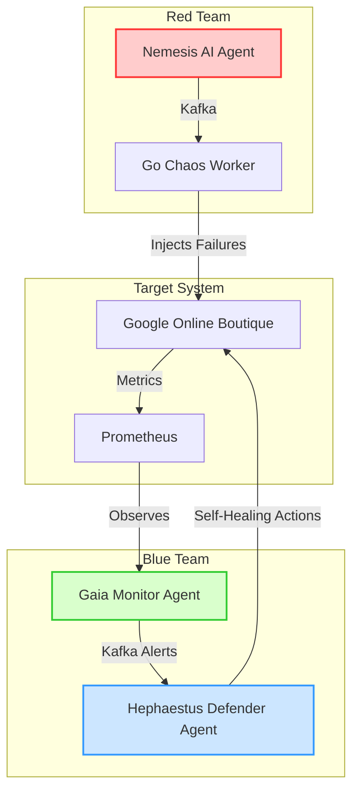

# 🚪 ZERO DOOR — AI-Powered Self-Healing Microservices
> **Hệ thống tự vá lỗi tự trị (Autonomous Self-Healing) cho kiến trúc Microservices sử dụng Multi-Agent AI**


---

## 🔍 Giới thiệu ZERO DOOR

**ZERO DOOR** là một hệ thống **Proactive Defense** (phòng thủ chủ động) được thiết kế cho kiến trúc Microservices, kết hợp **Multi-Agent AI** với **Chaos Engineering** để xây dựng cơ chế tự phục hồi (**Self-Healing**). Hệ thống hoạt động theo vòng lặp kín **Attack → Detect → Heal** thông qua 3 AI Agents tự trị cộng tác qua Apache Kafka:

1.  🔴 **Nemesis (Attacker - Red Team)**: AI Agent lập kế hoạch tấn công thông minh sử dụng Gemini 3.1 LLM, phân tích sơ đồ metrics cào từ Prometheus để xác định điểm yếu nhất (Bottleneck) của ứng dụng đích, đóng gói lệnh tấn công gửi vào Kafka.
2.  🟢 **Gaia (Observer - Monitor)**: Giám sát toàn bộ microservices bằng Prometheus metrics real-time (sử dụng range vector `[2m]` để lọc nhiễu), phát hiện bất thường hiệu năng (CPU stress, HTTP Flood, Pod Crash) và gửi cảnh báo lên Kafka topic.
3.  🔵 **Hephaestus (Defender - Blue Team)**: Tiếp nhận cảnh báo sự cố, ra quyết định tự phục hồi dựa trên Decision Matrix và gọi trực tiếp K8s API để vá lỗi (Scale Up pods, Block IP nguồn qua NetworkPolicy, Restart/Rollback pod bị treo).

---

## 🏗️ Kiến trúc & Luồng Dữ Liệu



*Toàn bộ trạng thái và hội thoại suy luận (Reasoning & Logic) của các Agents được đồng bộ hóa thời gian thực lên **Zero Door Control Center Dashboard** sử dụng chuẩn giao diện AWS Cloudscape Light Theme.*

---

## ⚙️ Công Nghệ Sử Dụng (Tech Stack)

| Lớp | Công nghệ | Chi tiết |
|---|---|---|
| **Hạ tầng (Infrastructure)** | Kubernetes (K3d / K3s), Docker | Môi trường Sandbox chạy cụm K8s đa node local |
| **Ingress Controller** | Nginx Ingress | Expose Target App và APIs ổn định trên cổng 8080 |
| **AI Agents Code** | Python (FastAPI, Uvicorn, Kafka-Python) | Nhanh chóng, tối ưu cho xử lý dữ liệu và tích hợp LLMs |
| **Chaos Executor** | Go (Golang) | Chaos Worker nhẹ, hiệu năng cao để stress CPU/Network |
| **AI Model** | Google Gemini 3.1 API | Model đa phương tiện cao cấp để phân tích và lập kế hoạch |
| **Message Broker** | Apache Kafka | Bus thông tin liên lạc bất đồng bộ giữa các Agents |
| **Giám sát (Observability)** | Prometheus, Prometheus Operator | Thu thập tài nguyên phần cứng và hiệu năng microservices |

---

## 📁 Cấu Trúc Thư Mục Dự Án

```
Zero-Door/
├── agent-orchestrator/            # Code các AI Agents (Python FastAPI)
│   ├── nemesis/                   # Agent Nemesis (Attacker + Web Dashboard)
│   ├── gaia/                      # Agent Gaia (Observer - Prometheus Poll)
│   └── hephaestus/                # Agent Hephaestus (Defender - K8s healer)
│
├── chaos-worker/                  # Code Chaos Engine (Go)
│   ├── cmd/                       # Điểm khởi chạy CLI
│   └── internal/attack/           # Các scripts tấn công (cpu_stress, http_flood, pod_kill)
│
├── infrastructure/                # Kubernetes manifests
│   ├── k3d-config.yaml            # Cấu hình cụm K3d đa node
│   └── manifests/                 # Deployments cho Kafka, Prometheus, Target App, Ingress
│
├── docs/                          # Tài liệu các Phase phát triển
│   ├── phases/                    # Chi tiết Phase 1 -> Phase 6
│   └── demo_script.md             # Kịch bản thuyết trình bảo vệ
│
├── start-demo.ps1                 # Script một nút bấm để khởi chạy demo
└── README.md                      # File tài liệu bạn đang đọc
```

---

## 🚀 Hướng Dẫn Chạy Thử Nghiệm (Getting Started)

### Yêu Cầu Hệ Thống
*   Windows 10/11 với Docker Desktop đang hoạt động.
*   Công cụ dòng lệnh `kubectl` được cấu hình.
*   Python 3.10+ và Go 1.21+.

### Các Bước Khởi Chạy Nhanh

1.  **Clone code**:
    ```bash
    git clone https://github.com/hp8001/Zero-Door-hp8001-.git
    cd Zero-Door-hp8001-
    ```

2.  **Chạy kịch bản tự động**:
    Mở PowerShell với quyền Administrator trong thư mục dự án và chạy:
    ```powershell
    .\start-demo.ps1
    ```
    Script này sẽ tự động dọn dẹp các cổng bị kẹt, cấu hình port-forward cần thiết, cấu hình Nginx Ingress trên cổng 8080 của host và mở trình duyệt truy cập thẳng vào **Zero Door Dashboard** tại địa chỉ:
    `http://localhost:9092/dashboard/`

3.  **Kiểm chứng các kịch bản**:
    *   **AI Attack**: Click nút **🧠 Trigger Gemini Attack** trên Dashboard để xem AI tự lập kế hoạch và các Agents tự trao đổi cảnh báo.
    *   **HTTP Flood (DDoS)**: Kích hoạt tấn công vào `frontend`, mở tab `http://localhost:8080/` và nhấn F12 Network tab để thấy trang web bị lag (3000ms), sau khi scale up tự động phục hồi về 500ms.
    *   **Pod Kill**: Kích hoạt tấn công vào `frontend`, liên tục F5 trang Boutique App trên cổng `8080` sẽ thấy lỗi `502/503` tạm thời và tự động load bình thường trở lại sau **1.34 giây** nhờ Ingress chuyển hướng thông minh.

---

## 📊 Kết Quả Thực Nghiệm (KPIs)

Hệ thống đã trải qua đợt đánh giá tự động với **40 kịch bản sự cố thực tế**:

*   **MTTD (Mean Time To Detect)**: Trung bình **< 25 giây** (Gaia phát hiện bất thường CPU và lỗi hệ thống).
*   **MTTR (Mean Time To Recover)**: Trung bình **1.01 giây** (Hephaestus nhận alert và thực hiện vá lỗi thành công).
*   **Downtime khi bị Pod Kill**: Chỉ **1.34 giây** nhờ sự kết hợp giữa Hephaestus scale-up và cơ chế proxy thông minh của Nginx Ingress.
*   **Uptime trong quá trình bị tấn công**: Duy trì ổn định **> 99.5%**.

---

## 👥 Danh Sách Thành Viên Thực Hiện

Dự án được thực hiện phục vụ nghiên cứu khoa học tại **Trường Đại học Thủ Dầu Một**:
*   **🔴 EurusDevSec**: Lead DevOps, Cloud & System Architecture, AI Agent Core Logics.
*   **🟡 hp8001**: Research, Frontend Dashboard Developer, System Tester.
