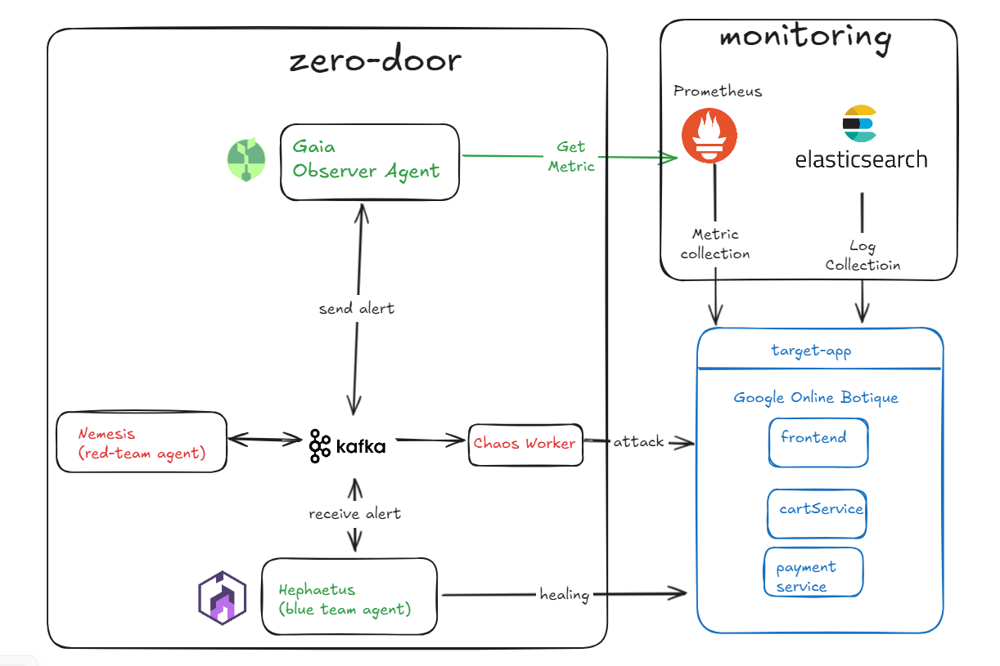

# PROJECT ZERO DOOR — DevOps & Cloud Infrastructure Plan

> **Version:** 4.0 — DevOps & Cloud Engineering Focus  
> **Last Updated:** 2026-05-31  
> **Author:** EurusDevSec (Team Lead — DevOps, Cloud, Infrastructure)

---
  
## ⚠️ MENTOR DIRECTIVES (Đọc kỹ trước khi bắt đầu)

```
╔══════════════════════════════════════════════════════════════════╗
║              CORE DIRECTIVES — STRICTLY ENFORCED                ║
╠══════════════════════════════════════════════════════════════════╣
║  1. NO SPOON-FEEDING                                            ║
║     Mentor sẽ không viết config hoàn chỉnh cho bạn.            ║
║     Bạn phải tự viết, mentor chỉ critique và phản biện.        ║
║                                                                  ║
║  2. NO STEP-BY-STEP TUTORIALS                                   ║
║     Mentor không tạo task list tự động.                         ║
║     Bạn đặt câu hỏi → Mentor hỏi ngược lại.                    ║
║                                                                  ║
║  3. SOCRATIC METHOD ONLY                                        ║
║     Câu trả lời = Câu hỏi phản biện + Reference links          ║
║                                                                  ║
║  4. REVIEW & CRITIQUE FRAMEWORK                                  ║
║     Khi bạn submit config/code → Mentor review theo 4 trục:    ║
║     Security | Scalability | Cost | Best Practices              ║
╚══════════════════════════════════════════════════════════════════╝
```

---

## 1. Bức tranh toàn cảnh (The Big Picture)

### 1.1. Nghiên cứu khoa học cần chứng minh điều gì?

| Research Question | DevOps Translation | Key Metric |
|---|---|---|
| RQ1: Multi-Agent AI phát hiện tấn công real-time? | Làm sao Observability Stack của bạn biết có anomaly? | MTTD < 60s |
| RQ2: Chaos Engineering tìm lỗ hổng chủ động? | CI/CD pipeline của bạn inject failure như thế nào? | Coverage rate |
| RQ3: Self-Healing hiệu quả hơn thủ công? | SRE runbook vs automated playbook — đo được gì? | MTTR < 180s |

> **Câu hỏi đầu tiên cho bạn:** Nếu hệ thống của bạn là một "bệnh nhân", thì Prometheus/Grafana là gì? Và ai là "bác sĩ" trong vòng lặp Attack→Detect→Heal? 
Prometheus/grafana là thiết bị giám sát còn bác sĩ ở đây là hephaetus agents

### 1.2. Vai trò của bạn trong dự án (DevOps/Cloud Focus)

Bạn **không phải** là AI researcher. Bạn là kỹ sư chịu trách nhiệm:

```
┌─────────────────────────────────────────────────────────────┐
│                  YOUR ENGINEERING SCOPE                     │
├─────────────────┬───────────────────────────────────────────┤
│  INFRASTRUCTURE │  K8s cluster design, namespacing,         │
│                 │  resource quotas, network policies         │
├─────────────────┼───────────────────────────────────────────┤
│  CI/CD PIPELINE │  Container build, image scanning, deploy  │
│                 │  strategy (rolling, blue-green, canary)    │
├─────────────────┼───────────────────────────────────────────┤
│  OBSERVABILITY  │  Metrics pipeline, alerting, log agg,     │
│                 │  tracing — the full O11y stack             │
├─────────────────┼───────────────────────────────────────────┤
│  CHAOS ENG.     │  Failure injection, experiment design,     │
│                 │  blast radius control, steady-state hyp.   │
├─────────────────┼───────────────────────────────────────────┤
│  SECURITY       │  RBAC, Network Policies, Secret mgmt,      │
│                 │  container hardening, supply chain         │
└─────────────────┴───────────────────────────────────────────┘
```

AI code (Nemesis/Gaia/Hephaestus logic) — bạn containerize và deploy. Bạn không phải là người viết ML model.

---

## 2. Kiến trúc Hệ thống (Từ góc nhìn Infrastructure)

### 2.1. High-Level Architecture

```
                    ┌─────────────────────────────────┐
                    │         KUBERNETES CLUSTER       │
                    │                                  │
  ┌──────────────── │ ─────────────────────────────────│──────┐
  │  Namespace:     │                                  │      │
  │  zero-door      │   ┌──────────┐  ┌──────────┐    │      │
  │                 │   │  NEMESIS │  │   GAIA   │    │      │
  │                 │   │ (Attack) │  │ (Monitor)│    │      │
  │                 │   └────┬─────┘  └────┬─────┘    │      │
  │                 │        │              │          │      │
  │                 │        ▼              ▼          │      │
  │                 │   ┌──────────────────────────┐  │      │
  │                 │   │      APACHE KAFKA         │  │      │
  │                 │   │   (Message Bus)           │  │      │
  │                 │   └──────────────┬───────────┘  │      │
  │                 │                  │               │      │
  │                 │        ┌─────────▼───────┐       │      │
  │                 │        │   HEPHAESTUS    │       │      │
  │                 │        │   (Defender)    │       │      │
  │                 │        └────────┬────────┘       │      │
  └─────────────────│─────────────────│────────────────│──────┘
                    │                 │                │
  ┌──────────────── │─────────────────│────────────────│──────┐
  │  Namespace:     │                 ▼                │      │
  │  target-app     │        ┌────────────────┐        │      │
  │                 │        │ Google Online  │        │      │
  │                 │        │   Boutique     │        │      │
  │                 │        │ (10+ services) │        │      │
  │                 │        └───────┬────────┘        │      │
  └─────────────────│────────────────│────────────────│──────┘
                    │                │                 │
  ┌──────────────── │────────────────│─────────────────│──────┐
  │  Namespace:     │                ▼                 │      │
  │  monitoring     │   ┌────────────────────────────┐ │      │
  │                 │   │ Prometheus | Grafana | ELK  │ │      │
  │                 │   └────────────────────────────┘ │      │
  └─────────────────│──────────────────────────────────│──────┘
                    └─────────────────────────────────┘
```

> **Phản biện đầu tiên:** Tại sao bạn dùng 3 namespace thay vì 1? Trả lời được câu này trước khi bạn `kubectl create namespace`.

### 2.2. Tech Stack (Đã quyết định)

| Layer | Technology | Lý do kỹ thuật |
|---|---|---|
| **Container Orchestration** | Kubernetes (K3s / local) → EKS/GKE (cloud) | Industry standard, CNCF ecosystem |
| **Service Mesh** | Cân nhắc: Istio vs Linkerd vs không dùng | Traffic management, mTLS, observability |
| **Message Broker** | Apache Kafka | High-throughput, durable, replay capable |
| **Agent Core** | Java Spring Boot 3.x | Spring AI integration, mature ecosystem |
| **Chaos Worker** | Go (Golang) | Low latency, low memory, goroutine-based concurrency |
| **AI Integration** | Spring AI + OpenAI/Ollama | Cloud/Local LLM flexibility |
| **Metrics** | Prometheus + Grafana | De-facto cloud-native observability |
| **Logging** | ELK Stack | Centralized log aggregation |
| **CI/CD** | GitHub Actions | Native SCM integration |
| **Container Registry** | Docker Hub / GHCR | Image versioning |
| **Secret Management** | Kubernetes Secrets (MVP) → Vault (production) | Credential isolation |

### 2.3. Kafka Topics — Agent Communication

| Topic | Producer | Consumer | Payload |
|---|---|---|---|
| `attack.commands` | Nemesis | Chaos Worker | Attack instruction JSON |
| `attack.results` | Chaos Worker | Gaia | Execution result JSON |
| `monitoring.alerts` | Gaia | Hephaestus | Anomaly alert JSON |
| `healing.actions` | Hephaestus | Gaia | Remediation log JSON |
| `system.logs` | All agents | Dashboard | Unified event log |

> **Câu hỏi kỹ thuật:** Kafka topics nên có bao nhiêu partitions? Replication factor là bao nhiêu? Điều gì xảy ra nếu Kafka broker chết khi Hephaestus đang gửi healing action?

---

## 3. Infrastructure Design Decisions (Bạn phải trả lời)

Đây là các quyết định thiết kế bạn **chưa làm**. Bạn cần tự nghiên cứu, đề xuất, và defend trước mentor.

### 3.1. Cluster Design

- [ ] **Single-node vs Multi-node?** Trong ngân sách 500k/tháng, tradeoff là gì?
- [ ] **K3s vs Minikube vs Kind?** Khi nào dùng cái nào? Cái nào phù hợp sandbox research?
- [ ] **Resource Quotas:** Mỗi namespace nên có `LimitRange` và `ResourceQuota` không? Tại sao?
- [ ] **Storage Class:** Kafka cần persistent storage. Bạn dùng StorageClass nào trên K3s?

### 3.2. Networking

- [ ] **Ingress Controller:** Nginx vs Traefik vs HAProxy? Ai xử lý traffic vào Target App?
- [ ] **Network Policies:** Có nên cô lập Namespace `zero-door` với `target-app` không? Hay cần allow?
- [ ] **Service Discovery:** Agents dùng Kubernetes DNS (`service.namespace.svc.cluster.local`) hay cần thêm gì?

### 3.3. Observability Architecture

- [ ] **Metrics Scraping:** `ServiceMonitor` vs `PodMonitor` — khi nào dùng cái nào?
- [ ] **Alert Routing:** AlertManager route alert tới đâu? Slack? Email? Kafka topic?
- [ ] **Log Aggregation:** Fluentd vs Fluent Bit vs Logstash — bạn chọn gì và tại sao?
- [ ] **Distributed Tracing:** Bạn có cần OpenTelemetry không? Nếu không, tại sao không?

### 3.4. CI/CD Pipeline

- [ ] **Build Strategy:** Multi-stage Dockerfile để optimize image size — Java image target < 200MB, Go < 20MB
- [ ] **Deploy Strategy:** Rolling update vs Recreate vs Blue-Green? Kịch bản nào phù hợp Chaos testing?
- [ ] **Image Scanning:** Trivy hay Snyk? Scan ở bước nào trong pipeline?
- [ ] **Helm Packaging:** Một chart cho toàn bộ hệ thống hay split thành sub-charts?

---

## 4. KPIs & Experiment Design (Góc nhìn SRE)

### 4.1. Steady-State Hypothesis (Chaos Engineering principle)

Trước khi inject failure, bạn phải định nghĩa "bình thường" là gì:

| Metric | Normal Range | Tooling |
|---|---|---|
| CPU Usage (target-app pods) | < 60% | Prometheus `container_cpu_usage_seconds_total` |
| Memory Usage | < 70% | Prometheus `container_memory_working_set_bytes` |
| HTTP Error Rate (5xx) | < 1% | Prometheus `http_server_requests_seconds_count` |
| P99 Latency | < 500ms | Prometheus histogram |
| Kafka Consumer Lag | < 100 messages | Kafka JMX metrics |

> **Câu hỏi:** Làm thế nào bạn biết khi nào hệ thống đã đạt steady-state trước khi chạy chaos experiment?

### 4.2. Target KPIs cho Báo cáo NCKH

| Metric | Baseline (Manual) | Target (Auto) | Measurement Method |
|---|---|---|---|
| **MTTD** | 5-15 phút | < 60 giây | Timestamp: attack_start → Gaia alert |
| **MTTR** | 15-30 phút | < 180 giây | Timestamp: Gaia alert → Hephaestus done |
| **Uptime** (during attack) | ~90% | ≥ 99% | `(1 - error_rate) * 100` |
| **False Positive Rate** | N/A | < 10% | Alert count vs actual attack count |

### 4.3. Experiment Scenarios

| Scenario | Attack Type | Expected Heal Action | Success Criteria |
|---|---|---|---|
| S1 | SQL Injection burst | Block source IP via NetworkPolicy | Error rate drops < 1% |
| S2 | HTTP Flood (DDoS L7) | Horizontal Pod Autoscaling | Latency < 500ms |
| S3 | Resource Exhaustion (OOM) | Pod rollback/restart | Pod restarts, no data loss |
| S4 | All 3 simultaneously | Priority-based healing | System stable in < 3 min |

---

## 5. Security Considerations (Non-negotiable)

> **Cảnh báo:** Đây là hệ thống tự động tấn công. Nếu bị cấu hình sai, có thể tấn công ra ngoài môi trường sandbox.

### 5.1. Blast Radius Control

- [ ] Hephaestus có RBAC `ClusterRole` hay chỉ `Role` trong namespace? Tại sao quan trọng?
- [ ] Nemesis có thể attack URL nào? Bạn hardcode target hay dynamic? Validation ở đâu?
- [ ] Nếu Kafka bị compromise, attacker có thể inject `attack.commands` giả không?

### 5.2. Secret Management

| Secret | Current Approach | Risk | Better Approach |
|---|---|---|---|
| OpenAI API Key | K8s Secret (base64) | Git leak, etcd plain text | External Secrets Operator + Vault |
| Kafka credentials | K8s Secret | Same | Kafka SASL/TLS |
| K8s Service Account | Default SA | Overprivileged | Dedicated SA với minimal RBAC |

### 5.3. Container Security

- [ ] Chạy container với `USER nonroot`?
- [ ] `readOnlyRootFilesystem: true` trong SecurityContext?
- [ ] `allowPrivilegeEscalation: false`?

---

## 6. Timeline & Milestones (DevOps-Framed)

### 6.1. Phase Overview

```
Phase 1 (T1-T2): Foundation — Infrastructure, K8s, Observability
Phase 2 (T2-T3): Core Services — Gaia (Monitor) + Target App
Phase 3 (T3-T4): Attack Surface — Nemesis (Red Team) + Chaos Worker
Phase 4 (T4-T5): Defense Layer — Hephaestus (Blue Team) + Full Loop
Phase 5 (T5-T6): Experiments — War Game, Data Collection, Analysis
Phase 6 (T3-T6): Scientific Report — Writing parallel with implementation
```

### 6.2. Key Milestones

| Milestone | Condition | Verification |
|---|---|---|
| **M1: Infra Ready** | K8s cluster + Kafka + Prometheus running | `kubectl get pods -A` all Running |
| **M2: Observability Live** | Grafana dashboard showing target-app metrics | CPU/Memory/Error rate visible |
| **M3: Detect Loop** | Gaia alerts published to Kafka on anomaly | Kafka consumer group offset moves |
| **M4: Attack Loop** | Nemesis generates and executes 3 attack types | `attack.results` topic has data |
| **M5: Heal Loop** | Hephaestus triggers K8s action on alert | Pod count changes, IP blocked |
| **M6: Full Loop** | End-to-end Attack→Detect→Heal < thresholds | MTTD < 60s, MTTR < 180s in 70% runs |
| **M7: Defense Ready** | Demo + Report + Slides complete | Hội đồng có thể reproduce kết quả |

### 6.3. Sprint Skeleton (12 sprints × 2 tuần)

> Bạn tự điền chi tiết. Mentor chỉ verify xem sprint goal có SMART không.

| Sprint | Focus Area | Definition of Done |
|---|---|---|
| S1-S2 | Foundation + Architecture | — (Bạn tự định nghĩa) |
| S3-S4 | Target App + Gaia | — |
| S5-S6 | Chaos Worker + Nemesis | — |
| S7-S8 | Hephaestus + Full Loop | — |
| S9-S10 | Experiments + Data | — |
| S11-S12 | Report + Defense Prep | — |

---

## 7. Risk Register (Infrastructure Perspective)

| Risk | Probability | Impact | Mitigation Strategy |
|---|---|---|---|
| K8s cluster instability (OOM, disk) | Medium | High | Resource Quotas, PodDisruptionBudget |
| Kafka data loss during chaos | Medium | High | Replication factor ≥ 2, persistent volumes |
| OpenAI rate limit / cost overrun | Medium | Medium | Local Ollama fallback, usage alerts |
| CI/CD pipeline breaks mid-sprint | Low | Medium | Pipeline tests, rollback strategy |
| Nemesis escapes sandbox | Low | Critical | Network Policies, RBAC, audit logs |
| Experiment data loss | Low | High | Prometheus remote_write, Grafana snapshots |

---

## 8. Deliverables cho Hội đồng NCKH

### 8.1. Technical Artifacts

| # | Artifact | Format | Owner |
|---|---|---|---|
| 1 | Source code (3 Agents + Chaos Worker) | GitHub Repository | EurusDevSec |
| 2 | Infrastructure as Code (Helm Charts) | YAML / Helm | EurusDevSec |
| 3 | CI/CD Pipeline | GitHub Actions YAML | EurusDevSec |
| 4 | Observability Dashboards | Grafana JSON export | EurusDevSec |
| 5 | Architecture Diagrams | Draw.io / Mermaid | Team |

### 8.2. Scientific Artifacts

| # | Artifact | Format | Owner |
|---|---|---|---|
| 6 | Báo cáo NCKH (full text) | PDF/Word | hp8001 + Review EurusDevSec |
| 7 | Experiment Data & Analysis | CSV + Charts | Team |
| 8 | Demo Video (Attack→Detect→Heal) | MP4 5-10 phút | EurusDevSec |
| 9 | Defense Presentation | PowerPoint/PDF | Team |

### 8.3. Phân biệt rõ: Project này là gì?

| KHÔNG phải | LÀ |
|---|---|
| Web app cho end user | Backend Platform cho DevOps Engineers |
| Mobile/Desktop app | 3 Microservices + Observability Stack trên K8s |
| AI model training | Containerization + Deployment của AI agents |
| Pentest tool | Research platform trong controlled sandbox |

---

## 9. Định hướng Nghiên cứu (Scientific Contribution)

> Bạn cần defend những điều này trước hội đồng. Mentor sẽ phản biện từng điểm.

### 9.1. Research Gap (Trong hệ sinh thái open-source cho SME)

| Gap | Existing Solutions | What Zero Door Proposes |
|---|---|---|
| Thiếu giải pháp tích hợp hoàn chỉnh | Chaos RIÊNG, Monitor RIÊNG, Respond RIÊNG | Closed-loop, single deployable platform |
| Thiếu AI-driven attack trong open-source | LitmusChaos chỉ predefined experiments | LLM-generated payload variations |
| Thiếu continuous Red Team nội bộ | Pentest tools chạy 1 lần | Always-on adversarial testing |

### 9.2. Scientific Contributions

| Code | Contribution | Type |
|---|---|---|
| C1 | Closed-Loop AI Security Framework | Architecture pattern |
| C2 | Adversarial Self-Testing Model (Self-Immune System paradigm) | Novel application |
| C3 | GenAI-powered Attack Synthesis với template+variation approach | AI integration |
| C4 | Open-source Self-Healing Platform accessible cho SME | Software artifact |

### 9.3. Giới hạn Nghiên cứu (Limitations — Nói thẳng với Hội đồng)

| # | Limitation | Honesty Statement |
|---|---|---|
| L1 | Sandbox only | Kết quả chưa validate ở production scale |
| L2 | 3 attack types | Chỉ subset của OWASP Top 10 |
| L3 | Single K8s cluster | Chưa test multi-cluster federation |
| L4 | LLM dependency | Payload quality phụ thuộc model |
| L5 | No commercial benchmark | Chưa compare với Gremlin, Harness |

---

## 10. Mentor Critique Framework

Khi bạn submit bất kỳ thứ gì (config, diagram, code snippet), mentor sẽ review theo 4 trục:

```
┌─────────────────────────────────────────────────────────────┐
│                   CRITIQUE DIMENSIONS                        │
├──────────────┬──────────────────────────────────────────────┤
│  SECURITY    │  Attack surface? Least privilege? Secret mgmt?│
│              │  What can go wrong if this is misconfigured?  │
├──────────────┼──────────────────────────────────────────────┤
│  SCALABILITY │  Bottleneck at 10x load? Single point of      │
│              │  failure? Can this handle burst traffic?       │
├──────────────┼──────────────────────────────────────────────┤
│  COST        │  Cloud cost estimate? Can this run in budget?  │
│              │  Where are the cost traps?                     │
├──────────────┼──────────────────────────────────────────────┤
│  BEST        │  Does this follow CNCF best practices?         │
│  PRACTICES   │  What does the official docs say?              │
└──────────────┴──────────────────────────────────────────────┘
```

### 10.1. Cách làm việc với Mentor

1. **Bạn đề xuất** → Mentor critique
2. **Bạn hỏi "làm sao?"** → Mentor hỏi ngược: "Bạn đã đọc docs chưa? Bạn nghĩ cách nào?"
3. **Bạn submit config** → Mentor tìm lỗ hổng, bạn tự sửa
4. **Bạn bế tắc** → Mentor cho reference link, không cho code

### 10.2. Resources (Mentor-approved, không phải câu trả lời)

| Topic | Official Resource |
|---|---|
| Kubernetes | https://kubernetes.io/docs/concepts/ |
| Helm | https://helm.sh/docs/ |
| Prometheus | https://prometheus.io/docs/introduction/overview/ |
| Kafka | https://kafka.apache.org/documentation/ |
| Chaos Engineering | https://principlesofchaos.org/ |
| Spring AI | https://docs.spring.io/spring-ai/reference/ |
| Go | https://go.dev/doc/ |
| OWASP | https://owasp.org/www-project-web-security-testing-guide/ |
| Google SRE | https://sre.google/sre-book/table-of-contents/ |
| CNCF Landscape | https://landscape.cncf.io/ |

---

## 11. References (Academic)

1. Basiri, A., et al. (2016). "Chaos Engineering." *IEEE Software*, 33(3).
2. Wooldridge, M. (2009). *An Introduction to MultiAgent Systems*. Wiley.
3. Soldani, J., et al. (2022). "Automated Anomaly Detection and Root Cause Analysis for Microservices." *IEEE TSC*.
4. Sarda, K., et al. (2023). "ADARMA: Auto-Detection and Auto-Remediation of Microservice Anomalies by Leveraging LLMs." *ACM ISSTA*.
5. Malik, S., et al. (2023). "CHESS: A Framework for Evaluation of Self-Adaptive Systems Based on Chaos Engineering." *IEEE SEAMS*.
6. Zhang, L., et al. (2024). "A Survey of AIOps for Failure Management in the Era of LLMs." *arXiv:2406.11213*.
7. Google SRE Team. (2016). *Site Reliability Engineering*. O'Reilly.
8. Rosenthal, C., Jones, N. (2020). *Chaos Engineering: System Resiliency in Practice*. O'Reilly.

---

*Cập nhật lần cuối: 2026-05-31 | Version: 4.0 — DevOps & Cloud Engineering Focus*
