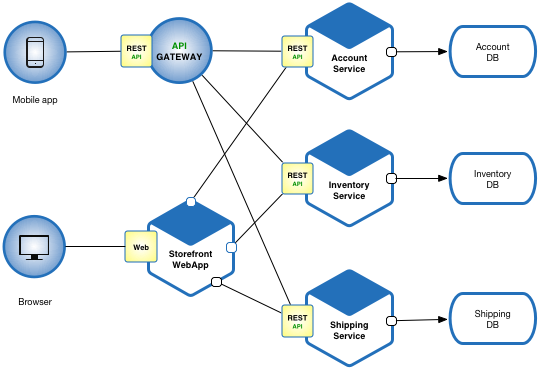
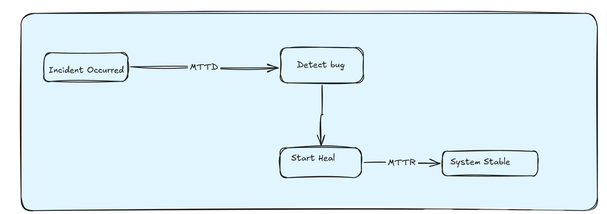

# CHƯƠNG 1: MỞ ĐẦU

## 1.1. Tính cấp thiết của đề tài

### 1.1.1. Bối cảnh chuyển đổi số và xu hướng dịch chuyển sang Microservices
Trong bối cảnh cuộc Cách mạng Công nghiệp 4.0 đang diễn ra mạnh mẽ, các tổ chức và doanh nghiệp trên toàn cầu đang đẩy nhanh tiến trình chuyển đổi số nhằm tối ưu hóa quy trình vận hành và nâng cao trải nghiệm khách hàng. Sự thay đổi này đòi hỏi hạ tầng công nghệ thông tin phải có tính linh hoạt cao, khả năng co giãn tức thời và tốc độ phân phối tính năng nhanh chóng. Để đáp ứng các yêu cầu đó, kiến trúc dịch vụ siêu nhỏ (Microservices) đã dần thay thế kiến trúc nguyên khối (Monolith) truyền thống, trở thành tiêu chuẩn công nghiệp trong thiết kế hệ thống phần mềm hiện đại.

Hình 1.1. Ảnh Kiến trúc Microservices

Bằng cách phân rã một ứng dụng cồng kềnh thành các dịch vụ độc lập, chạy cô lập trong các container và giao tiếp qua các giao thức mạng nhẹ như HTTP REST hoặc gRPC, kiến trúc Microservices mang lại nhiều lợi ích to lớn:
*   **Phát triển song song:** Các nhóm phát triển có thể làm việc độc lập trên từng dịch vụ mà không lo ngại ảnh hưởng chéo đến mã nguồn của nhau.
*   **Co giãn độc lập:** Dịch vụ nào bị quá tải có thể được scale-up riêng biệt, giúp tối ưu hóa chi phí tài nguyên phần cứng.
*   **Cô lập lỗi:** Một dịch vụ bị lỗi (crash) không làm sập toàn bộ hệ thống ứng dụng, giúp tăng cường khả năng chịu lỗi tự nhiên.

Tuy nhiên, tính phân tán cao của mô hình này cũng tạo ra thách thức lớn về quản trị kết nối, tính nhất quán dữ liệu và độ phức tạp trong việc giám sát trạng thái sức khỏe của các thành phần dịch vụ.

### 1.1.2. Thách thức bảo mật và bài toán chi phí gián đoạn dịch vụ (Downtime Cost)
Mặc dù mang lại tính linh hoạt cao, kiến trúc Microservices vô tình làm tăng đáng kể bề mặt tấn công (attack surface) của hệ thống. Mỗi API endpoint, mỗi kết nối mạng nội bộ giữa các container và mỗi điểm truy cập cơ sở dữ liệu đều là một mục tiêu tiềm ẩn cho kẻ tấn công. Các hình thức tấn công mạng ngày nay không còn dừng lại ở mức độ thủ công, mà đã tiến hóa lên các cuộc tấn công tự động hóa trên diện rộng (Automated Cyberattacks). Kẻ tấn công sử dụng mã độc tự động quét lỗi, botnet thực hiện DDoS tầng ứng dụng và các công cụ dò quét lỗ hổng liên tục 24/7.

Khi sự cố gián đoạn dịch vụ (Downtime) xảy ra trên các hệ thống microservices quy mô lớn của doanh nghiệp, hậu quả kinh tế và danh tiếng là vô cùng nghiêm trọng. Theo các báo cáo thống kê của Gartner và Uptime Institute:
*   Chi phí thiệt hại trung bình cho mỗi phút downtime của hệ thống doanh nghiệp lớn dao động từ **5.600 USD đến 9.000 USD** (tương đương hơn 130 triệu đến 200 triệu VNĐ mỗi phút).
*   Đối với các nền tảng thương mại điện tử lớn hoặc cổng thanh toán tài chính, con số này có thể tăng vọt lên hàng chục ngàn USD mỗi phút do mất mát trực tiếp giao dịch mua sắm của khách hàng.
*   Bên cạnh thiệt hại tài chính trực tiếp, downtime còn phá hủy niềm tin của khách hàng đối với thương hiệu, làm sụt giảm giá trị cổ phiếu và tạo cơ hội cho các đối thủ cạnh tranh trực tiếp.

Do đó, việc bảo vệ hệ thống hoạt động liên tục (High Availability) và khôi phục dịch vụ nhanh nhất có thể khi xảy ra sự cố không còn là bài toán kỹ thuật đơn thuần, mà đã trở thành yêu cầu sống còn đối với sự phát triển của doanh nghiệp.

### 1.1.3. Hạn chế của quy trình vận hành thủ công (Human-in-the-loop Bottleneck)
Hiện nay, hầu hết các hệ thống bảo mật và vận hành (SecOps/SRE) vẫn hoạt động theo cơ chế phản ứng thụ động và phụ thuộc nặng nề vào con người để ra quyết định và xử lý lỗi:
1.  **Nhận thông tin cảnh báo:** Hệ thống giám sát (như Prometheus/Grafana) phát hiện dị thường $\rightarrow$ kích hoạt cảnh báo gửi qua email, Slack hoặc Telegram $\rightarrow$ kỹ sư trực ca (On-call engineer) tiếp nhận.
2.  **Phân tích sự cố:** Kỹ sư phải truy cập vào hệ thống log tập trung, phân tích dữ liệu metrics, thực hiện các lệnh debug thủ công qua SSH để tìm nguyên nhân gốc (Root Cause Analysis - RCA).
3.  **Vá lỗi thực tế:** Kỹ sư đưa ra giải pháp (ví dụ: chạy lệnh scale up, restart dịch vụ bị treo đơ, viết file cấu hình chặn IP tấn công) và deploy thủ công lên môi trường Production.

Quy trình này tồn tại một nút thắt cổ chai lớn về mặt tốc độ phản ứng (Response Latency). Thời gian tối thiểu để một kỹ sư tiếp nhận, phân tích và xử lý xong một sự cố cơ bản thường dao động từ **15 phút đến hàng giờ đồng hồ**, ngay cả khi họ là chuyên gia có kinh nghiệm. Trong trường hợp sự cố xảy ra ngoài giờ làm việc hoặc vào ban đêm, thời gian này có thể kéo dài hơn nữa. 

Hơn thế nữa, việc con người can thiệp trực tiếp vào hệ thống đang chạy dưới áp lực khắc phục sự cố khẩn cấp rất dễ dẫn đến các lỗi cấu hình sai (human errors), gây ra các sự cố phụ nghiêm trọng hơn.

### 1.1.4. Sự dịch chuyển sang Phòng thủ chủ động và Triết lý "Zero Door"
Để giải quyết triệt để nút thắt cổ chai về mặt tốc độ của con người, ngành kỹ nghệ độ tin cậy hệ thống (Site Reliability Engineering - SRE) đang dịch chuyển mạnh mẽ từ mô hình "Phòng thủ thụ động" (Reactive) sang "Phòng thủ chủ động tự trị" (Proactive & Autonomous Defense). Yêu cầu cấp thiết đặt ra là hệ thống phải có khả năng **Self-Healing (Tự phục hồi)** – tự động phát hiện, cô lập và sửa chữa lỗi ở cấp độ thời gian thực (real-time).

Đề tài hướng tới triết lý **"Zero Door"** (Không cửa hậu). Ý nghĩa của "Zero Door" không chỉ dừng lại ở việc vá hết các lỗ hổng an ninh đã biết, mà là xây dựng một hệ thống có **"khả năng tự miễn dịch"** (Self-Immune System). 

Bằng cách kết hợp giữa kỹ thuật **Chaos Engineering** (chủ động gây lỗi để kiểm thử độ bền hệ thống) và kiến trúc **Multi-Agent AI** (các tác tử thông minh đóng vai trò Red Team tự tấn công và Blue Team tự phòng thủ), hệ thống sẽ liên tục tự kiểm tra và tự vá lỗi ngay trong môi trường Staging/Sandbox trước khi mã nguồn được triển khai chính thức. Điều này giúp phát hiện sớm các lỗi logic sâu tầng ứng dụng và cấu hình sai lệch hạ tầng, triệt tiêu mọi nguy cơ cửa hậu trước khi chúng có cơ hội tiếp xúc với người dùng cuối.

## 1.2. Mục tiêu nghiên cứu

### 1.2.1. Mục tiêu tổng quát
Mục tiêu tổng quát của đề tài là nghiên cứu, thiết kế và xây dựng thành công một hệ thống DevSecOps tự trị khép kín trên nền tảng điều phối container Kubernetes. Hệ thống tích hợp ba tác tử AI độc lập cùng một bộ tiêm lỗi hỗn mang để tự động hóa toàn bộ vòng đời ứng cứu sự cố bao gồm các pha: Tấn công giả lập (Attack) $\rightarrow$ Giám sát phát hiện (Detect) $\rightarrow$ Quyết định và Thực thi vá lỗi (Heal) mà không cần sự can thiệp của con người.

### 1.2.2. Mục tiêu cụ thể (KPIs kỹ thuật) và định nghĩa các chỉ số đo lường
Để đánh giá tính hiệu quả thực tế của giải pháp một cách khách quan và khoa học, đề tài đặt ra các chỉ số đo lường hiệu năng cốt lõi (SLA/SLO) bám sát các tiêu chuẩn công nghiệp về SRE:

Hình 1.2. Sơ đồ MTTD-MTTR

1.  **MTTD (Mean Time To Detect - Thời gian phát hiện lỗi trung bình):** 
    *   *Định nghĩa:* Khoảng thời gian tính từ lúc Chaos Worker kích hoạt lỗi hoặc cuộc tấn công bắt đầu tàn phá hệ thống mục tiêu cho đến khi tác tử Gaia phát hiện dị thường và gửi thành công bản tin Alert vào hàng đợi Kafka.
    *   *KPI mục tiêu:* **MTTD < 1 phút (60 giây)** cho mọi loại sự cố.
2.  **MTTR (Mean Time To Recover - Thời gian tự phục hồi trung bình):**
    *   *Định nghĩa:* Khoảng thời gian tính từ lúc Hephaestus nhận bản tin Alert từ Kafka, đưa ra quyết định hành động tương ứng từ ma trận quyết định, gọi API của Kubernetes để thực thi vá lỗi, cho đến khi hệ thống mục tiêu trở lại trạng thái hoạt động bình thường (Healthy).
    *   *KPI mục tiêu:* **MTTR < 3 phút (180 giây)**.
3.  **Tỷ lệ Uptime hệ thống (Uptime Service Level Objective - SLO):**
    *   *Định nghĩa:* Tỷ lệ phần trăm thời gian dịch vụ chính (frontend) phản hồi thành công mã HTTP 200 cho người dùng cuối trong suốt thời gian hệ thống liên tục chịu áp lực tấn công phá hủy từ tác tử Nemesis.
    *   *KPI mục tiêu:* **Uptime $\ge$ 99.9%** (giới hạn thời gian chết tối đa không quá vài chục giây trong suốt quá trình thử nghiệm).
4.  **Tỷ lệ vá lỗi thành công (Healing Success Rate):**
    *   *Định nghĩa:* Tỷ lệ phần trăm số lần Hephaestus thực thi hành động vá lỗi thành công và đưa dịch vụ từ trạng thái dị thường (Error/Crash) về trạng thái hoạt động ổn định trên tổng số lần nhận được cảnh báo.
    *   *KPI mục tiêu:* **Success Rate $\ge$ 80%** (chấp nhận một số tỷ lệ lỗi nhỏ do tranh chấp tài nguyên vật lý hoặc độ trễ mạng).
5.  **Mức độ tối ưu hóa tài nguyên hệ thống (FinOps Index):**
    *   *Định nghĩa:* Tỷ lệ phần trăm bộ nhớ RAM tiết kiệm được của hệ thống tác tử Zero Door so với kiến trúc tác tử truyền thống (Java Spring Boot), đảm bảo toàn bộ hệ thống có thể chạy ổn định trên cấu hình máy chủ đám mây giá rẻ.

## 1.3. Đối tượng và phạm vi nghiên cứu

### 1.3.1. Đối tượng nghiên cứu
*   Kiến trúc Microservices trên nền tảng container và cơ chế điều phối tài nguyên của Kubernetes.
*   Cơ chế giao tiếp hướng sự kiện (Event-Driven Architecture) trong hệ thống phân tán sử dụng Apache Kafka.
*   Cơ chế phát hiện dị thường (Anomaly Detection) dựa trên thu thập số liệu metrics (Prometheus) và phân tích nhật ký log tập trung (Elasticsearch).
*   Mô hình ra quyết định tự phục hồi (Self-Healing logic) và kỹ thuật Chaos Engineering tiêm lỗi mức ứng dụng.
*   Ứng dụng mô hình ngôn ngữ lớn (LLM - Gemini, OpenAI) trong việc phân tích trạng thái và sinh kịch bản tấn công.

### 1.3.2. Phạm vi nghiên cứu và Giới hạn tài nguyên thực tế
*   **Môi trường thử nghiệm cục bộ (Local Sandbox):** Hệ thống được cấu hình chạy trên cụm K3d (Kubernetes in Docker) cài đặt trên máy tính cá nhân Acer Nitro 5 với RAM 16GB. Môi trường này giả lập sự giới hạn tài nguyên khắt khe nhằm kiểm chứng độ bền của thuật toán tối ưu hóa bộ nhớ.
*   **Môi trường thử nghiệm đám mây (Cloud Deploy):** Dự án được chuyển đổi và deploy thực tế trên 1 Droplet VM của DigitalOcean (Singapore Region) với cấu hình 4 vCPUs, 8GB RAM, 160GB SSD. Đây là quy mô hạ tầng đám mây nhỏ, phù hợp cho các doanh nghiệp vừa và nhỏ khởi nghiệp.
*   **Ứng dụng mục tiêu chịu lỗi:** Sử dụng hệ thống mã nguồn mở **Google Online Boutique** làm môi trường giả lập. Đây là một ứng dụng thương mại điện tử microservices đa ngôn ngữ chuẩn công nghiệp được phát triển bởi Google nhằm mục đích demo cho Kubernetes. Chúng ta chỉ giữ lại **6 dịch vụ cốt lõi** (`frontend`, `cartservice`, `productcatalogservice`, `currencyservice`, `checkoutservice` và `redis-cart`) và giới hạn tải nghiêm ngặt ở mức `limits.memory: 256Mi` mỗi dịch vụ để thích ứng với phần cứng.
*   **Các kịch bản tấn công và giới hạn an toàn:** Đề tài chỉ tập trung thử nghiệm 3 hình thức tấn công: HTTP Flood (tương thích DDoS ứng dụng), CPU Stress (tương thích cạn kiệt tài nguyên), và Pod Kill (tương thích lỗi đột tử container). Chaos Worker được tích hợp bộ lọc an toàn để chỉ được phép tác động trong phạm vi namespace `target-app`, ngăn chặn tuyệt đối việc phá hủy hạ tầng chung của cụm K8s.

## 1.4. Ý nghĩa khoa học và thực tiễn

### 1.4.1. Ý nghĩa khoa học
*   **Đóng góp về mặt kiến trúc hệ thống:** Đề tài đề xuất và chứng minh tính khả thi của một mô hình tự trị đóng kín hoàn chỉnh kết hợp giữa Chaos Engineering chủ động và phản ứng tự phục hồi tự động dựa trên kiến trúc Đa tác tử (Multi-Agent).
*   **Sử dụng AI trong quy trình kiểm thử SRE:** Thay vì con người tự cấu hình kịch bản test lỗi, đề tài ứng dụng các mô hình LLM tiên tiến để đóng vai trò làm "Red Team" thông minh tự phân tích và lập kế hoạch tấn công. Điều này đóng góp cơ sở lý thuyết mới cho việc ứng dụng AI tạo sinh (Generative AI) vào ngành Kỹ nghệ độ tin cậy hệ thống.

### 1.4.2. Ý nghĩa thực tiễn
*   **Tối ưu hóa chi phí vận hành doanh nghiệp (SRE Cost):** Giải pháp giúp các doanh nghiệp vừa và nhỏ giảm thiểu sự phụ thuộc vào đội ngũ kỹ sư trực ca (On-call) đắt đỏ, tự động hóa các tác vụ xử lý sự cố cấp độ 1 lặp đi lặp lại.
*   **Giảm thiểu Downtime đột xuất:** Rút ngắn thời gian khôi phục hệ thống từ mức độ hàng chục phút (khi thao tác thủ công) xuống mức độ giây (khi tự động hóa qua API), bảo vệ doanh thu trực tuyến và uy tín thương hiệu của doanh nghiệp.
*   **Giải pháp FinOps khả thi:** Chứng minh phương pháp luận tối ưu hóa bộ nhớ (giảm 88% RAM tiêu thụ của lớp quản trị) giúp doanh nghiệp có thể vận hành hệ thống giám sát và tự phục hồi trên hạ tầng đám mây giá rẻ mà không sợ treo đơ máy chủ.
*   **Công cụ học tập trực quan:** Cung cấp bộ mã nguồn đầy đủ, các tài liệu hướng dẫn vận hành (Runbooks) và Dashboard mô phỏng trực quan "Chiến tranh AI" (Nemesis vs Hephaestus) thời gian thực phục vụ cho việc giảng dạy và thực hành an ninh mạng nâng cao trong các trường đại học.

## 1.5. Cấu trúc báo cáo nghiên cứu khoa học

Báo cáo nghiên cứu khoa học được cấu trúc thành 6 chương chính như sau:

*   **Chương 1: Mở đầu:** Giới thiệu tính cấp thiết, mục tiêu nghiên cứu, đối tượng, phạm vi và ý nghĩa của đề tài.
*   **Chương 2: Cơ sở lý thuyết và công nghệ liên quan:** Trình bày lý thuyết nền tảng về Kubernetes, Chaos Engineering, Apache Kafka, kiến trúc Multi-Agent AI và các công cụ DevOps/SecOps liên quan.
*   **Chương 3: Thiết kế kiến trúc hệ thống Zero Door:** Phân tích chi tiết thiết kế logic, luồng dữ liệu khép kín và kiến trúc thành phần của 3 Agent (Nemesis, Gaia, Hephaestus) và Chaos Worker.
*   **Chương 4: Hiện thực hóa và triển khai hệ thống:** Chi tiết hóa mã nguồn triển khai thực tế của các tác tử, kỹ thuật bảo mật container (Distroless), và tự động hóa hạ tầng đám mây sử dụng Terraform IaC kèm mã nguồn cấu hình cụ thể.
*   **Chương 5: Thực nghiệm, đo đếm và đánh giá kết quả:** Trình bày chi tiết số liệu thực nghiệm thu được từ 4 kịch bản chạy thử nghiệm, phân tích các chỉ số MTTD/MTTR, chỉ ra hạn chế kỹ thuật thực tế (Race Condition) và phân tích hiệu quả tài nguyên FinOps.
*   **Chương 6: Kết luận và hướng phát triển:** Tổng kết các đóng góp chính của đề tài, thẳng thắn nhìn nhận các hạn chế và đề xuất giải pháp cải tiến trong tương lai.
