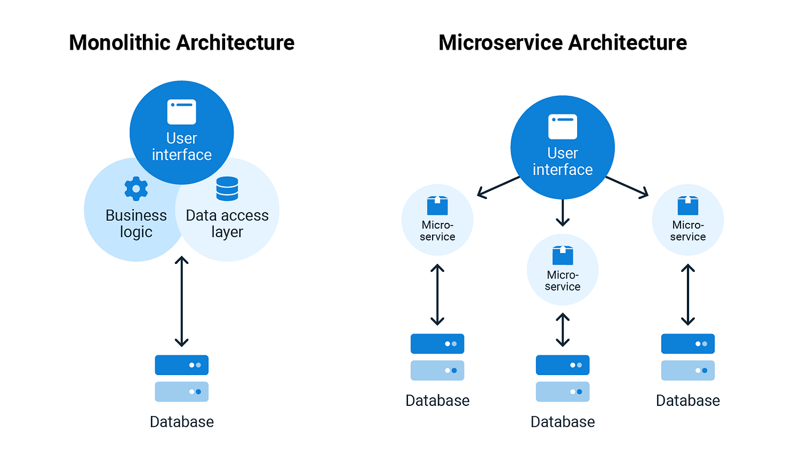
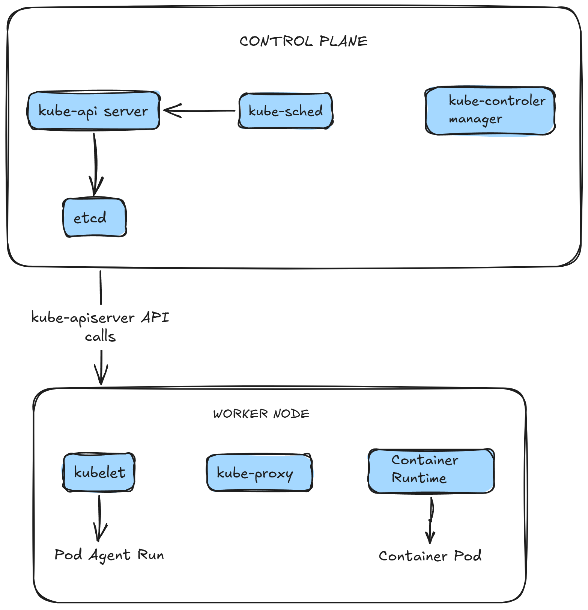
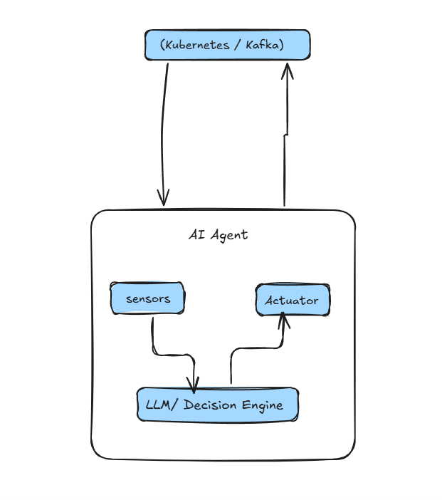
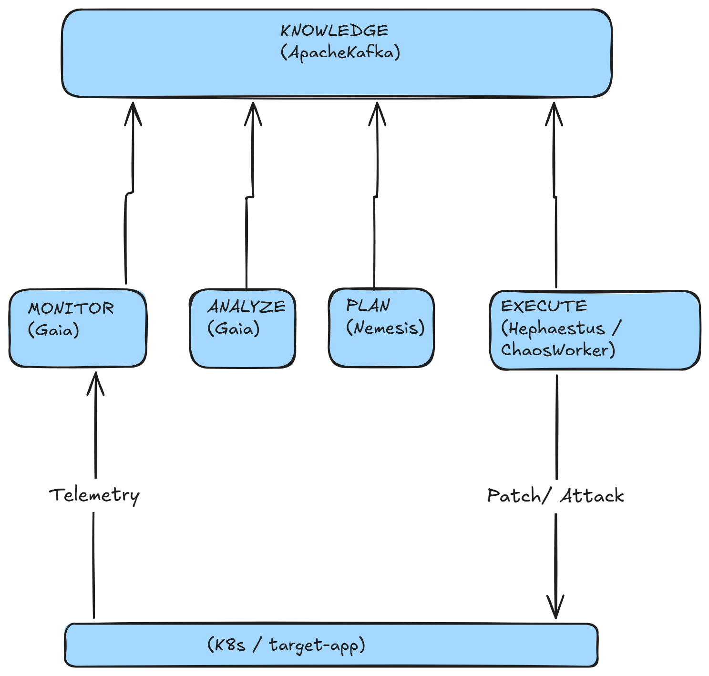
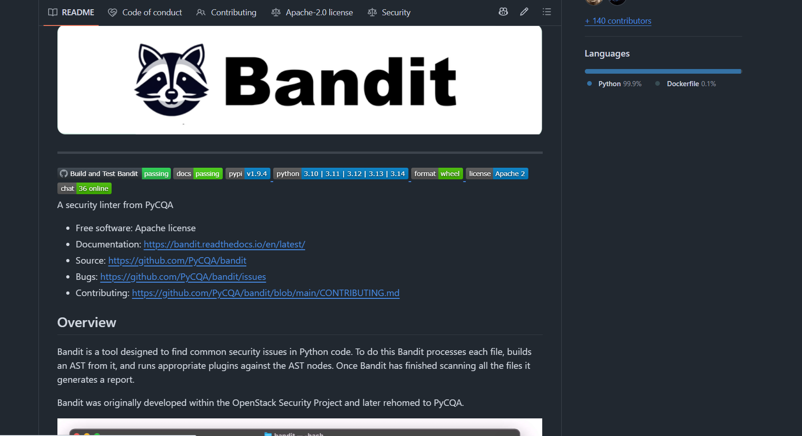
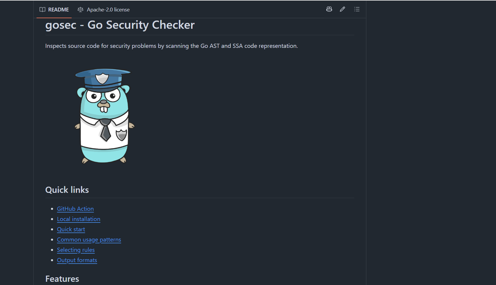
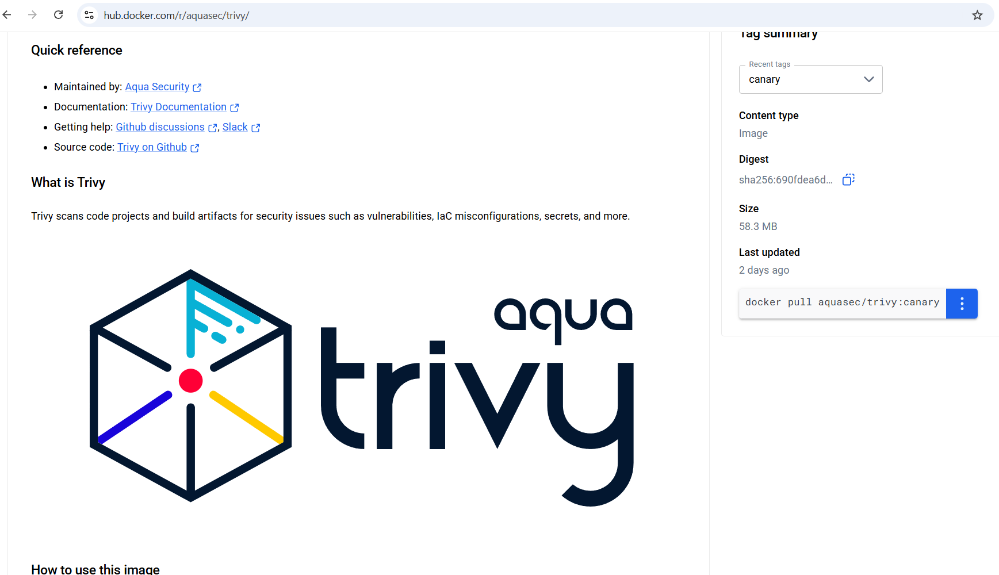

# CHƯƠNG 2: CƠ SỞ LÝ THUYẾT VÀ CÔNG NGHỆ LIÊN QUAN

## 2.1. Kiến trúc Microservices và Container Orchestration

### 2.1.1. So sánh kiến trúc nguyên khối (Monolith) và dịch vụ siêu nhỏ (Microservices)
Trong mô hình phát triển phần mềm truyền thống, kiến trúc nguyên khối (Monolith) tích hợp toàn bộ các thành phần chức năng (giao diện, logic xử lý, kết nối dữ liệu) vào một khối mã nguồn duy nhất và chạy chung trong một tiến trình hệ thống. Mô hình này ban đầu mang lại lợi thế về sự đơn giản trong triển khai và kiểm thử. 

Tuy nhiên, khi quy mô ứng dụng phình to, Monolith bộc lộ các hạn chế nghiêm trọng: thời gian build kéo dài, khó khăn trong việc áp dụng công nghệ mới do ràng buộc mã nguồn cũ, và đặc biệt là tính chịu lỗi kém – một lỗi nhỏ ở module này có thể làm sập toàn bộ tiến trình hệ thống (Single Point of Failure).

Hình 2.1: Kiến trúc Monolithic và Microservices

Kiến trúc dịch vụ siêu nhỏ (Microservices) giải quyết các bài toán trên bằng cách chia nhỏ hệ thống thành các dịch vụ độc lập. Mỗi dịch vụ chạy trong một tiến trình riêng biệt và giao tiếp phi trạng thái (stateless) thông qua môi trường mạng (HTTP REST, gRPC hoặc Message Broker). Nguyên lý cốt lõi của Microservices bao gồm:
*   **Decoupling (Phân rã liên kết):** Các dịch vụ có chu kỳ phát triển, kiểm thử và deploy hoàn toàn độc lập.
*   **Database per Service (Mỗi dịch vụ một cơ sở dữ liệu):** Ngăn chặn việc truy cập chéo dữ liệu trực tiếp, ép buộc các dịch vụ phải giao tiếp qua API sạch.
*   **Polyglot Programming (Đa ngôn ngữ lập trình):** Cho phép lựa chọn công nghệ tối ưu cho từng nghiệp vụ (ví dụ: Go cho dịch vụ xử lý song song cao, Python cho dịch vụ xử lý dữ liệu và AI, C# cho nghiệp vụ doanh nghiệp phức tạp).

### 2.1.2. Móng nền Containerization và Cơ chế cô lập của nhân Linux
Công nghệ container hóa đóng vai trò là xương sống giúp hiện thực hóa kiến trúc Microservices. Trái ngược với công nghệ ảo hóa truyền thống (Hypervisor-based Virtualization) vốn phải ảo hóa toàn bộ phần cứng và chạy một hệ điều hành khách (Guest OS) cồng kềnh, container chia sẻ trực tiếp nhân của hệ điều hành máy chủ (Host OS kernel). Sự cô lập giữa các container được nhân Linux thực thi thông qua hai cơ chế cốt lõi:
1.  **Namespaces (Không gian tên):** Cung cấp khả năng cô lập tài nguyên hệ thống ở cấp độ tiến trình. Các namespaces chính bao gồm:
    *   `PID Namespace`: Cô lập cây tiến trình (tiến trình trong container không thấy tiến trình của host).
    *   `NET Namespace`: Cô lập card mạng, bảng định tuyến và các cổng kết nối (ports).
    *   `MNT Namespace`: Cô lập các điểm mount ổ đĩa hệ thống.
    *   `IPC Namespace`: Cô lập các tài nguyên giao tiếp nội bộ giữa các tiến trình.
    *   `UTS Namespace`: Cô lập hostname và domain name.
    *   `USER Namespace`: Cô lập các định danh người dùng (UID/GID), cho phép một tiến trình có quyền root trong container nhưng chỉ là user thường ngoài host.
2.  **Control Groups (cgroups):** Quản lý và giới hạn tài nguyên phần cứng vật lý cấp phát cho container. Kỹ sư có thể đặt giới hạn cứng về lượng CPU (tính bằng cores hoặc millicores), dung lượng RAM (bytes), và tốc độ đọc/ghi ổ đĩa (I/O throughput) cho từng container, ngăn ngừa hiện tượng một container bị lỗi chiếm dụng hết tài nguyên của host (noisy neighbor).

### 2.1.3. Nền tảng điều phối Kubernetes (K8s) và Cơ chế định tuyến mạng
Kubernetes là một nền tảng nguồn mở dùng để tự động hóa việc triển khai, mở rộng quy mô và quản lý các container. Kiến trúc Kubernetes bao gồm hai phần chính: Control Plane (quản lý cụm) và Worker Nodes (nơi chạy ứng dụng).

Hình 2.2: Kubernetes architechture

*   **Kube-apiserver:** Cổng giao tiếp trung tâm expose REST API của K8s, tiếp nhận mọi yêu cầu cấu hình hạ tầng.
*   **Etcd:** Cơ sở dữ liệu key-value phân tán, lưu trữ toàn bộ trạng thái cấu hình của cụm.
*   **Kube-scheduler:** Tìm kiếm và chọn lựa Worker Node phù hợp nhất để đặt Pod mới dựa trên yêu cầu tài nguyên.
*   **Kube-controller-manager:** Chạy các tiến trình controller kiểm soát trạng thái cụm (như ReplicaSet Controller duy trì số lượng pod, Node Controller phát hiện node offline).
*   **Kubelet:** Agent chạy trên từng Worker Node, lắng nghe chỉ thị từ API Server để quản lý vòng đời container thông qua Container Runtime (như containerd).
*   **Kube-proxy:** Quản lý bảng định tuyến mạng nội bộ và thực thi cơ chế phân tải IPVS/IPTables để kết nối các Pods.
*   **Nginx Ingress Controller:** Lắng nghe cấu hình Ingress của cụm, tự động biên dịch các quy tắc routing mạng thành cấu hình của máy chủ Nginx, thực hiện nạp lại cấu hình (reload) động để dẫn luồng HTTP/HTTPS từ IP public vào đúng cổng của Service bên trong cụm.

## 2.2. Kỹ thuật Hỗn mang (Chaos Engineering)

### 2.2.1. Phân tích sâu các Nguyên tắc Chaos Engineering
Kỹ thuật hỗn mang không phải là hành động phá hoại ngẫu nhiên mà là một phương pháp khoa học có kiểm soát để kiểm thử độ bền hệ thống phân tán.
1.  **Xây dựng giả thuyết xung quanh trạng thái ổn định (Steady State):** Hệ thống được định nghĩa ổn định thông qua các chỉ số đo lường hiệu năng cốt lõi (SLIs - Service Level Indicators). Ví dụ, trong điều kiện tải bình thường, tỷ lệ lỗi phản hồi (Error Rate) phải $< 0.1\%$ và độ trễ phản hồi P99 phải $< 500ms$. Giả thuyết Chaos là: *"Khi lỗi X xảy ra, hệ thống vẫn duy trì các SLIs này trong giới hạn an toàn nhờ cơ chế tự phục hồi."*
2.  **Mô phỏng đa dạng sự cố thực tế:** Lỗi được tiêm phải tương ứng với các thảm họa có xác suất xảy ra cao trong vận hành thực tế như: cạn kiệt tài nguyên node, phân rã mạng nội bộ (network partition), mất kết nối cơ sở dữ liệu, hoặc ứng dụng bị tấn công quá tải.
3.  **Thử nghiệm trực tiếp trên Staging/Production:** Để đảm bảo tính chân thực của môi trường (vì môi trường dev local thường không có tải thật hoặc thiếu cấu hình network chính xác). Tuy nhiên, đối với đề tài nghiên cứu này, việc thử nghiệm được thực hiện trên cụm cục bộ K3d và môi trường Sandbox Cloud để kiểm soát rủi ro an ninh.
4.  **Tự động hóa chạy thử nghiệm liên tục:** Tích hợp Chaos Experiments vào quy trình CI/CD hoặc chạy định kỳ tự động giúp phát hiện lỗi cấu hình sai (configuration drift) ngay khi thay đổi mã nguồn được deploy.
5.  **Giảm thiểu tối đa vùng ảnh hưởng (Blast Radius):** Đây là nguyên tắc sống còn. Mọi cuộc thử nghiệm đều phải được thiết kế có chốt chặn an toàn (như giới hạn timeout tấn công, chỉ tấn công một container riêng biệt, và có cơ chế khôi phục tức thời nếu chỉ số SLIs tụt giảm quá ngưỡng cho phép).

### 2.2.2. Chi tiết các dạng tấn công ứng dụng trong đề tài
*   **DDoS HTTP Flood:** Gửi liên tiếp lượng lớn HTTP requests phi trạng thái đến ứng dụng đích. Việc này kiểm tra khả năng của Ingress Controller trong việc cân bằng tải và đánh giá tốc độ của cơ chế co giãn tự động (Horizontal Pod Autoscaler - HPA) khi CPU của pod frontend tăng vọt.
*   **CPU/Memory Stress:** Sử dụng stresser để tiêu hao RAM và CPU bên trong container. Lỗi này mô phỏng lỗi rò rỉ bộ nhớ (memory leak) hoặc lỗi vòng lặp vô hạn (infinite loop) trong code backend, ép buộc Kubernetes phải đưa ra quyết định phục hồi.
*   **Pod Kill:** Sử dụng K8s API để gửi tín hiệu `SIGKILL` (hoặc xóa đột ngột) pod đang xử lý request. Thử nghiệm này kiểm chứng xem Ingress có tự động gỡ bỏ pod chết ra khỏi danh sách upstream kịp thời hay không, hay người dùng sẽ nhận lỗi HTTP 502 Bad Gateway.

## 2.3. Kiến trúc Đa Tác tử (Multi-Agent Systems)

### 2.3.1. Mô hình kiến trúc Tác tử tự trị thông minh
Một tác tử thông minh hoạt động dựa trên vòng lặp tương tác liên tục với môi trường:

Hình 2.3: Mô hình Agent

*   **Cảm biến (Sensors):** Nơi tiếp nhận dữ liệu telemetry từ môi trường. Ở Gaia, cảm biến chính là các HTTP Client truy vấn Prometheus và Elasticsearch.
*   **Bộ não quyết định (Decision Engine):** Ở Nemesis, bộ não quyết định là các Prompt và LLM sinh kịch bản. Ở Hephaestus, đó là Ma trận quyết định bám sát các logic nghiệp vụ SRE.
*   **Cơ cấu thực thi (Actuators):** Các thư viện kết nối hạ tầng (như K8s API python-client, Kafka producer) để trực tiếp thay đổi trạng thái môi trường.

### 2.3.2. Mô hình hàn lâm MAPE-K Loop trong hệ thống tự thích ứng
Mô hình **MAPE-K** (Monitor - Analyze - Plan - Execute - Knowledge) là tiêu chuẩn học thuật của IBM dành cho các hệ thống tự trị và phần mềm tự thích ứng (Self-Adaptive Software):

Hình 2.4: Mô hình MAPE-K

*   **Monitor (Giám sát):** Thu thập telemetry từ target-app. Do Gaia đảm nhận thông qua việc cào dữ liệu metrics và logs.
*   **Analyze (Phân tích):** Gaia đối chiếu metrics với ngưỡng cảnh báo và rà soát logs tìm signature lỗi để xác định hệ thống có bị dị thường hay không.
*   **Plan (Lên kế hoạch):** Nemesis (khi tấn công) hoặc Hephaestus (khi phòng thủ) lập kế hoạch hành động tiếp theo.
*   **Execute (Thực thi):** Thực hiện thay đổi trạng thái thông qua K8s API (do Hephaestus thực hiện) hoặc tiêm lỗi (do Chaos Worker thực hiện).
*   **Knowledge (Tri thức):** Kafka đóng vai trò là kho lưu trữ trạng thái tri thức dùng chung phân tán, giúp các bước M-A-P-E chia sẻ thông tin phi trạng thái và phi đồng bộ một cách tức thời.

## 2.5. Quy trình DevSecOps và Tự động hóa hạ tầng (IaC)

### 2.5.1. Hạ tầng dạng mã (IaC - Terraform) và File State
Terraform hoạt động theo mô hình khai báo (Declarative). Kỹ sư DevOps chỉ cần mô tả trạng thái cuối mong muốn của hạ tầng đám mây (ví dụ: *"Tôi muốn có 1 máy ảo Ubuntu 8GB RAM và 1 Firewall đóng cổng 6443"*). Terraform tự động tính toán đồ thị phụ thuộc (dependency graph) giữa các tài nguyên và tương tác với API của Cloud Provider để tạo lập tài nguyên theo đúng thứ tự tối ưu.

Terraform quản lý tất cả các tài nguyên thông qua tệp tin trạng thái `terraform.tfstate`. Tệp tin này lưu trữ ánh xạ thực tế giữa các khai báo code HCL và ID tài nguyên thực tế trên Cloud. Khi có sự thay đổi code, Terraform thực hiện cơ chế so khớp (diff) giữa cấu hình mới, tệp state và trạng thái thực tế trên Cloud để chỉ cập nhật hoặc tạo mới những tài nguyên có sự thay đổi, giảm thiểu rủi ro gián đoạn hạ tầng sẵn có.

### 2.5.2. Công cụ quét tĩnh bảo mật (SAST) và Trivy Scan
*   **Bandit (SAST cho Python):** Sử dụng thư viện phân tích cú pháp trừu tượng (Abstract Syntax Trees - AST) của Python để chuyển đổi file code thành một sơ đồ cây logic. Bandit duyệt cây này để phát hiện các lỗ hổng an ninh kinh điển mà không cần chạy code thực tế, giúp loại bỏ các lỗi cơ bản ngay từ máy developer.

Hình 2.5: Bandit SAST cho Python

*   **Gosec (SAST cho Go):** Tương tự như Bandit, Gosec phân tích AST của mã nguồn Go để phát hiện lỗi bảo mật bộ nhớ, lỗi ép kiểu không an toàn, hoặc xử lý concurrency không đồng bộ dẫn đến race condition trong Chaos Worker.

Hình 2.6: Gosec SAST cho Golang

*   **Trivy (IaC Security Scan):** Trivy sử dụng bộ engine quét cấu hình dựa trên chính sách viết bằng ngôn ngữ **Rego** (Open Policy Agent - OPA). Trivy phân tích các tệp tin cấu hình Kubernetes Manifests để đối chiếu với hàng trăm quy tắc bảo mật chuẩn CIS Benchmarks (như đảm bảo `readOnlyRootFilesystem: true`, cấm sử dụng tag image `:latest` ở production, bắt buộc phải có `resources.limits`). Việc này chặn đứng các lỗ hổng cấu hình sai (misconfigurations) trước khi deploy lên cụm.

Hình 2.7: trivy cho Docker