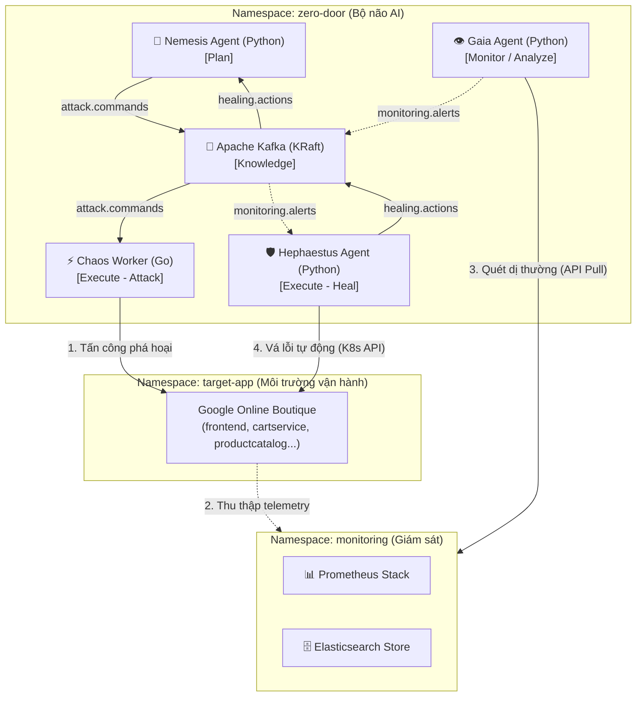

# CHƯƠNG 3: THIẾT KẾ KIẾN TRÚC HỆ THỐNG TỰ PHỤC HỒI ZERO DOOR

## 3.1. Phân tích Yêu cầu và Ràng buộc hệ thống

### 3.1.1. Yêu cầu phi chức năng và tính cô lập (Blast Radius)
Hệ thống tự phục hồi (Self-Healing) yêu cầu khả năng can thiệp trực tiếp vào tài nguyên vận hành của cụm Kubernetes (như xóa pod, chỉnh sửa replicas, tạo NetworkPolicy). Để ngăn ngừa rủi ro xảy ra lỗi dây chuyền hoặc phá hủy nhầm các thành phần cốt lõi của hạ tầng, hệ thống bắt buộc phải tuân thủ nghiêm ngặt nguyên tắc **Blast Radius Isolation** (Giới hạn vùng ảnh hưởng):
*   **Cô lập quyền hạn (RBAC):** Chaos Worker và Hephaestus chỉ được cấp quyền trong phạm vi namespace ứng dụng mục tiêu (`target-app`). Các API calls ra các namespace hệ thống (`kube-system`, `monitoring`, `zero-door`) phải bị API Server từ chối tuyệt đối.
*   **Xác thực tính an toàn (Blast Radius Validator):** Trước khi thực thi bất kỳ kịch bản tiêm lỗi nào, Chaos Worker phải kiểm tra nhãn (label) của namespace mục tiêu và địa chỉ đích. Mọi lệnh tấn công hướng vào các namespace không nằm trong danh sách an toàn (whitelist) phải bị từ chối ngay lập tức tại tầng mã nguồn của worker.

### 3.1.2. Ràng buộc về mặt tài nguyên (FinOps)
Môi trường phát triển ban đầu của đề tài được triển khai trên máy tính cá nhân Acer Nitro 5 với cấu hình 16GB RAM. Sau khi trừ đi tài nguyên hệ thống (OS, Chrome, IDE, Docker daemon), tổng dung lượng RAM thực tế khả dụng cho cụm Kubernetes cục bộ chỉ còn khoảng **8GB - 8.5GB**. 

Do đó, kiến trúc hệ thống Zero Door được thiết kế tối giản hóa tối đa về mặt tài nguyên:
*   Sử dụng cụm K3d với cấu hình tối giản: 1 Server node + 1 Agent node thay vì chạy nhiều nodes vật lý để tiết kiệm ~500MB RAM overhead.
*   Ứng dụng mục tiêu Google Online Boutique được rút gọn từ 11 xuống còn **6 dịch vụ cốt lõi** (`frontend`, `cartservice`, `productcatalogservice`, `currencyservice`, `checkoutservice`, `redis-cart`). Thiết lập resource limits chặt chẽ cho các pod ứng dụng ở mức `limits.memory: 256Mi`.
*   Chuyển đổi tech stack của 3 AI Agents tự trị từ Java Spring Boot (trung bình tiêu hao 300MB RAM mỗi agent khi chạy) sang **Python FastAPI** (chỉ tiêu hao từ **40MB - 50MB RAM** mỗi agent), giúp tiết kiệm hơn 1GB RAM tổng thể.

---

## 3.2. Thiết kế Kiến trúc tổng thể và các Phân vùng (Namespaces)

Hệ thống được thiết kế theo vòng lặp tự trị đóng kín (**MAPE-K Loop**: Monitor - Analyze - Plan - Execute - Knowledge) phân chia trên 3 phân vùng độc lập:



1.  **Namespace `zero-door`:** Nơi vận hành toàn bộ logic điều phối AI và bưu điện truyền tin Kafka.
2.  **Namespace `target-app`:** Môi trường cô lập chạy ứng dụng thương mại điện tử mục tiêu chịu sự tác động chéo của tác tử tấn công và tác tử phòng thủ.
3.  **Namespace `monitoring`:** Phân vùng an toàn chứa hệ thống Prometheus và Elasticsearch thu thập dữ liệu từ target-app để cung cấp cho Gaia phân tích.

---

## 3.3. Thiết kế Tác tử Nemesis (Red Team)

Nemesis đóng vai trò là kiến trúc sư trưởng của các kịch bản tấn công. Tác tử này hoạt động định kỳ theo vòng lặp truy vấn số liệu hiệu năng của hệ thống mục tiêu từ Prometheus.
*   **Phân tích bằng LLM:** Nemesis nạp dữ liệu CPU/RAM hiện tại của target-app vào Prompt Template được chuẩn hóa và gửi yêu cầu đến mô hình ngôn ngữ lớn (Gemini hoặc OpenAI). LLM chịu trách nhiệm phân tích điểm yếu (ví dụ: *"frontend đang bị quá tải CPU nhẹ"*) và đưa ra kịch bản tấn công tiếp theo để đẩy hệ thống đến giới hạn chịu đựng tối đa.
*   **Cơ chế Round-Robin API Keys:** Để giải quyết hạn chế về mặt chi phí và giới hạn số lần gọi API miễn phí (Rate Limit) cho sinh viên nghiên cứu, Nemesis được thiết kế module xoay vòng khóa API (Round-Robin). Hệ thống tự động chuyển sang khóa tiếp theo trong danh sách cấu hình sau mỗi lượt gọi để đảm bảo vòng lặp không bị đứt quãng.
*   **Cấu trúc Lệnh Tấn Công (Attack Command Schema):** Sau khi quyết định kịch bản, Nemesis đóng gói thành bản tin JSON gửi vào Kafka topic `attack.commands`:
    ```json
    {
      "commandId": "uuid-string",
      "attackType": "HTTP_FLOOD | CPU_STRESS | POD_KILL",
      "targetService": "frontend",
      "targetNamespace": "target-app",
      "parameters": {
        "duration": 30,
        "concurrency": 20,
        "intensity": "HIGH"
      }
    }
    ```

---

## 3.4. Thiết kế Chaos Worker (Go Executor)

Chaos Worker là thành phần thực thi lỗi trực tiếp, được viết bằng ngôn ngữ Go để đạt hiệu năng xử lý song song cao và tiết kiệm RAM tối đa.
*   **Bộ lọc Blast Radius Validator:** Trước khi xử lý bất kỳ command nào từ topic `attack.commands`, Worker chạy qua bộ lọc validation:
    *   Kiểm tra `targetNamespace` phải bằng `"target-app"`.
    *   Kiểm tra nhãn của namespace phải chứa `attack-target: "true"`.
    *   Nếu vi phạm, lệnh bị hủy bỏ ngay lập tức và gửi trạng thái `REJECTED` về Kafka topic `attack.results`.
*   **HTTP Flood Executor:** Spawn số lượng goroutines giới hạn bởi biến cấu hình `concurrency` (tối đa 50) để liên tục gửi HTTP GET/POST requests đến địa chỉ IP của frontend dịch vụ mục tiêu, giả lập tấn công DDoS tầng ứng dụng.
*   **CPU/Memory Stress Executor:** Tạo ra một K8s Pod tạm thời (stress-pod) chạy chương trình `stress-ng` đặt trực tiếp trong namespace `target-app` nhằm chiếm dụng tài nguyên CPU/RAM theo thời gian cấu hình, sau đó tự động dọn dẹp pod khi hết chu kỳ.
*   **Pod Kill Executor:** Gọi trực tiếp REST API của Kubernetes để xóa ngẫu nhiên một Pod thuộc deployment mục tiêu, giả lập lỗi crash đột ngột của dịch vụ.

---

## 3.5. Thiết kế Tác tử Gaia (Quan sát & Phát hiện)

Gaia đóng vai trò là cảm biến nhận diện dị thường của toàn hệ thống thông qua hai kênh dữ liệu:
*   **Giám sát Metrics (Prometheus Pull):** Gọi API `/api/v1/query` của Prometheus sau mỗi 15 giây để kiểm tra 5 chỉ số chính của các pod trong `target-app`: Tải CPU, dung lượng Memory sử dụng, tỷ lệ mã lỗi HTTP Ingress (5xx), thời gian phản hồi (latency), và số lần khởi động lại Pod (restart count).
*   **Phân tích Logs (Elasticsearch Search):** Thực hiện tìm kiếm các từ khóa dị thường hoặc dấu hiệu tấn công trong Access Logs lưu trữ tại Elasticsearch sau mỗi 15 giây. Gaia tìm kiếm các chuỗi mẫu nhạy cảm như: `OOMKilled` (hệ thống tự động kill pod do tràn RAM), `Exception`/`CRITICAL ERROR`, và các mẫu SQL Injection phổ biến (`UNION SELECT`, `OR '1'='1'`).
*   **Khử trùng lặp cảnh báo (Alert Deduplication):** Để tránh việc liên tục bắn cảnh báo rác (alert spamming) vào Kafka gây quá tải Hephaestus khi sự cố đang diễn ra, Gaia thiết lập thời gian làm nguội cảnh báo (Deduplication Cooldown) là **60 giây** cho cùng một cặp dịch vụ và loại lỗi.

---

## 3.6. Thiết kế Tác tử Hephaestus (Blue Team)

Hephaestus là tác tử đưa ra quyết định khắc phục sự cố và trực tiếp gọi API của cụm Kubernetes để khôi phục trạng thái ổn định cho hệ thống mục tiêu.

### 3.6.1. Ma trận quyết định (Decision Matrix)
Hephaestus ánh xạ các cảnh báo nhận được từ Kafka topic `monitoring.alerts` sang hành động cụ thể thông qua bảng quyết định logic:

| Loại Cảnh Báo | Mức Độ | Hành Động Phục Hồi | Lý do lựa chọn |
| :--- | :--- | :--- | :--- |
| `HIGH_CPU` | WARNING | **`SCALE_UP`** | Tăng tài nguyên tính toán để phân tải lưu lượng. |
| `HIGH_CPU` | CRITICAL | **`RESTART`** | Tiêu diệt tiến trình bị rò rỉ hoặc treo đơ CPU. |
| `HIGH_MEMORY` | WARNING/CRITICAL | **`RESTART`** | Restart để giải phóng bộ nhớ bị rò rỉ (leak). |
| `HIGH_ERROR_RATE` | CRITICAL | **`ROLLBACK`** | Đưa ứng dụng về phiên bản cũ ổn định trước đó. |
| `POD_CRASH` | WARNING/CRITICAL | **`RESTART`** | Force delete pod bị lỗi để K8s lập tức tạo lại pod sạch. |
| `SUSPICIOUS_LOG` | CRITICAL | **`BLOCK_IP`** | Chặn tức thời địa chỉ IP nguồn đang gửi mã độc. |

### 3.6.2. Cơ chế làm nguội cứu hộ (Healing Cooldown)
Khi một hành động cứu hộ (ví dụ: `SCALE_UP` frontend) được kích hoạt, Hephaestus thiết lập thời gian khóa (Cooldown) là **90 giây**. Trong thời gian này, tất cả các cảnh báo trùng lặp hướng vào frontend yêu cầu scale-up sẽ bị từ chối. 

Thời gian 90 giây là khoảng trống kỹ thuật bắt buộc để Pod mới có thời gian khởi động, tải thư viện và tham gia nhận tải mạng, đồng thời để Prometheus scrape chu kỳ mới và ghi nhận tải hệ thống giảm xuống, ngăn chặn việc scale-up vô hạn hoặc restart pod liên tục (thrashing).
