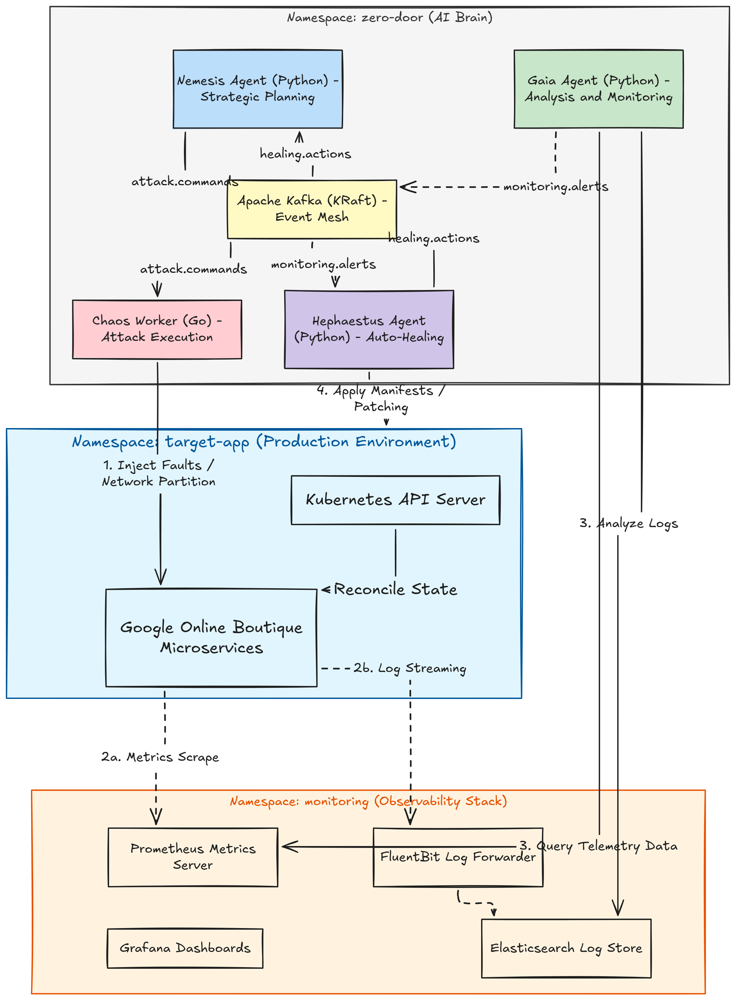
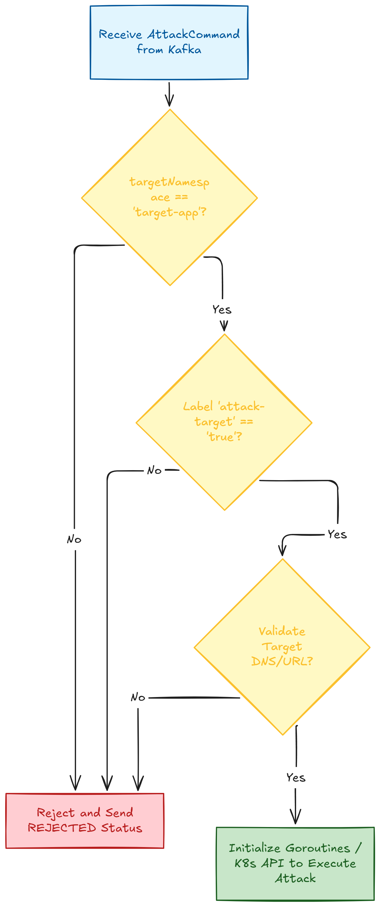

# CHƯƠNG 3: THIẾT KẾ KIẾN TRÚC HỆ THỐNG TỰ PHỤC HỒI ZERO DOOR

## 3.1. Phân tích Yêu cầu và Ràng buộc hệ thống

### 3.1.1. Phân tích yêu cầu chức năng (Functional Requirements)
Hệ thống tự phục hồi tự trị Zero Door được thiết kế để giải quyết toàn bộ quy trình ứng cứu sự cố không cần sự can thiệp của con người. Các yêu cầu chức năng cốt lõi bao gồm:
*   **Yêu cầu 1 (Tấn công mô phỏng):** Tác tử Nemesis phải có khả năng lập kế hoạch tấn công thông qua việc phân tích dữ liệu telemetry của cụm K8s và gọi LLM để đưa ra kịch bản. Chaos Worker phải thực thi chính xác 3 dạng lỗi: HTTP Flood, CPU/Memory Stress, và Pod Kill.
*   **Yêu cầu 2 (Giám sát dị thường):** Tác tử Gaia phải tự động truy vấn dữ liệu từ Prometheus Server và Elasticsearch Server theo chu kỳ 15 giây, phân tích các chỉ số CPU, Memory, Latency, Error Rate và phát hiện các chuỗi tấn công SQL Injection trong logs.
*   **Yêu cầu 3 (Vá lỗi tự trị):** Tác tử Hephaestus phải tự động đối chiếu các cảnh báo nhận được từ Gaia với ma trận quyết định để gọi Kubernetes API thực thi các hành động khắc phục tương ứng.
*   **Yêu cầu 4 (Minh bạch thông tin):** Giao diện Control Dashboard phải hiển thị trực quan các log hoạt động của các tác tử, hiển thị chuỗi hội thoại suy luận của AI (Reasoning logs) và cung cấp cơ chế reset môi trường kiểm thử về trạng thái ban đầu.

### 3.1.2. Yêu cầu phi chức năng và tính cô lập (Blast Radius)
Hệ thống tự phục hồi (Self-Healing) yêu cầu khả năng can thiệp trực tiếp vào tài nguyên vận hành của cụm Kubernetes (như xóa pod, chỉnh sửa replicas, tạo NetworkPolicy). Để ngăn ngừa rủi ro xảy ra lỗi dây chuyền hoặc phá hủy nhầm các thành phần cốt lõi của hạ tầng, hệ thống bắt buộc phải tuân thủ nghiêm ngặt nguyên tắc **Blast Radius Isolation** (Giới hạn vùng ảnh hưởng):
*   **Cô lập quyền hạn (RBAC):** Chaos Worker và Hephaestus chỉ được cấp quyền trong phạm vi namespace ứng dụng mục tiêu (`target-app`). Các API calls ra các namespace hệ thống (`kube-system`, `monitoring`, `zero-door`) phải bị API Server từ chối tuyệt đối.
*   **Xác thực tính an toàn (Blast Radius Validator):** Trước khi thực thi bất kỳ kịch bản tiêm lỗi nào, Chaos Worker phải kiểm tra nhãn (label) của namespace mục tiêu và địa chỉ đích. Mọi lệnh tấn công hướng vào các namespace không nằm trong danh sách an toàn (whitelist) phải bị từ chối ngay lập tức tại tầng mã nguồn của worker.

### 3.1.3. Ràng buộc về mặt tài nguyên (FinOps)
Môi trường phát triển ban đầu của đề tài được triển khai trên máy tính cá nhân Acer Nitro 5 với cấu hình 16GB RAM. Sau khi trừ đi tài nguyên hệ thống (OS, Chrome, IDE, Docker daemon), tổng dung lượng RAM thực tế khả dụng cho cụm Kubernetes cục bộ chỉ còn khoảng **8GB - 8.5GB**. 

Do đó, kiến trúc hệ thống Zero Door được thiết kế tối giản hóa tối đa về mặt tài nguyên:
*   Sử dụng cụm K3d với cấu hình tối giản: 1 Server node + 1 Agent node thay vì chạy nhiều nodes vật lý để tiết kiệm ~500MB RAM overhead.
*   Ứng dụng mục tiêu Google Online Boutique được rút gọn từ 11 xuống còn **6 dịch vụ cốt lõi** (`frontend`, `cartservice`, `productcatalogservice`, `currencyservice`, `checkoutservice`, `redis-cart`). Thiết lập resource limits chặt chẽ cho các pod ứng dụng ở mức `limits.memory: 256Mi`.
*   Chuyển đổi tech stack của 3 AI Agents tự trị từ Java Spring Boot (trung bình tiêu hao 300MB RAM mỗi agent khi chạy) sang **Python FastAPI** (chỉ tiêu hao từ **40MB - 50MB RAM** mỗi agent), giúp tiết kiệm hơn 1GB RAM tổng thể.


## 3.2. Thiết kế Kiến trúc tổng thể và các Phân vùng (Namespaces)

Hệ thống được thiết kế theo vòng lặp tự trị đóng kín (**MAPE-K Loop**: Monitor - Analyze - Plan - Execute - Knowledge) phân chia trên 3 phân vùng độc lập:

Hình 3.1: Sơ đồ kiến trúc tổng thể và phân vùng

1.  **Namespace `zero-door`:** Nơi vận hành toàn bộ logic điều phối AI và bưu điện truyền tin Kafka.
2.  **Namespace `target-app`:** Môi trường cô lập chạy ứng dụng thương mại điện tử mục tiêu chịu sự tác động chéo của tác tử tấn công và tác tử phòng thủ.
3.  **Namespace `monitoring`:** Phân vùng an toàn chứa hệ thống Prometheus và Elasticsearch thu thập dữ liệu từ target-app để cung cấp cho Gaia phân tích.

### 3.2.1. Thiết kế Schema các bản tin trao đổi trong cụm (Kafka Topics)
Các Agent giao tiếp phi đồng bộ thông qua 5 Kafka topics cốt lõi với cấu trúc JSON được chuẩn hóa:

1.  **Topic `attack.commands`:** Nemesis gửi lệnh tấn công cho Chaos Worker.
    ```json
    {
      "commandId": "uuid-string",
      "timestamp": "ISO-8601-datetime",
      "attackType": "HTTP_FLOOD | CPU_STRESS | POD_KILL",
      "targetService": "frontend | cartservice",
      "targetNamespace": "target-app",
      "parameters": {
        "durationSec": 30,
        "concurrency": 20,
        "intensity": "LOW | HIGH"
      }
    }
    ```
2.  **Topic `attack.results`:** Chaos Worker phản hồi kết quả thực thi cuộc tấn công cho Nemesis.
    ```json
    {
      "commandId": "uuid-string",
      "status": "SUCCESS | FAILED | REJECTED",
      "requestsSent": 15430,
      "errorMessage": "string (nếu failed/rejected)"
    }
    ```
3.  **Topic `monitoring.alerts`:** Gaia gửi cảnh báo dị thường phát hiện được cho Hephaestus.
    ```json
    {
      "alertId": "uuid-string",
      "timestamp": "ISO-8601-datetime",
      "severity": "WARNING | CRITICAL",
      "type": "HIGH_CPU | HIGH_MEMORY | HIGH_ERROR_RATE | POD_CRASH | SUSPICIOUS_LOG",
      "affectedService": "frontend",
      "affectedNamespace": "target-app",
      "description": "OOMKilled event detected in logs",
      "suggestedAction": "RESTART | SCALE_UP | ROLLBACK | BLOCK_IP",
      "sourceIP": "192.168.1.100 (chỉ có khi bị attack)"
    }
    ```
4.  **Topic `healing.actions`:** Hephaestus ghi nhật ký cứu hộ phục vụ cho kiểm toán (audit log).
    ```json
    {
      "healingId": "uuid-string",
      "timestamp": "ISO-8601-datetime",
      "triggerAlertId": "uuid-string",
      "action": "SCALE_UP | RESTART | ROLLBACK | BLOCK_IP",
      "target": {
        "namespace": "target-app",
        "resource": "frontend"
      },
      "status": "SUCCESS | FAILED | PARTIAL",
      "details": {
        "previousState": "1 replicas",
        "newState": "2 replicas",
        "durationMs": 1010
      }
    }
    ```
5.  **Topic `system.logs`:** Ghi nhận logs hoạt động tập trung của cả 3 agents để đẩy lên Dashboard điều khiển.


## 3.3. Thiết kế Tác tử Nemesis (Red Team)

Nemesis đóng vai trò là kiến trúc sư trưởng của các kịch bản tấn công. Tác tử này hoạt động định kỳ theo vòng lặp truy vấn số liệu hiệu năng của hệ thống mục tiêu từ Prometheus.
*   **Phân tích bằng LLM:** Nemesis nạp dữ liệu CPU/RAM hiện tại của target-app vào Prompt Template được chuẩn hóa và gửi yêu cầu đến mô hình ngôn ngữ lớn (Gemini hoặc OpenAI). LLM chịu trách nhiệm phân tích điểm yếu (ví dụ: *"frontend đang bị quá tải CPU nhẹ"*) và đưa ra kịch bản tấn công tiếp theo để đẩy hệ thống đến giới hạn chịu đựng tối đa.
*   **Cơ chế Round-Robin API Keys:** Để giải quyết hạn chế về mặt chi phí và giới hạn số lần gọi API miễn phí (Rate Limit) cho sinh viên nghiên cứu, Nemesis được thiết kế module xoay vòng khóa API (Round-Robin). Hệ thống tự động chuyển sang khóa tiếp theo trong danh sách cấu hình sau mỗi lượt gọi để đảm bảo vòng lặp không bị đứt quãng.

### 3.3.1. Thiết kế Prompt Template cho Nemesis
Để đảm bảo LLM phản hồi đúng định dạng JSON và đưa ra các suy luận an ninh chính xác, Nemesis sử dụng hai lớp Prompts:

**System Prompt (Quy định vai trò):**
```
Bạn là một kỹ sư kiểm thử bảo mật chuyên nghiệp (Red Team Leader) hệ thống Kubernetes.
Nhiệm vụ của bạn là phân tích các chỉ số CPU, RAM, lỗi HTTP của ứng dụng mục tiêu được cung cấp bởi Prometheus để đưa ra kịch bản tấn công thông minh nhất giúp đẩy hệ thống đến giới hạn tải.
Bạn CHỈ được phép phản hồi dưới dạng JSON hợp lệ tuân thủ đúng Schema sau:
{
  "reasoning": "giải trình lý do chọn tấn công dịch vụ này",
  "attackType": "HTTP_FLOOD" hoặc "CPU_STRESS" hoặc "POD_KILL",
  "targetService": "frontend" hoặc "cartservice",
  "durationSec": số nguyên từ 10 đến 60,
  "intensity": "LOW" hoặc "HIGH"
}
Không viết thêm bất kỳ đoạn text giải thích nào ngoài JSON.
```

**User Prompt (Truyền tải trạng thái hệ thống thực tế):**
```
Dưới đây là thông số hiệu năng hiện tại của cụm Kubernetes target-app:
- Dịch vụ 'frontend': CPU load là {frontend_cpu} cores, Memory là {frontend_mem} MB, Ingress Error Rate là {frontend_errors}%.
- Dịch vụ 'cartservice': CPU load là {cart_cpu} cores, Memory là {cart_mem} MB.
Hãy đưa ra quyết định tấn công tiếp theo.
```


## 3.4. Thiết kế Chaos Worker (Go Executor)

Chaos Worker là thành phần thực thi lỗi trực tiếp, được viết bằng ngôn ngữ Go để đạt hiệu năng xử lý song song cao và tiết kiệm RAM tối đa.

### 3.4.1. Thiết kế luồng xử lý của bộ lọc Blast Radius Validator
Mọi cuộc tấn công đều phải được kiểm duyệt thông qua biểu đồ logic sau:



Hình 3.2: Thiết kế luồng xử lý bộ lọc Blast Radius Validator

Bộ lọc này đảm bảo rằng ngay cả khi mô hình LLM bị lỗi và trả về tham số phá hủy các namespace quan trọng (như `kube-system` hay `monitoring`), Chaos Worker vẫn sẽ ngăn chặn cuộc tấn công ở mức mã nguồn của Go client trước khi gửi yêu cầu lên K8s API Server.

### 3.4.2. Thiết kế Cơ chế tiêm lỗi CPU/Memory Stress
Thay vì chạy các luồng tiêu hao CPU trực tiếp trên máy chủ vật lý (điều này có thể làm sập hệ thống điều khiển của K8s), Chaos Worker thiết kế cơ chế **stressor cô lập**:
1.  Worker gọi API của Kubernetes để tạo mới một Pod độc lập tên là `stress-pod-<uuid>` trực tiếp trong namespace `target-app`.
2.  Pod này chạy image `polinux/stress-ng` với cấu hình giới hạn tài nguyên nghiêm ngặt (ví dụ: `resources.limits.cpu: 200m`).
3.  Pod thực thi lệnh tiêu hao CPU (`stress-ng --cpu 2 --timeout 30s`).
4.  Khi hết thời gian timeout, Chaos Worker tự động phát lệnh gọi API xóa bỏ stress-pod để dọn dẹp môi trường.
5.  Giải pháp này đảm bảo việc stress CPU chỉ ăn vào hạn mức Quota của namespace `target-app` mà không gây ảnh hưởng chéo (no collateral damage) sang các namespace khác của hệ thống.


## 3.5. Thiết kế Tác tử Gaia (Quan sát & Phát hiện)

Gaia đóng vai trò là cảm biến nhận diện dị thường của toàn hệ thống thông qua hai kênh dữ liệu:
*   **Giám sát Metrics (Prometheus Pull):** Gọi API `/api/v1/query` của Prometheus sau mỗi 15 giây để kiểm tra 5 chỉ số chính của các pod trong `target-app`: Tải CPU, dung lượng Memory sử dụng, tỷ lệ mã lỗi HTTP Ingress (5xx), thời gian phản hồi (latency), và số lần khởi động lại Pod (restart count).
*   **Phân tích Logs (Elasticsearch Search):** Thực hiện tìm kiếm các từ khóa dị thường hoặc dấu hiệu tấn công trong Access Logs lưu trữ tại Elasticsearch sau mỗi 15 giây.
*   **Khử trùng lặp cảnh báo (Alert Deduplication):** Để tránh việc liên tục bắn cảnh báo rác (alert spamming) vào Kafka gây quá tải Hephaestus khi sự cố đang diễn ra, Gaia thiết lập thời gian làm nguội cảnh báo (Deduplication Cooldown) là **60 giây** cho cùng một cặp dịch vụ và loại lỗi.

### 3.5.1. Thiết kế Query tìm kiếm tấn công SQL Injection trên Elasticsearch
Gaia định kỳ gửi yêu cầu POST tìm kiếm đến Elasticsearch sử dụng cấu trúc Lucene Query DSL để lọc Access Logs:
```json
{
  "query": {
    "bool": {
      "must": [
        { "term": { "kubernetes.namespace_name": "target-app" } },
        {
          "bool": {
            "should": [
              { "match_phrase": { "log": "UNION SELECT" } },
              { "match_phrase": { "log": "OR '1'='1'" } },
              { "match_phrase": { "log": "OOMKilled" } }
            ]
          }
        }
      ],
      "filter": {
        "range": {
          "@timestamp": {
            "gte": "now-30s"
          }
        }
      }
    }
  }
}
```
*Giải thích:* Việc thiết lập `@timestamp: now-30s` (gấp đôi chu kỳ quét 15 giây của Gaia) giúp ngăn chặn việc mất log do độ trễ truyền dữ liệu (latency) của Fluent Bit khi đẩy logs về Elasticsearch.


## 3.6. Thiết kế Tác tử Hephaestus (Blue Team)

Hephaestus là tác tử đưa ra quyết định khắc phục sự cố và trực tiếp gọi API của cụm Kubernetes để khôi phục trạng thái ổn định cho hệ thống mục tiêu.

### 3.6.1. Ma trận quyết định (Decision Matrix)
Hephaestus ánh xạ các cảnh báo nhận được từ Kafka topic `monitoring.alerts` sang hành động cụ thể thông qua bảng quyết định logic:

| Loại Cảnh Báo | Mức Độ | Hành Động Phục Hồi | Lý do lựa chọn |
| :--- | :--- | :--- | :--- |
| `HIGH_CPU` | WARNING | **`SCALE_UP`** | Tăng tài nguyên tính toán để phân tải lưu lượng. |
| `HIGH_CPU` | CRITICAL | **`RESTART`** | Tiêu diệt tiến trình bị rò rỉ hoặc treo đơ CPU. |
| `HIGH_MEMORY` | WARNING/CRITICAL | **`RESTART`** | Restart để giải phóng bộ nhớ bị rò rỉ (leak). |
| `HIGH_ERROR_RATE` | CRITICAL | **`ROLLBACK`** | Đưa ứng dụng về phiên bản cũ ổn định trước đó. |
| `POD_CRASH` | WARNING/CRITICAL | **`RESTART`** | Force delete pod bị lỗi để K8s lập tức tạo lại pod sạch. |
| `SUSPICIOUS_LOG` | CRITICAL | **`BLOCK_IP`** | Chặn tức thời địa chỉ IP nguồn đang gửi mã độc. |

### 3.6.2. Cơ chế làm nguội cứu hộ (Healing Cooldown)
Khi một hành động cứu hộ (ví dụ: `SCALE_UP` frontend) được kích hoạt, Hephaestus thiết lập thời gian khóa (Cooldown) là **90 giây**. Trong thời gian này, tất cả các cảnh báo trùng lặp hướng vào frontend yêu cầu scale-up sẽ bị từ chối. 

Thời gian 90 giây là khoảng trống kỹ thuật bắt buộc để Pod mới có thời gian khởi động, tải thư viện và tham gia nhận tải mạng, đồng thời để Prometheus scrape chu kỳ mới và ghi nhận tải hệ thống giảm xuống, ngăn chặn việc scale-up vô hạn hoặc restart pod liên tục (thrashing).

### 3.6.3. Thiết kế Dynamic NetworkPolicy cho hành động BLOCK_IP
Hành động `BLOCK_IP` được thiết kế để tự động sinh ra một tường lửa cô lập IP nguồn tấn công mà không làm ảnh hưởng đến người dùng sạch khác. Khi Gaia báo cáo có SQL Injection kèm IP nguồn:
1.  Hephaestus gọi API tạo mới một resource `NetworkPolicy` có tên dạng `block-frontend-<id>`.
2.  Mã nguồn cấu hình Network Policy được sinh động như sau:
    ```yaml
    apiVersion: networking.k8s.io/v1
    kind: NetworkPolicy
    metadata:
      name: block-frontend-a1b2c3d4
      namespace: target-app
      labels:
        hephaestus.io/managed: "true"
      annotations:
        hephaestus.io/expires-at: "ISO-8601-datetime" # Lưu thời gian tự hủy
    spec:
      podSelector:
        matchLabels:
          app: frontend
      policyTypes:
        - Ingress
      ingress:
        - from:
            - ipBlock:
                cidr: 0.0.0.0/0
                except:
                  - 192.168.1.100/32 # Chặn IP của kẻ tấn công
    ```
3.  Để ngăn việc chặn IP vô hạn (gây cạn kiệt tài nguyên mạng và ảnh hưởng nếu kẻ tấn công đổi IP), Hephaestus thiết lập một Asyncio task trong bộ nhớ tự động phát lệnh gọi API xóa bỏ NetworkPolicy này sau **300 giây (5 phút)**.
