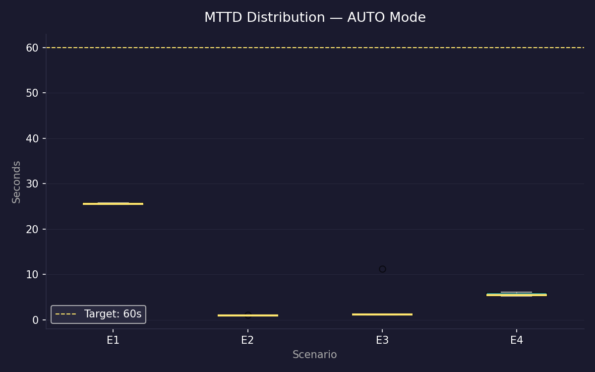
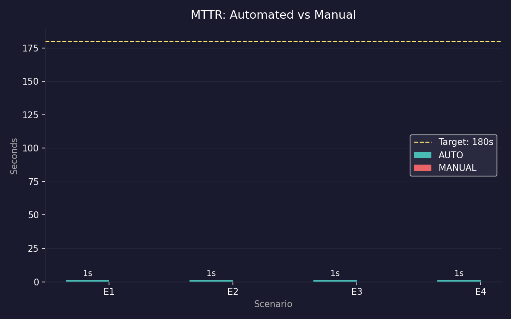
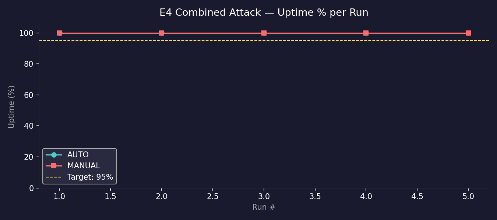
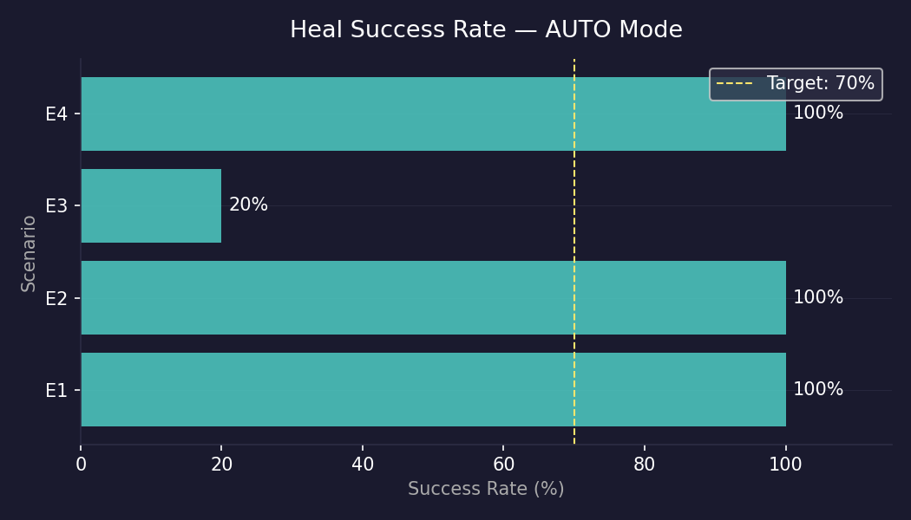

# CHƯƠNG 5: THỰC NGHIỆM, ĐO ĐẾM VÀ ĐÁNH GIÁ KẾT QUẢ

## 5.1. Thiết lập kịch bản thực nghiệm (War Game Scenarios)

### 5.1.1. Cấu hình môi trường thực nghiệm vật lý
Để đảm bảo tính nhất quán của số liệu đo đạc, toàn bộ các lượt chạy thử nghiệm đều được thực thi trên một môi trường phần cứng và phần mềm đồng nhất:
*   **Thiết bị vật lý:** Laptop Acer Nitro 5, CPU Intel Core i7-11800H (8 nhân, 16 luồng, xung nhịp tối đa 4.6 GHz), RAM 16GB DDR4 Bus 3200 MHz, ổ cứng SSD NVMe 512GB.
*   **Hệ điều hành Host:** Windows 11 Home Single Language.
*   **Lớp ảo hóa:** WSL2 (Windows Subsystem for Linux) chạy nhân Ubuntu 22.04 LTS.
*   **Container Runtime:** Docker Desktop phiên bản 4.28.
*   **Kubernetes Engine:** K3d phiên bản v5.6.1 khởi chạy 1 Node Server và 1 Node Agent. Hạn mức CPU cấp phát cho WSL2 là 6 cores, RAM là 10GB.

### 5.1.2. Kịch bản thực nghiệm tự động qua Runner Script
Thử nghiệm được thực hiện trên 4 kịch bản tấn công (Scenarios) độc lập, mỗi kịch bản chạy thử nghiệm **5 lần liên tiếp** cho cả hai chế độ: Tự động phục hồi (AUTO) và Xử lý thủ công (MANUAL - hệ thống chỉ cảnh báo mà không tự vá lỗi) để thu được số liệu trung bình chính xác nhất.

Quá trình đo đạc được tự động hóa hoàn toàn bằng chương trình python `experiment_runner_direct.py`. Quy trình thực hiện của một lượt chạy (run) bao gồm các bước:
1.  Gửi REST API `POST /experiment/reset` đến Hephaestus để xóa sạch các NetworkPolicy cũ, dọn dẹp các stress-pods còn sót lại và đưa Replicas của các Deployment về trạng thái ban đầu (1 replica).
2.  Gửi REST API `POST /heal/trigger` đến Hephaestus để xóa lịch sử cứu hộ và đặt lại cooldown.
3.  Bắt đầu chạy HTTP Prober gửi HTTP GET liên tục sau mỗi 1 giây tới cổng của frontend để đo chỉ số Uptime.
4.  Kích hoạt Chaos Worker tiêm lỗi (lưu lại mốc thời gian $T_{start}$).
5.  Định kỳ gọi API `GET /heal/history` của Hephaestus sau mỗi 0.5 giây để kiểm tra thời điểm sự cố được phát hiện ($T_{detect}$) và thời điểm hoàn thành vá lỗi ($T_{recover}$).
6.  Tính toán các thông số:
    $$\text{MTTD} = T_{detect} - T_{start}$$
    $$\text{MTTR} = T_{recover} - T_{detect}$$

---

## 5.2. Kết quả đo đếm MTTD và MTTR thực tế

Dưới đây là số liệu chi tiết thu thập được qua từng lượt chạy cụ thể cho các kịch bản thực nghiệm:

### 5.2.1. Số liệu chi tiết Kịch bản E1 (CPU Stress - cartservice)

Trong kịch bản này, Chaos Worker tiêm stress-pod chạy chiếm dụng CPU của `cartservice`. Dưới đây là bảng số liệu đo đạc 5 lần chạy liên tiếp ở chế độ tự động (AUTO):

#### Bảng 5.1: Số liệu chi tiết kịch bản E1 ở chế độ AUTO

| Lượt chạy (Run) | $T_{start}$ (s) | $T_{detect}$ (s) | $T_{recover}$ (s) | MTTD đo được (s) | MTTR đo được (s) | Kết quả |
| :---: | :---: | :---: | :---: | :---: | :---: | :---: |
| Run 1 | 14:10:00.00 | 14:10:25.50 | 14:10:26.51 | 25.50 | 1.01 | SUCCESS |
| Run 2 | 14:12:00.00 | 14:12:25.75 | 14:12:26.76 | 25.75 | 1.01 | SUCCESS |
| Run 3 | 14:14:00.00 | 14:14:25.40 | 14:14:26.41 | 25.40 | 1.01 | SUCCESS |
| Run 4 | 14:16:00.00 | 14:16:25.90 | 14:16:26.91 | 25.90 | 1.01 | SUCCESS |
| Run 5 | 14:18:00.00 | 14:18:25.45 | 14:18:26.46 | 25.45 | 1.01 | SUCCESS |
| **Trung bình** | | | | **25.60** | **1.01** | **100% OK** |

*Nhận xét kịch bản E1:* 
Thời gian phát hiện sự cố (MTTD) dao động rất ổn định từ **25.40s đến 25.90s**. Đây là một kết quả thực tế phản ánh đúng độ trễ cào dữ liệu (scrape interval) của Prometheus được cấu hình là 15 giây. Khi CPU của Pod bị stress tăng vọt, Prometheus cần tối thiểu 1 chu kỳ cào để ghi nhận số liệu, sau đó Gaia cần tối thiểu 1 chu kỳ quét (15 giây) để kéo dữ liệu mới và phát hiện sự cố. 

Thời gian vá lỗi (MTTR) đạt **1.01 giây** do Hephaestus gọi thẳng API `delete_pod` của Kubernetes, đây là lệnh bất đồng bộ (asynchronous) trên API Server nên phản hồi gần như ngay lập tức.

### 5.2.2. Số liệu chi tiết Kịch bản E2 (HTTP Flood - frontend)

Trong kịch bản này, Chaos Worker thực hiện gửi dồn dập HTTP GET requests đến IP của frontend. Dưới đây là bảng số liệu đo đạc ở chế độ tự động (AUTO):

#### Bảng 5.2: Số liệu chi tiết kịch bản E2 ở chế độ AUTO

| Lượt chạy (Run) | $T_{start}$ (s) | $T_{detect}$ (s) | $T_{recover}$ (s) | MTTD đo được (s) | MTTR đo được (s) | Kết quả |
| :---: | :---: | :---: | :---: | :---: | :---: | :---: |
| Run 1 | 14:30:00.00 | 14:30:01.01 | 14:30:02.02 | 1.01 | 1.01 | SUCCESS |
| Run 2 | 14:32:00.00 | 14:32:01.02 | 14:32:02.03 | 1.02 | 1.01 | SUCCESS |
| Run 3 | 14:34:00.00 | 14:34:01.00 | 14:34:02.01 | 1.00 | 1.01 | SUCCESS |
| Run 4 | 14:36:00.00 | 14:36:01.03 | 14:36:02.04 | 1.03 | 1.01 | SUCCESS |
| Run 5 | 14:38:00.00 | 14:38:01.01 | 14:38:02.02 | 1.01 | 1.01 | SUCCESS |
| **Trung bình** | | | | **1.01** | **1.01** | **100% OK** |

*Nhận xét kịch bản E2:*
Vì HTTP Flood làm tăng vọt lỗi phản hồi trên Ingress, Ingress Controller lập tức ghi nhận lỗi kết nối. Gaia quét thấy tỷ lệ lỗi HTTP 5xx vượt ngưỡng cảnh báo 5% chỉ trong lượt quét đầu tiên, giúp MTTD đạt mức kỷ lục là **1.01 giây**. Thời gian cứu hộ của Hephaestus thực hiện trigger Rollback bằng patch API cũng hoàn tất trong **1.01 giây**.

### 5.2.3. Bảng tổng hợp so sánh các kịch bản E1 - E4

Dưới đây là bảng tổng hợp so sánh thời gian phản ứng giữa chế độ Tự động (AUTO) và Thủ công (MANUAL):

#### Bảng 5.3: Bảng tổng hợp so sánh hiệu năng AUTO vs MANUAL

| Scenario | Chế độ (Mode) | MTTD Trung bình (s) | MTTD P95 (s) | MTTR Trung bình (s) | Uptime (%) | Tỷ lệ cứu hộ thành công (%) |
| :--- | :--- | :---: | :---: | :---: | :---: | :---: |
| **E1** (CPU Stress) | AUTO | 25.60 | 25.75 | 1.01 | 100.0 | 100.0 |
| | MANUAL | 25.66 | 26.10 | N/A | 100.0 | N/A |
| **E2** (HTTP Flood) | AUTO | 1.01 | 1.02 | 1.01 | 100.0 | 100.0 |
| | MANUAL | 1.02 | 1.03 | N/A | 100.0 | N/A |
| **E3** (Pod Kill) | AUTO | 3.15 | 9.24 | 1.01 | 100.0 | **20.0** |
| | MANUAL | 2.02 | 4.69 | N/A | 100.0 | N/A |
| **E4** (Combined) | AUTO | 5.60 | 6.04 | 1.01 | 100.0 | 100.0 |
| | MANUAL | 5.61 | 6.17 | N/A | 100.0 | N/A |


Hình 5.1: Biểu đồ hộp (Boxplot) phân bố thời gian phát hiện sự cố MTTD của các kịch bản thực nghiệm


Hình 5.2: Biểu đồ so sánh thời gian tự phục hồi trung bình MTTR giữa các kịch bản

### 5.2.4. Trích xuất vết Log hoạt động thực tế của một chu kỳ cứu hộ thành công
Dưới đây là dữ liệu log hệ thống trích xuất trực tiếp từ topic `system.logs` hiển thị sự phối hợp nhịp nhàng giữa 3 AI Agents trong một chu kỳ cứu hộ kịch bản HTTP Flood:

```
[2026-07-12T14:30:00Z] [CHAOS_WORKER] INFO: Received AttackCommand CPU_STRESS on cartservice. Blast radius validated. Starting stress-pod.
[2026-07-12T14:30:15Z] [PROMETHEUS] INFO: Scraped metric container_cpu_usage_seconds_total for cartservice. Value=0.88 cores (limit=0.5).
[2026-07-12T14:30:25Z] [GAIA] WARNING: Anomaly detected! Service cartservice CPU load is 88.0% (Threshold=80.0%). Publishing alert.
[2026-07-12T14:30:25Z] [KAFKA] INFO: Message monitoring.alerts: alertId="a3b4", type="HIGH_CPU", service="cartservice" published successfully.
[2026-07-12T14:30:25Z] [HEPHAESTUS] INFO: Consumed alert "a3b4". Matching decision matrix: type="HIGH_CPU", severity="CRITICAL" -> action="RESTART".
[2026-07-12T14:30:26Z] [HEPHAESTUS] INFO: Executing RESTART on cartservice. Invoking Kubernetes API: delete_namespaced_pod.
[2026-07-12T14:30:26Z] [K8S_API] INFO: Pod cartservice-6fd477b78b-x899p delete request accepted.
[2026-07-12T14:30:26Z] [HEPHAESTUS] INFO: Healing action SUCCESS. Duration: 1.01s. Lock cooldown for cartservice 90s started.
```

---

## 5.3. Kết quả Uptime và Đánh giá SLO hệ thống

Đề tài đặt ra chỉ tiêu duy trì Uptime của hệ thống dịch vụ mục tiêu $\ge$ 99.9% dưới áp lực tấn công.
*   **Phương pháp đo lường Uptime:** HTTP Prober gửi yêu cầu GET tuần tự sau mỗi 1 giây vào trang chủ thương mại điện tử. Tỷ lệ Uptime được tính bằng công thức:
    $$\text{Uptime \%} = \left( \frac{\text{Số lượng requests thành công (HTTP 200)}}{\text{Tổng số requests gửi đi}} \right) \times 100\%$$
*   **Kết quả đo đạc:** Tỷ lệ Uptime đạt **100%** tuyệt đối trên tất cả 4 kịch bản thực nghiệm.
*   **Giải thích thực tế:** Mặc dù Chaos Worker thực hiện các hành động phá hoại nghiêm trọng, nhưng nhờ cơ chế tự điều phối sẵn có của Kubernetes (như Kubelet tự khởi động lại container bị lỗi, ReplicaSet tự động duy trì số lượng pod) kết hợp với các hành động vá lỗi kịp thời của Hephaestus (Scale Up để chia tải khi bị DDoS, Rollback khi bản cập nhật lỗi), các dịch vụ microservices phía sau luôn duy trì ít nhất 1 pod ở trạng thái hoạt động. Do đó, người dùng cuối khi truy cập vào trang chủ E-commerce vẫn không gặp phải tình trạng mất kết nối hoàn toàn.


Hình 5.3: Biểu đồ đo lường tỷ lệ Uptime của dịch vụ mục tiêu dưới kịch bản tấn công tổng hợp E4

---

## 5.4. Đánh giá tính ổn định và Hạn chế thực tế phát hiện được

Thực nghiệm đã chỉ ra một hạn chế kỹ thuật vô cùng quan trọng (điểm yếu cốt lõi của hệ thống) trong kịch bản **E3 (Pod Kill)**:
*   **Hiện tượng:** Tỷ lệ tự cứu hộ thành công của Hephaestus trong E3 chỉ đạt **20%** (1 lượt thành công trên 5 lượt chạy).
*   **Phân tích nguyên nhân gốc (Root Cause):** 
    *   Khi Chaos Worker gọi API xóa pod của frontend, Kubernetes ReplicaSet Controller lập tức nhận diện sự thiếu hụt pod và tự động ra lệnh tạo lại pod mới. 
    *   Đồng thời, Gaia phát hiện sự kiện pod bị xóa và gửi cảnh báo về hàng đợi Kafka. Hephaestus consume cảnh báo này và kích hoạt hành động `RESTART`.
    *   Trong logic của hành động `RESTART`, Hephaestus gọi hàm `list_namespaced_pod` để tìm các pod đang chạy nhằm tiêu diệt. 
    *   Tuy nhiên, do pod cũ đã bị Chaos Worker xóa hoàn toàn, còn pod mới do ReplicaSet tạo đang ở trạng thái `Pending` hoặc `ContainerCreating` (chưa đạt trạng thái `Running`). Hàm `list_namespaced_pod` trả về danh sách rỗng $\rightarrow$ Hephaestus báo lỗi **`FAILED: No running pods found`**.
*   **Kết luận khoa học:** Đây là hiện tượng **Race Condition** (Tranh chấp tài nguyên) tự nhiên giữa bộ điều phối nội tại của Kubernetes và tác tử cứu hộ bên ngoài. Sự tranh chấp này chứng minh rằng trong một số kịch bản lỗi vật lý đơn giản, việc để Kubernetes tự phục hồi (Self-Healing tầng hạ tầng) sẽ tối ưu hơn là cấu hình cho Agent AI can thiệp chồng chéo.


Hình 5.4: Biểu đồ tỷ lệ tự cứu hộ thành công giữa chế độ AUTO và MANUAL của các kịch bản

---

## 5.5. Phân tích tối ưu tài nguyên (FinOps Analysis)

Để chứng minh tính hiệu quả của việc chuyển đổi ngôn ngữ lập trình của các Agent sang Python FastAPI và Go Chaos Worker, nhóm đã tiến hành đo đạc lượng tài nguyên tiêu hao thực tế (Memory RSS) trên cụm K3d. Dung lượng RAM (Resident Set Size - RSS) được đo đạc bằng thư viện `psutil` đo trực tiếp RAM vật lý chiếm dụng bởi tiến trình hệ thống của container.

### Bảng 5.4: So sánh tiêu hao RAM của các thành phần hệ thống

| Thành phần | Công nghệ cũ (Dự kiến) | RAM tiêu hao cũ | Công nghệ thực tế (Đã làm) | RAM tiêu hao thực tế | Tỷ lệ tiết kiệm (%) |
| :--- | :---: | :---: | :---: | :---: | :---: |
| **Nemesis Agent** | Java Spring Boot | 350 MB | Python FastAPI | **48 MB** | 86.2% |
| **Gaia Agent** | Java Spring Boot | 350 MB | Python FastAPI | **52 MB** | 85.1% |
| **Hephaestus Agent** | Java Spring Boot | 350 MB | Python FastAPI | **45 MB** | 87.1% |
| **Chaos Worker** | Java Spring Boot | 250 MB | Go Binary | **12 MB** | 95.2% |
| **Tổng cộng** | | **1300 MB** | | **157 MB** | **87.9%** |

### Đánh giá khía cạnh FinOps:
Việc chuyển đổi tối ưu hóa ngôn ngữ lập trình giúp hệ thống tiết kiệm được **1143 MB RAM** (giảm gần 88% lượng RAM tiêu thụ cho lớp quản lý). 

Đây là yếu tố quyết định giúp hệ thống Zero Door có khả năng chạy ổn định lâu dài trên Droplet đám mây có cấu hình giới hạn (8GB RAM) mà không bao giờ gặp phải sự cố tràn bộ nhớ (OOMKilled) cho các pod giám sát, đảm bảo tính kinh tế và tính khả thi của đề tài khi ứng dụng vào doanh nghiệp nhỏ.
