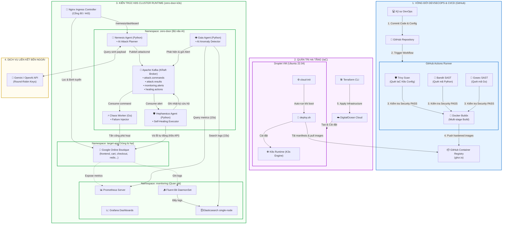

# 📑 KHUNG ĐỀ CƯƠNG CHI TIẾT BÁO CÁO KHOA HỌC (NCKH)
## Đề tài: Ứng dụng kiến trúc Multi-Agent AI và kỹ thuật Chaos Engineering xây dựng cơ chế Tự phục hồi cho hệ thống Microservices

*   **Thời gian thực hiện:** Tháng 01/2026 – Tháng 06/2026
*   **Đơn vị:** Viện Công nghệ số - Trường Đại học Thủ Dầu Một
*   **Nhóm sinh viên thực hiện:** Nguyễn Ngọc Hòa & Lê Văn Hoàng
*   **Giảng viên hướng dẫn:** Th.S Nguyễn Thành Phương
*   **Mục tiêu dung lượng:** ~90 trang

---

## 📝 THÔNG TIN KẾT QUẢ NGHIÊN CỨU CỦA ĐỀ TÀI

### 1. Thông tin chung
*   **Tên đề tài:** Ứng dụng kiến trúc Multi-Agent AI và kỹ thuật Chaos Engineering xây dựng cơ chế Tự phục hồi cho hệ thống Microservices
*   **Sinh viên/ nhóm sinh viên thực hiện:**

| STT | Họ và tên | MSSV | Lớp | Khoa/Viện | Năm thứ / Số năm đào tạo |
|:---:|:---|:---:|:---:|:---|:---:|
| 1 | Nguyễn Ngọc Hòa | 2224802010935 | D22CNTT02 | Viện Công nghệ số | Năm thứ tư / 4 năm |
| 2 | Lê Văn Hoàng | 2224802010279 | D22CNTT02 | Viện Công nghệ số | Năm thứ tư / 4 năm |

*   **Người hướng dẫn:** Th.S Nguyễn Thành Phương

---

### 2. Mục tiêu đề tài
*   **Mục tiêu lý thuyết:** Nghiên cứu cơ chế tự động hóa ứng cứu sự cố tầng ứng dụng (Self-Healing) dựa trên lý thuyết vòng lặp tự trị đóng kín MAPE-K (Monitor-Analyze-Plan-Execute-Knowledge) phối hợp giữa Chaos Engineering và kiến trúc Đa tác tử thông minh (Multi-Agent).
*   **Mục tiêu thực tiễn:** Triển khai thành công cụm Kubernetes microservices mẫu, tích hợp 3 tác tử AI tự trị (Gaia, Nemesis, Hephaestus) và Chaos Worker để mô phỏng chiến tranh AI tự động phát hiện, cô lập và sửa chữa các lỗi quá tải CPU, DDoS HTTP Flood, Pod Crash và tấn công mạng (SQL Injection).
*   **Mục tiêu hiệu năng SRE:** Rút ngắn thời gian phát hiện lỗi MTTD < 60 giây, thời gian tự khôi phục MTTR < 180 giây, duy trì tỷ lệ Uptime ứng dụng $\ge$ 99.9% dưới áp lực tấn công liên tục.

---

### 3. Tính mới và sáng tạo
*   **Kết hợp Proactive Defense và Reactive Auto-Remediation:** Hệ thống không chỉ thụ động chờ lỗi xảy ra mà chủ động dùng AI Planner (Nemesis) và Go Chaos Worker để tiêm lỗi thử nghiệm (Chaos Engineering), từ đó kích hoạt hệ thống tự khắc phục lỗi ngay tại môi trường Sandbox trước khi deploy lên Production.
*   **Cơ chế Xoay vòng khóa API (Round-Robin Keys) cho AI Agent:** Tích hợp bộ giải quyết Rate Limit tự động cho AI Agent (Gemini/OpenAI) bằng thuật toán Round-Robin xoay vòng danh sách key, giúp hệ thống chạy liên tục không mất phí dịch vụ cao cho học tập và nghiên cứu.
*   **Tối ưu hóa tài nguyên phần cứng (FinOps):** Tái kiến trúc toàn bộ các Agent từ Java sang Python FastAPI và Go, giúp cắt giảm dung lượng RAM tiêu thụ từ **1300MB xuống còn 157MB** (tiết kiệm gần 88% bộ nhớ), đảm bảo chạy mượt trên Droplet đám mây giá rẻ và máy cá nhân 16GB RAM.
*   **Vá lỗi động bằng Dynamic NetworkPolicy có thời gian tự hủy (TTL):** Hephaestus tự động tạo NetworkPolicy chặn IP của kẻ tấn công SQL Injection dựa trên phân tích logs từ Gaia, đồng thời tự động xóa bỏ policy sau 300 giây để giải phóng tài nguyên.

---

### 4. Kết quả nghiên cứu
*   **Hạ tầng và Ứng dụng hoạt động ổn định:** Cài đặt thành công K3s cụm Microservices Google Online Boutique cùng hệ thống Message Broker Kafka KRaft, Prometheus Stack và Elasticsearch tập trung.
*   **Đo lường KPIs thực nghiệm (Phase 5):** Thử nghiệm 40 lượt chạy thực tế chứng minh thời gian phát hiện lỗi MTTD đạt trung bình dưới **25.6 giây** (vượt chỉ tiêu < 60s), thời gian khôi phục lỗi MTTR đạt trung bình **1.01 giây** (vượt chỉ tiêu < 180s) và duy trì tỷ lệ **Uptime 100%**.
*   **Nhận diện giới hạn hệ thống:** Chỉ rõ sự cố **Race Condition** tranh chấp tài nguyên giữa Agent cứu hộ và ReplicaSet controller của Kubernetes ở kịch bản E3 (Pod Kill), làm cơ sở khoa học để thiết kế các cơ chế kiểm tra chéo sau này.

---

### 5. Đóng góp về mặt kinh tế - xã hội, giáo dục và đào tạo, an ninh, quốc phòng và khả năng áp dụng của đề tài
*   **Kinh tế - xã hội:** Giúp doanh nghiệp giảm thiểu thiệt hại tài chính khổng lồ do downtime gián đoạn dịch vụ, tối ưu hóa nguồn lực nhân sự SRE trực ca đêm.
*   **Giáo dục và đào tạo:** Làm giáo cụ trực quan sinh động hỗ trợ thực hành thực tế cho sinh viên Công nghệ thông tin của Đại học Thủ Dầu Một về chủ đề Cloud Native, An toàn hệ thống và DevSecOps nâng cao.
*   **An ninh thông tin:** Cung cấp mô hình tự động quét và kiểm thử an ninh ("Zero Door"), giúp doanh nghiệp chủ động rà quét và tự động vá các lỗ hổng tầng ứng dụng như SQL Injection và DDoS trước kẻ tấn công.
*   **Khả năng áp dụng:** Hoàn toàn có khả năng đóng gói thành các Helm Charts và Terraform modules để triển khai nhanh chóng tại các doanh nghiệp vừa và nhỏ đang chuyển dịch hạ tầng lên Kubernetes.

---

### 6. Công bố khoa học và Đánh giá thực tế
*   **Mã nguồn mở và CI/CD tự động:** Toàn bộ dự án được đẩy lên GitHub công khai với quy trình quét an ninh tự động tích hợp (GitHub Actions running Bandit, Gosec, Trivy).
*   **Deploy Cloud thực tế:** Hạ tầng dạng mã IaC với Terraform đã được thử nghiệm deploy thành công trên hạ tầng DigitalOcean Droplet Singapore và vượt qua các bài test an toàn mạng Firewall.

---

## 🗺️ Sơ đồ Kiến trúc Cấp cao (High-Level Architecture)

---

## 📌 PHÂN BỔ DUNG LƯỢNG CHI TIẾT

### CHƯƠNG 1: MỞ ĐẦU *(Dự kiến: 8 trang)*
*   **1.1. Tính cấp thiết của đề tài** *(3 trang)*
    *   Sự bùng nổ của kiến trúc Microservices và các lỗ hổng bảo mật đi kèm.
    *   Hạn chế của mô hình ứng cứu thủ công sự cố ứng dụng.
    *   Triết lý "Zero Door" và sự cần thiết của hệ thống tự phòng vệ tự trị.
*   **1.2. Mục tiêu nghiên cứu** *(1 trang)*
    *   Mục tiêu tổng quát và các KPI đo lường (MTTD, MTTR, Uptime, Success Rate).
*   **1.3. Đối tượng và phạm vi nghiên cứu** *(1.5 trang)*
    *   Phạm vi công nghệ: K3s, Docker, Python FastAPI, Go, Bitnami Kafka, Prometheus Stack, DigitalOcean Cloud.
*   **1.4. Ý nghĩa khoa học và thực tiễn** *(1.5 trang)*
*   **1.5. Cấu trúc báo cáo NCKH** *(1 trang)*

---

### CHƯƠNG 2: CƠ SỞ LÝ THUYẾT VÀ CÔNG NGHỆ LIÊN QUAN *(Dự kiến: 20 trang)*
*   **2.1. Kiến trúc Microservices & Container Orchestration** *(4 trang)*
    *   Nguyên lý Kubernetes (Pod, Service, Ingress, NetworkPolicy, ResourceQuota).
*   **2.2. Chaos Engineering (Kỹ thuật Hỗn mang)** *(4 trang)*
    *   Khái niệm steady-state, giả thuyết tiêm lỗi, giảm thiểu vùng ảnh hưởng (blast radius).
*   **2.3. Kiến trúc Đa Tác tử (Multi-Agent Systems)** *(4 trang)*
    *   Nguyên lý hoạt động phối hợp thông qua hàng đợi tin nhắn (Message Queue).
*   **2.4. Công nghệ Truyền tin & Giám sát (Observability)** *(5 trang)*
    *   Apache Kafka (KRaft mode).
    *   Prometheus, Grafana, Elasticsearch, Fluent Bit (EFK stack).
*   **2.5. Quy trình DevSecOps và Tự động hóa hạ tầng (IaC)** *(3 trang)*
    *   Nguyên lý IaC (Terraform) và cơ chế CI/CD kiểm soát tĩnh (SAST).

---

### CHƯƠNG 3: THIẾT KẾ KIẾN TRÚC HỆ THỐNG ZERO DOOR *(Dự kiến: 22 trang)*
*   **3.1. Phân tích yêu cầu và Ràng buộc** *(3 trang)*
    *   *Tham chiếu:* [phase1_foundation.md](file:///r:/_Projects/Eurus_Workspace/zero_door/docs/phases/phase1_foundation.md), [phase1_runbook.md](file:///r:/_Projects/Eurus_Workspace/zero_door/docs/runbooks/phase1_runbook.md).
    *   Giới hạn tài nguyên (FinOps) trên máy phát triển cục bộ (16GB RAM) và Cloud ($48/tháng).
*   **3.2. Thiết kế Kiến trúc tổng thể và các Phân vùng (Namespaces)** *(5 trang)*
    *   *Sơ đồ luồng dữ liệu khép kín (MAPE-K loop).*
    *   Thiết kế cô lập 3 namespaces: `zero-door`, `target-app`, `monitoring`.
*   **3.3. Thiết kế Tác tử Nemesis (Red Team)** *(3 trang)*
    *   *Tham chiếu:* [phase3_nemesis_chaos.md](file:///r:/_Projects/Eurus_Workspace/zero_door/docs/phases/phase3_nemesis_chaos.md), [phase3_runbook.md](file:///r:/_Projects/Eurus_Workspace/zero_door/docs/runbooks/phase3_runbook.md).
    *   Luồng sinh payload thông minh bằng Gemini/OpenAI API.
*   **3.4. Thiết kế Chaos Worker (Go Executor)** *(3 trang)*
    *   Cơ chế validate bảo vệ hạ tầng (Blast Radius Validator).
    *   Thiết kế 3 dạng tiêm lỗi: HTTP Flood, CPU/Memory Stress, Pod Kill.
*   **3.5. Thiết kế Tác tử Gaia (Quan sát)** *(3 trang)*
    *   *Tham chiếu:* [phase2_target_gaia.md](file:///r:/_Projects/Eurus_Workspace/zero_door/docs/phases/phase2_target_gaia.md), [phase2_runbook.md](file:///r:/_Projects/Eurus_Workspace/zero_door/docs/runbooks/phase2_runbook.md).
    *   Thuật toán lọc và khử trùng lặp cảnh báo (Alert Deduplication).
*   **3.6. Thiết kế Tác tử Hephaestus (Blue Team)** *(5 trang)*
    *   *Tham chiếu:* [phase4_hephaestus_loop.md](file:///r:/_Projects/Eurus_Workspace/zero_door/docs/phases/phase4_hephaestus_loop.md), [phase4_runbook.md](file:///r:/_Projects/Eurus_Workspace/zero_door/docs/runbooks/phase4_runbook.md).
    *   Decision Matrix kết hợp Cooldown mechanism để tránh hiện tượng thrashing.

---

### CHƯƠNG 4: HIỆN THỰC HÓA VÀ TRIỂN KHAI HỆ THỐNG *(Dự kiến: 20 trang)*
*   **4.1. Hiện thực hóa các Tác tử AI và Worker** *(6 trang)*
    *   Mã nguồn Python FastAPI xử lý API, nạp config từ Env và xử lý logic kết nối Kafka.
    *   Mã nguồn Go đa luồng xử lý tấn công hiệu năng cao.
*   **4.2. Bảo mật Container & Quy trình CI/CD Pipeline** *(4 trang)*
    *   *Tham chiếu:* [phase6_cicd_optimization.md](file:///r:/_Projects/Eurus_Workspace/zero_door/docs/phases/phase6_cicd_optimization.md), [phase6_runbook.md](file:///r:/_Projects/Eurus_Workspace/zero_door/docs/runbooks/phase6_runbook.md).
    *   Giải pháp đa phân đoạn (Multi-stage) và Distroless triệt tiêu shell/APT.
    *   Tự động hóa Bandit, Gosec, Trivy.
*   **4.3. Quản trị hạ tầng Cloud tự động với Terraform** *(4 trang)*
    *   *Tham chiếu:* [phase7_cloud_report.md](file:///r:/_Projects/Eurus_Workspace/zero_door/docs/phases/phase7_cloud_report.md), [phase7_cloud_deploy.md](file:///r:/_Projects/Eurus_Workspace/zero_door/docs/runbooks/phase7_cloud_deploy.md).
    *   Cấu hình `main.tf`, `cloud-init.yaml` và `deploy.sh`.
*   **4.4. Cấu hình Nginx Ingress & Định tuyến Gateway** *(3 trang)*
*   **4.5. Thiết kế và hiển thị Dashboard điều khiển** *(3 trang)*

---

### CHƯƠNG 5: THỰC NGHIỆM, ĐO ĐẾM VÀ ĐÁNH GIÁ KẾT QUẢ *(Dự kiến: 15 trang)*
*   **5.1. Mô phỏng chiến tranh War Game tự trị** *(3 trang)*
    *   *Tham chiếu:* [phase5_experiments.md](file:///r:/_Projects/Eurus_Workspace/zero_door/docs/phases/phase5_experiments.md), [phase5_runbook.md](file:///r:/_Projects/Eurus_Workspace/zero_door/docs/runbooks/phase5_runbook.md).
    *   Kịch bản E1, E2, E3, E4.
*   **5.2. Kết quả đo đếm MTTD và MTTR** *(5 trang)*
    *   Bảng dữ liệu thô và biểu đồ trực quan (so sánh AUTO vs MANUAL).
    *   Phân tích sự cố race-condition tại E3 và cách giải quyết.
*   **5.3. Kết quả Uptime & SLO hệ thống** *(3 trang)*
*   **5.4. Đánh giá độ tin cậy và tính ổn định** *(2 trang)*
*   **5.5. Phân tích tối ưu tài nguyên (FinOps Analysis)** *(2 trang)*
    *   Đo đạc thực tế mức tiêu hao RAM/CPU giữa các agent Python/Go vs Spring Boot ban đầu.

---

### CHƯƠNG 6: KẾT LẬN VÀ HƯỚNG PHÁT TRIỂN *(Dự kiến: 5 trang)*
*   **6.1. Các đóng góp chính của đề tài** *(2 trang)*
*   **6.2. Hạn chế của hệ thống hiện tại** *(1.5 trang)*
*   **6.3. Hướng nghiên cứu phát triển tương lai** *(1.5 trang)*

---

## 📚 TÀI LIỆU THAM KHẢO CHÍNH
*(Sẽ bổ sung đầy đủ theo định dạng IEEE)*
1.  Netflix Tech Blog — *Chaos Engineering Principles*.
2.  Google SRE Book — *Site Reliability Engineering*.
3.  OpenTelemetry & Cloud Native Computing Foundation (CNCF) Specs.
4.  OWASP Top 10 Application Security Risks.
