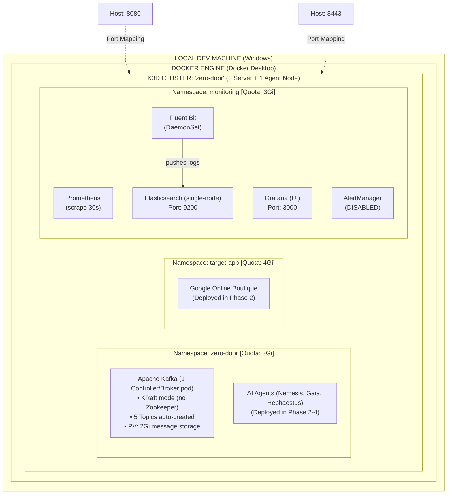
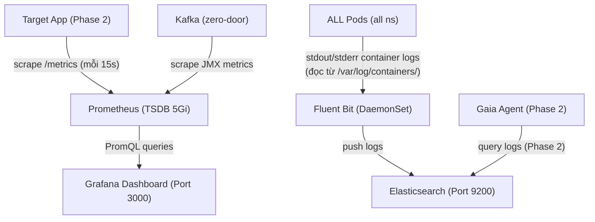
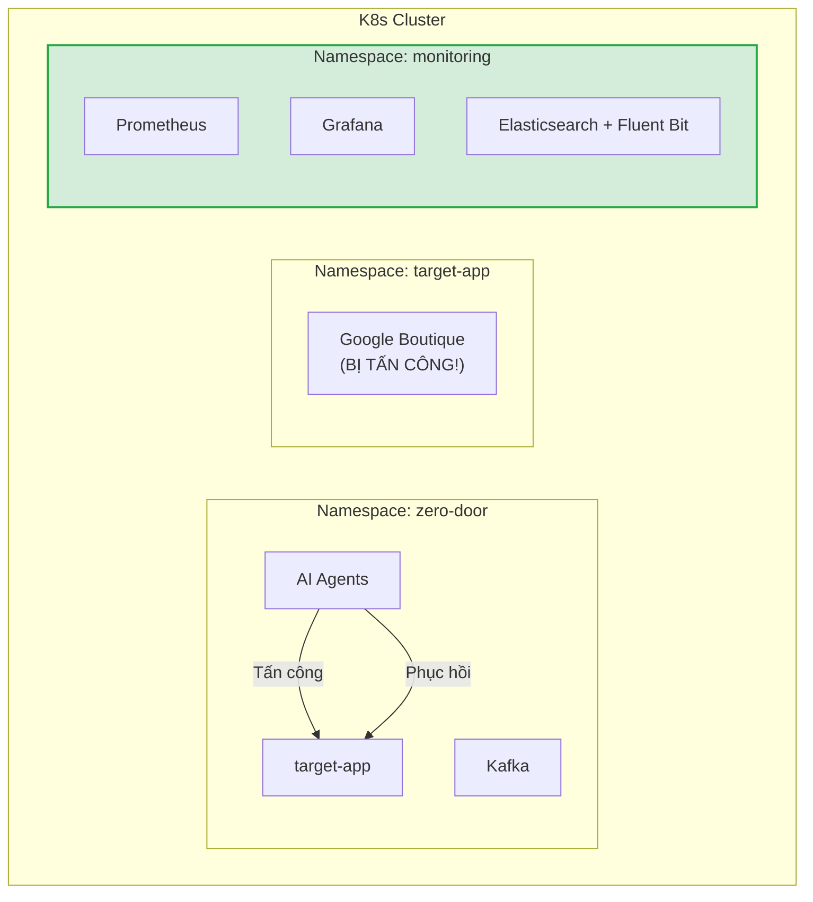
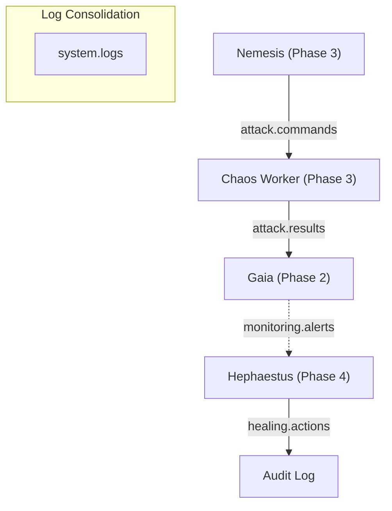
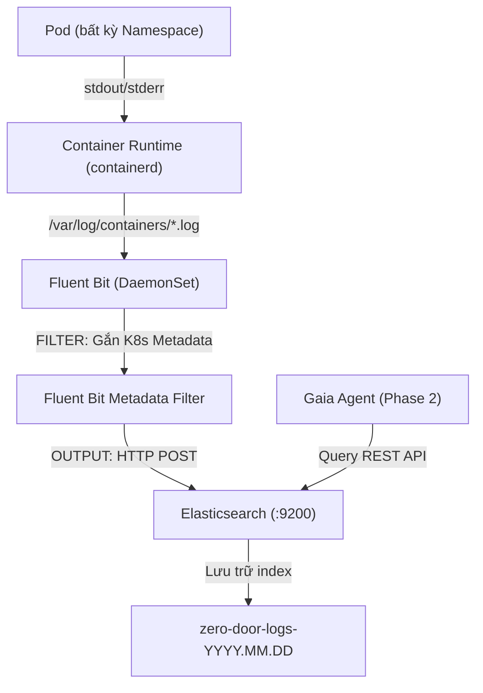

# 📘 RUNBOOK — Phase 1: Foundation Infrastructure

> **Tài liệu hướng dẫn vận hành (Runbook)** giải thích CHI TIẾT từng bước đã triển khai,  
> TẠI SAO làm như vậy, và CẤU TRÚC hệ thống sau khi hoàn thành Phase 1.  
> Cập nhật: 2026-06-23 | Author: EurusDevSec

---

## 1. Tổng quan Kiến trúc Phase 1

### Sơ đồ Infrastructure — Sau khi Phase 1 hoàn thành



### Sơ đồ Luồng Dữ Liệu — Observability Pipeline



---

## 2. Cấu trúc File Infrastructure

```
infrastructure/
├── k3d-config.yaml                    # Cấu hình K3d cluster (đã tối ưu 1 Server + 1 Agent)
│
├── namespaces/                         # Định nghĩa 3 phân vùng K8s
│   ├── zero-door.yaml                 # NS cho Agents + Kafka
│   ├── target-app.yaml                # NS cho ứng dụng mục tiêu
│   └── monitoring.yaml                # NS cho Observability stack
│
├── resource-quotas/                    # Giới hạn tài nguyên mỗi namespace
│   ├── zero-door-quota.yaml           # Max 3Gi RAM, 10 pods (đã tối ưu)
│   ├── target-app-quota.yaml          # Max 4Gi RAM, 20 pods
│   └── monitoring-quota.yaml          # Max 3Gi RAM, 10 pods (đã tối ưu)
│
├── helm-values/                        # Cấu hình cho Helm Charts
│   ├── kafka-values.yaml              # Bitnami Kafka: KRaft combined, 1 broker, 5 topics
│   ├── prometheus-values.yaml         # Prometheus + Grafana (AlertManager disabled)
│   └── ingress-nginx-values.yaml      # Nginx Ingress (Admission webhooks disabled)
│
├── logging/                            # ELK-lite logging stack
│   ├── elasticsearch.yaml             # ES single-node Deployment + PVC + Service (JVM limit 512M)
│   └── fluent-bit.yaml                # DaemonSet + ConfigMap + RBAC
│
├── manifests/                          # Các Kubernetes manifests khác
│   └── network-policies.yaml          # Network Policies bảo vệ monitoring
│
└── scripts/
    └── setup-phase1.ps1               # Script tự động chạy toàn bộ Phase 1
```

---

## 3. Giải thích Chi tiết Từng Thành phần

### 3.1. K3d Cluster — Tại sao 1 Server + 1 Agent Node?

**File:** `k3d-config.yaml`

```yaml
servers: 1    # Control Plane (K8s API Server, Scheduler, Controller Manager)
agents: 1     # Worker Node (chạy workload pods)
```

**Tại sao giảm từ 2 Agents xuống 1 Agent Node?**
- Để **tiết kiệm RAM tối đa** cho máy dev local (16GB RAM nhưng thực tế chạy Chrome, IDE, Docker Engine chỉ còn 6-8GB khả dụng).
- K3s/K3d chạy 1 Server + 1 Agent chỉ tiêu tốn khoảng ~1GB RAM nền (tiết kiệm ~500MB RAM so với 2 Agent nodes).
- Vẫn đáp ứng đầy đủ yêu cầu học tập, chạy thử nghiệm Kafka, Ingress và các Agents.
- Fluent Bit DaemonSet vẫn chạy 1 pod trên agent node để thu thập logs bình thường.

**Tại sao disable Traefik?**
```yaml
options:
  k3s:
    extraArgs:
      - arg: --disable=traefik
```
- K3d mặc định cài Traefik Ingress Controller. Nhưng trong thực tế doanh nghiệp, Nginx Ingress phổ biến hơn và bạn cần thực hành cài đặt Ingress Controller thủ công.
- Tránh xung đột port 80/443 giữa Traefik tự động và Nginx bạn tự cài.

---

### 3.2. Namespaces — Tại sao chia 3 namespace?

**Nguyên lý: Blast Radius Isolation (Cô lập vùng ảnh hưởng)**



**Labels quan trọng:**
- `attack-target: "true"` trên `target-app` → Chaos Worker validate label này trước khi tấn công
- `attack-target: "false"` trên `monitoring` → Chaos Worker từ chối tấn công namespace có label này
- `monitoring: enabled` trên tất cả → Prometheus scrape metrics từ mọi namespace

---

### 3.3. ResourceQuota & LimitRange — Tại sao cần?

**Bài toán:** Máy dev có 16GB RAM. K3d + Docker chiếm ~6GB. Còn ~10GB cho workload.

| Namespace | Requests (đảm bảo) | Limits (tối đa) | Pods max |
|---|---|---|---|
| `zero-door` | 1 CPU, 1Gi RAM | 3 CPU, 3Gi RAM | 10 |
| `target-app` | 1.5 CPU, 2Gi RAM | 3 CPU, 4Gi RAM | 20 |
| `monitoring` | 0.5 CPU, 1.8Gi RAM | 2 CPU, 3Gi RAM | 10 |
| **Tổng** | **3 CPU, 4.8Gi RAM** | **8 CPU, 10Gi RAM** | **40** |

**LimitRange đặt mặc định cho mỗi container:**
- Nếu developer quên khai báo `resources` trong Pod spec → K8s tự gán default từ LimitRange
- Tránh tình huống 1 pod "tham lam" chiếm hết quota của cả namespace

---

### 3.4. Kafka — Tại sao dùng KRaft mode?

**Trước KRaft (Kafka < 3.4):**
```
Kafka Broker + Zookeeper (2 pods, ~1.5GB RAM)
```

**Với KRaft (Kafka ≥ 3.4):**
```
Kafka Controller+Broker (1 pod, ~600-800MB RAM)  ← Tiết kiệm 700MB+
```

KRaft loại bỏ dependency vào Zookeeper → ít pods hơn, ít RAM hơn, ít complexity hơn.

**5 Kafka Topics tự động tạo khi startup:**



---

### 3.5. Prometheus + Grafana — Tại sao scrape ALL namespaces?

```yaml
# prometheus-values.yaml
podMonitorSelectorNilUsesHelmValues: false
serviceMonitorSelectorNilUsesHelmValues: false
```

**Mặc định**, kube-prometheus-stack chỉ scrape metrics **trong namespace monitoring**. Nhưng Zero Door cần scrape metrics từ `target-app` (CPU, Memory, HTTP errors) và `zero-door` (Kafka JMX). Hai dòng config trên bảo Prometheus: "Hãy nhìn ServiceMonitors/PodMonitors ở MỌI namespace, không chỉ namespace của mình."

**Grafana credentials:**
- User: `admin` / Password: `zerodoor123`
- Đây là local dev — production phải dùng K8s Secret hoặc Vault.

---

### 3.6. Elasticsearch + Fluent Bit — Luồng Log Collection



**Tại sao Fluent Bit chứ không phải Logstash hoặc Fluentd?**
- Fluent Bit viết bằng C, cực nhẹ (~15MB RAM). Logstash viết bằng Java, cần ~500MB+ RAM.
- Trên local K3d, mỗi MB RAM đều quý giá.

**Tại sao Elasticsearch single-node?**
- JVM heap giới hạn 512MB (`-Xms256m -Xmx512m`) thay vì default 1GB.
- `discovery.type: single-node` tắt cluster discovery → khởi động nhanh, ít overhead.
- Đủ cho mục đích log analysis trong sandbox. Production sẽ cần ≥ 3 nodes.

---

## 4. Cách Chạy Phase 1

### Bước 1: Kiểm tra Prerequisites

```powershell
docker --version          # Cần Docker Desktop đang chạy
k3d version               # Cần k3d CLI
kubectl version --client   # Cần kubectl
helm version              # Cần Helm 3.x
```

### Bước 2: Chạy Script Tự Động

```powershell
cd r:\_Projects\Eurus_Workspace\zero_door
.\infrastructure\scripts\setup-phase1.ps1
```

Script sẽ tự động thực hiện 12 bước (mất khoảng 5-10 phút lần đầu do pull Docker images).

### Bước 3: Verify Kết Quả

```powershell
# Kiểm tra tất cả pods
kubectl get pods -A

# Kiểm tra Ingress Controller
kubectl get pods -n kube-system -l app.kubernetes.io/name=ingress-nginx

# Kiểm tra Kafka topics
kubectl exec -n zero-door kafka-controller-0 -- kafka-topics.sh --list --bootstrap-server localhost:9092

# Truy cập Grafana
kubectl port-forward svc/prometheus-grafana 3000:80 -n monitoring
# → Mở http://localhost:3000 (admin / zerodoor123)

# Truy cập Prometheus
kubectl port-forward svc/prometheus-kube-prometheus-prometheus 9090:9090 -n monitoring
# → Mở http://localhost:9090/targets

# Kiểm tra Elasticsearch
kubectl port-forward svc/elasticsearch 9200:9200 -n monitoring
# → curl http://localhost:9200/_cat/health
# → curl http://localhost:9200/_cat/indices
```

---

## 5. Troubleshooting

### Pod bị Pending (không đủ resources)
```powershell
kubectl describe pod <pod-name> -n <namespace>
# Tìm Events: "Insufficient memory" hoặc "Insufficient cpu"
# → Giảm resource requests trong helm-values hoặc tăng ResourceQuota
```

### Kafka pod CrashLoopBackOff
```powershell
kubectl logs kafka-controller-0 -n zero-door
# Thường do: PersistentVolume chưa sẵn sàng hoặc hết disk
# → kubectl get pvc -n zero-door (kiểm tra PVC status = Bound)
```

### Elasticsearch OOMKilled
```powershell
kubectl describe pod elasticsearch-xxx -n monitoring
# → Tăng memory limit hoặc giảm ES_JAVA_OPTS heap
```

### Fluent Bit không gửi logs về Elasticsearch
```powershell
kubectl logs -l app=fluent-bit -n monitoring
# Kiểm tra: Elasticsearch service DNS có đúng không
# → elasticsearch.monitoring.svc.cluster.local:9200
```

### Lỗi lệch IP chứng chỉ x509 (Sau khi Docker Desktop hoặc Máy tính khởi động lại)
Khi máy tính Sleep hoặc Docker Engine khởi động lại, Docker có thể cấp phát lại dải IP khác cho các node K3d (ví dụ: IP server đổi từ `172.18.0.3` thành `172.18.0.4`). Tuy nhiên, chứng chỉ TLS của Kubelet được cache trên node cũ sẽ không trùng khớp, dẫn đến việc chạy các lệnh `kubectl exec` hoặc gọi API nội bộ cluster bị từ chối với lỗi:
`tls: failed to verify certificate: x509: certificate is valid for ...`

**👉 Giải pháp khắc phục triệt để:**
Nhóm đã chuẩn bị sẵn một script tự động xóa sạch cluster cũ và dựng lại nhanh từ đầu (do Docker đã cache sẵn image nên chạy mất chưa đầy 3 phút):
```powershell
.\infrastructure\scripts\recreate-cluster.ps1
```

---

## 6. Cleanup (Khi cần xóa sạch)

```powershell
# Xóa toàn bộ cluster (MẤT HẾT DỮ LIỆU)
k3d cluster delete zero-door

# Hoặc chỉ xóa workload, giữ cluster
helm uninstall kafka -n zero-door
helm uninstall prometheus -n monitoring
kubectl delete -f infrastructure/logging/ -n monitoring
```

