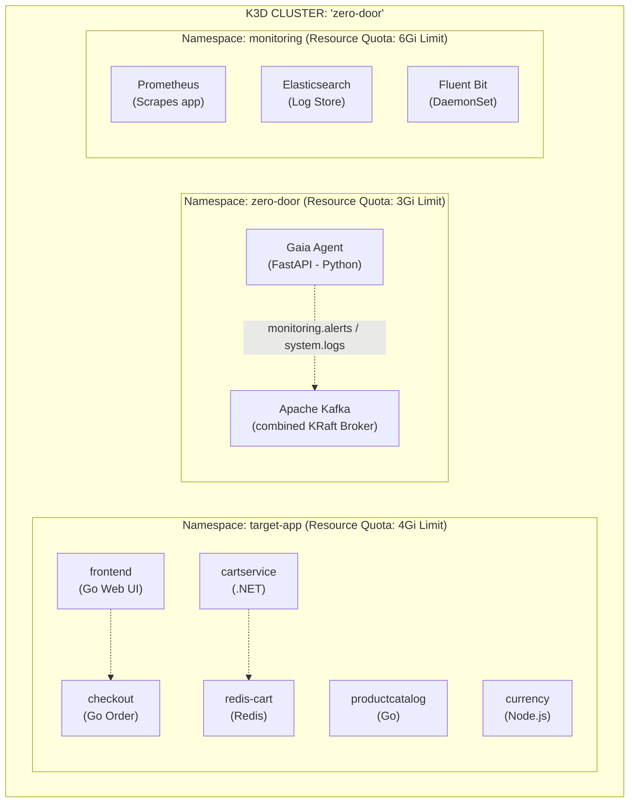
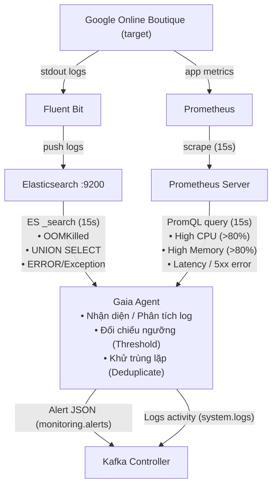

# 📘 RUNBOOK — Phase 2: Target App Deployment & Gaia Agent (Observer)

> **Tài liệu hướng dẫn vận hành (Runbook)** giải thích CHI TIẾT các bước đã triển khai,  
> TẠI SAO làm như vậy, cấu trúc hệ thống, và cách vận hành/kiểm thử Phase 2.  
> Cập nhật: 2026-06-24 | Author: EurusDevSec

---

## 1. Tổng quan Kiến trúc Phase 2

Trong Phase 2, chúng ta đưa ứng dụng mục tiêu (Google Online Boutique) và Agent giám sát (Gaia Agent) vào vận hành thực tế trên nền tảng hạ tầng K3d đã chuẩn bị ở Phase 1.

### Sơ đồ Kiến trúc Thành phần (Namespaces & Pods)



### Sơ đồ Luồng xử lý Anomaly Detection (Gaia Loop)



---

## 2. Cấu trúc Tài nguyên & File đã Triển khai

```
zero-door/
├── infrastructure/
│   └── manifests/
│       ├── target-app.yaml            # Deploy 6 core boutique services tối ưu RAM
│       ├── target-app-hpa.yaml        # Autoscaling cho frontend & cartservice
│       ├── target-app-monitor.yaml    # ServiceMonitor cho frontend http endpoint
│       ├── prometheus-rules.yaml      # Bộ 5 rules cảnh báo mặc định của Prometheus
│       └── gaia-deployment.yaml       # ServiceAccount, Deployment, Service cho Gaia
│
└── agent-orchestrator/
    └── gaia/
        ├── requirements.txt           # Thư viện FastAPI, kafka-python-ng, elasticsearch
        ├── Dockerfile                 # Multi-stage build cực nhẹ (< 80MB)
        └── main.py                    # Mã nguồn vòng lặp giám sát của Gaia Agent
```

---

## 3. Các thành phần Chi tiết

### 3.1. Target App (Google Online Boutique)
Để chạy mượt mà trên môi trường máy cá nhân (Acer Nitro 5 - 16GB RAM), ứng dụng Online Boutique được cấu hình rút gọn:
*   Chỉ giữ lại **6 dịch vụ cốt lõi**: `frontend`, `cartservice`, `productcatalogservice`, `currencyservice`, `checkoutservice` và `redis-cart`.
*   Giới hạn tài nguyên chặt chẽ: Các container (trừ redis) được set cứng `requests.cpu: 50m`, `requests.memory: 64Mi` và `limits.cpu: 200m`, `limits.memory: 256Mi`.
*   **HPA**: Tự động scale từ 1 đến 3 replicas khi CPU chạm ngưỡng 70%.

### 3.2. Prometheus Rule & ServiceMonitor
*   `ServiceMonitor`: Tự động tìm kiếm và scrape metrics từ cổng HTTP `:8080` của frontend service theo chu kỳ 15 giây.
*   `PrometheusRule`: Định nghĩa sẵn các ngưỡng cảnh báo chuẩn (CPU > 80%, RAM > 80%, Ingress Error > 5%, Latency P99 > 1s, Pod Restart > 3 lần/5 phút).

### 3.3. Gaia Agent (FastAPI + Background Loop)
Được phát triển hoàn toàn bằng **Python** thay thế cho Java Spring Boot để tối ưu hóa bộ nhớ RAM từ ~300MB xuống chỉ còn **~50MB** khi chạy.
*   **Prometheus Query Client**: Gọi HTTP API `/api/v1/query` mỗi 15 giây để truy vấn dữ liệu thời gian thực của CPU, Memory, Ingress Latency, Ingress Error, và Restart Count.
*   **Elasticsearch Log Analyzer**: Gọi REST API `/zero-door-logs-*/_search` mỗi 15 giây.
    *   Sử dụng dải thời gian `now-30s` (gấp đôi interval) để đảm bảo không bị mất log do độ trễ truyền dữ liệu của Fluent Bit.
    *   Tự động phát hiện các chuỗi nhạy cảm: `OOMKilled`, SQL Injection (`UNION SELECT`, `OR '1'='1`), ứng dụng gặp lỗi `ERROR`/`Exception`.
*   **Kafka Publisher**: Đóng gói Anomaly thành định dạng Alert JSON chuẩn và publish vào topic `monitoring.alerts`. Đồng thời in dấu vết hoạt động vào `system.logs`.
*   **Deduplication**: Lưu vết trạng thái gửi alert. Nếu cùng một dịch vụ và một loại lỗi xảy ra liên tục, Gaia sẽ chặn không gửi thêm alert vào Kafka trong vòng **60 giây** (cooldown period) nhằm chống tràn tin nhắn rác.

---

## 4. Hướng dẫn Vận hành & Kiểm thử (Runbook)

### 4.1. Lệnh Kiểm tra Trạng thái Triển khai
Kiểm tra xem tất cả các Pods của Phase 2 đã chạy ổn định chưa:
```powershell
# Xem pods của target app
kubectl get pods -n target-app

# Xem pods gaia
kubectl get pods -n zero-door -l app=gaia
```
*Tất cả phải hiển thị trạng thái `Running` và `1/1` Ready.*

### 4.2. Truy cập Giao diện Web (Frontend)
Để truy cập cửa hàng Google Online Boutique từ trình duyệt máy chủ (host):
```powershell
kubectl port-forward svc/frontend 8080:80 -n target-app
```
👉 Mở trình duyệt truy cập: `http://localhost:8080`

### 4.3. Kiểm thử Phát hiện Log Anomaly (Ví dụ: Lỗi Hết Bộ Nhớ - OOMKilled)
Tạo một pod tạm thời trong namespace `target-app` để in ra thông điệp log giả lập sự cố OOM:
```powershell
kubectl run test-logger-oom -n target-app --image=busybox --restart=Never -- sh -c "echo 'CRITICAL ERROR: OOMKilled detected in process' && sleep 10"
```

### 4.4. Xem Nhật ký Giám sát của Gaia Agent
Xem cách Gaia phát hiện log lỗi từ Elasticsearch và publish alert vào Kafka:
```powershell
kubectl logs -n zero-door -l app=gaia --tail=50 -f
```
Bạn sẽ thấy dòng log xác nhận phát hiện log sự cố:
```
2026-06-24 11:00:10,634 - gaia-agent - [INFO] - Elasticsearch log query returned 2 hits.
2026-06-24 11:00:10,635 - gaia-agent - [WARNING] - ALERT PUBLISHED to Kafka [Topic: monitoring.alerts]: Suspicious activity on pod 'test-logger-oom' container 'test-logger-oom': OOMKilled event detected in container logs.
```

### 4.5. Kiểm tra Cảnh báo trong Hàng đợi Kafka
Để chắc chắn thông tin cảnh báo đã được gửi thành công vào hàng đợi Kafka để Hephaestus (ở Phase 4) xử lý, chạy lệnh consume thử 1 message:
```powershell
kubectl exec -n zero-door kafka-controller-0 -- bash -c "unset JMX_PORT && kafka-console-consumer.sh --bootstrap-server localhost:9092 --topic monitoring.alerts --from-beginning --max-messages 1"
```
Đầu ra sẽ trả về JSON định dạng chuẩn:
```json
{
  "alertId": "ca93919f-2cce-4e2c-9deb-5892337d7275", 
  "timestamp": "2026-06-24T11:00:10.634831+00:00", 
  "severity": "CRITICAL", 
  "type": "HIGH_MEMORY", 
  "source": "gaia-agent", 
  "affectedService": "test-logger-oom", 
  "affectedNamespace": "target-app", 
  "metric": "log_pattern_match", 
  "currentValue": 1.0, 
  "threshold": 0.0, 
  "description": "Suspicious activity on pod 'test-logger-oom' container 'test-logger-oom': OOMKilled event detected in container logs.", 
  "suggestedAction": "RESTART"
}
```

---

## 5. Các Lỗi Thường Gặp & Cách Khắc Phục (Troubleshooting)

### 5.1. Gaia Agent báo không kết nối được Kafka hoặc Elasticsearch
*   **Nguyên nhân**: Các Pod Kafka hoặc Elasticsearch khởi động chậm hơn Gaia nên kết nối bị rớt lúc khởi động.
*   **Khắc phục**: Gaia Agent được xây dựng cơ chế tự phục hồi kết nối. Khi Kafka/Elasticsearch Online trở lại, Gaia sẽ tự động kết nối lại ở chu kỳ tiếp theo mà không cần khởi động lại Pod.

### 5.2. Chạy test-logger nhưng Gaia không nổ cảnh báo
*   **Nguyên nhân 1**: Pod test-logger chạy ở sai namespace. Đảm bảo nó chạy trong `-n target-app` vì Fluent Bit được cấu hình gom log tại đây và Gaia lọc theo namespace này.
*   **Nguyên nhân 2**: Kiểm tra lại xem thông điệp log in ra có khớp với các keyword nhạy cảm không (`OOMKilled`, `UNION SELECT`, `ERROR`).
