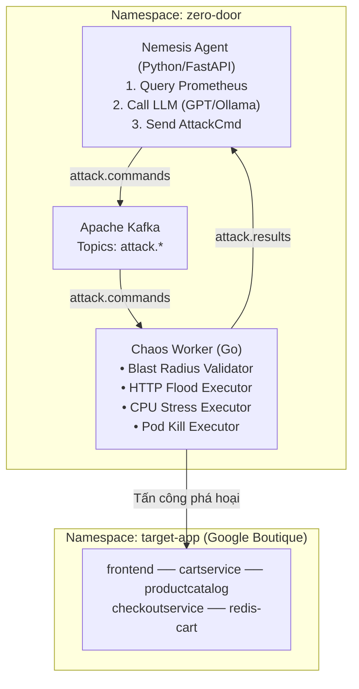
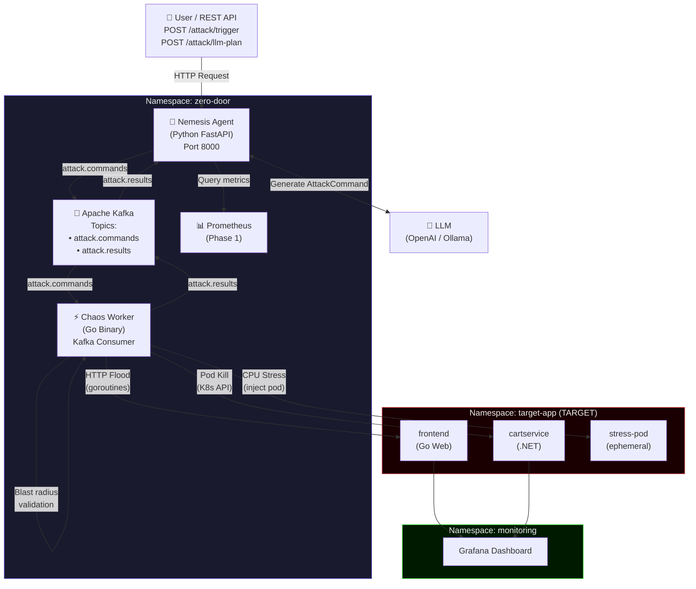

# 📘 RUNBOOK — Phase 3: Agent Nemesis (Red Team) + Go Chaos Worker

> **Tài liệu hướng dẫn vận hành (Runbook)** giải thích CHI TIẾT các thành phần đã triển khai,  
> TẠI SAO thiết kế như vậy, cấu trúc hệ thống, và cách vận hành/kiểm thử Phase 3.  
> Cập nhật: 2026-06-24 | Author: EurusDevSec

---

## 1. Tổng quan Kiến trúc Phase 3

Phase 3 bổ sung **năng lực tấn công chủ động (Red Team)** vào hệ thống. Hai thành phần mới được triển khai:

- **Agent Nemesis** (Python / FastAPI): "Bộ não" chiến lược — sử dụng LLM (OpenAI hoặc Ollama) để phân tích metrics và sinh ra kịch bản tấn công thông minh.
- **Chaos Worker** (Go): "Cánh tay thực thi" — nhận lệnh tấn công từ Kafka và trực tiếp thực hiện phá hoại lên Target App.

### Sơ đồ Attack Loop



### Luồng dữ liệu đầy đủ (Full Attack Loop)

```
Nemesis                     Kafka                    Chaos Worker
   │                          │                           │
   │── [1] Query Prometheus ──▶ (get system metrics)      │
   │                          │                           │
   │── [2] Call LLM ──────────▶ (generate AttackCommand)  │
   │                          │                           │
   │── [3] send(attack.commands) ───────────────────────▶ │
   │                          │                           │
   │                          │ [4] Validate blast radius │
   │                          │     (namespace whitelist) │
   │                          │                           │
   │                          │ [5] Execute Attack:       │
   │                          │   • HTTP Flood            │
   │                          │   • CPU Stress pod        │
   │                          │   • Pod Kill              │
   │                          │                           │
   │◀─ [6] send(attack.results) ────────────────────────── │
   │                          │                           │
   │── [7] Log result ────────▶                           │
```

---

## 2. Cấu trúc File đã tạo

### Go Chaos Worker (`chaos-worker/`)

```
chaos-worker/
├── go.mod                                 # Module + dependencies (confluent-kafka-go, client-go)
├── Dockerfile                             # Multi-stage: Alpine builder → Alpine runtime
├── cmd/
│   └── main.go                           # Entry point: wires config, K8s, Kafka, executors
└── internal/
    ├── config/
    │   └── config.go                     # Config từ env vars
    ├── validation/
    │   └── target.go                     # Blast radius safety (namespace + DNS whitelist)
    ├── attack/
    │   ├── executor.go                   # Shared types: AttackCommand, AttackResult, Executor interface
    │   ├── http_flood.go                 # HTTP Flood — goroutines + context deadline
    │   ├── cpu_stress.go                 # CPU/Memory Stress — inject ephemeral K8s pod
    │   └── pod_kill.go                   # Pod Kill — K8s API delete pod by label selector
    └── kafka/
        └── client.go                     # Consumer + Producer wrappers (confluent-kafka-go)
```

### Agent Nemesis (`agent-orchestrator/nemesis/`)

```
agent-orchestrator/nemesis/
├── main.py                               # FastAPI app: REST API + LLM attack planner
├── requirements.txt                      # fastapi, uvicorn, kafka-python, openai, httpx
└── Dockerfile                            # Multi-stage: Python 3.11 slim + non-root
```

### Kubernetes Manifests (`infrastructure/manifests/`)

```
infrastructure/manifests/
├── chaos-worker.yaml                     # ServiceAccount, Role, RoleBinding, ConfigMap, Deployment
└── nemesis-deployment.yaml               # ConfigMap, Secret, Deployment, Service, Ingress
```

---

## 3. Design Decisions — Tại sao làm như vậy?

### 3.1. Blast Radius Safety — Tầng bảo vệ kép

> **Vấn đề**: Chaos Worker có quyền xóa pods và tạo stress pods. Nếu có bug, nó có thể vô tình phá Kafka hoặc Prometheus.

**Giải pháp**: Hai lớp kiểm tra độc lập:

1. **Namespace Whitelist** (`validation/target.go`): Mọi `AttackCommand` phải có `namespace = "target-app"`. Nếu không → `REJECTED` + log `CRITICAL`.
2. **DNS Pattern Check**: URL phải chứa `.target-app.svc.cluster.local`. Ngăn attack chỉ vào cluster-internal service.
3. **RBAC Scoping** (`chaos-worker.yaml`): Role chỉ có quyền `get/list/delete pods` trong namespace `target-app`. K8s API server sẽ từ chối request ngay cả khi code bị bypass.

> "Defense in depth" — 3 lớp bảo vệ: code validation → RBAC → K8s admission control.

### 3.2. Circuit Breaker — Kill Switch tự động

Mọi attack đều được bao bởi `context.WithTimeout`:

```go
// Trong main.go
attackCtx, cancel := context.WithTimeout(context.Background(),
    time.Duration(cfg.MaxDurationSec+10)*time.Second,
)
```

- **`MaxDurationSec`** (default 120s): Global kill switch từ env var `MAX_ATTACK_DURATION_SEC`.
- **`cmd.SafetyLimits.MaxDurationSec`**: Nemesis có thể chỉ định giới hạn riêng cho từng command.
- **`EffectiveDuration()`**: Lấy giá trị nhỏ hơn giữa `cmd.Parameters.Duration` và `maxDuration`.

### 3.3. HTTP Flood — Giới hạn goroutine để tránh OOM

> **Q4 (Design Question)**: Nếu spawn 10,000 goroutines, memory và file descriptors sẽ bị cạn kiệt.

**Giải pháp**: `MaxConcurrency` cap trong config (default 50). HTTP Client được cấu hình với `MaxIdleConnsPerHost = concurrency` để tái dùng connections thay vì tạo mới liên tục. Atomic counter đảm bảo thread-safe counting.

```go
// Goroutines bị giới hạn bởi config
for i := 0; i < concurrency; i++ { // max = cfg.DefaultConcurrency (50)
    wg.Add(1)
    go func() { ... }()
}
```

### 3.4. CPU Stress — Tại sao dùng ephemeral pod thay vì chạy stress trong worker?

- **Isolation**: Stress pod chạy trong `target-app` namespace → ăn vào resource quota của target, không của Chaos Worker.
- **Auto-cleanup**: Pod có `RestartPolicy: Never` + Chaos Worker delete sau timeout → không để lại garbage.
- **Safety**: Pod chạy với non-root user `65534`, có resource limits rõ ràng.

### 3.5. Nemesis LLM — Triple Provider (Gemini + OpenAI + Ollama)

Toggle qua env var `NEMESIS_LLM_PROVIDER`:

| Provider | Env | Use case |
|---|---|---|
| `gemini` | `GEMINI_API_KEYS` | (Khuyên dùng) Hỗ trợ nhiều API keys (comma-separated) chạy Round-Robin tránh quota limit |
| `openai` | `OPENAI_API_KEY` | Môi trường Cloud / Production |
| `ollama` | `OLLAMA_BASE_URL` | Local development không tốn phí |

OpenAI SDK hỗ trợ cả ba vì Ollama và Gemini (qua proxy/adapter tương thích) expose API tương thích OpenAI (`/v1/chat/completions`).

### 3.6. Unknown Attack Type Handling (Design Question Q2)

Nếu LLM trả về `"DNS_SPOOFING"` (không hỗ trợ):

```go
executor, ok := executors[cmd.AttackType]
if !ok {
    // Publish REJECTED result back to Kafka
    // Log warning, không crash worker
    continue
}
```

→ Worker gửi `REJECTED` về `attack.results`. Nemesis nhận và log. Worker tiếp tục sẵn sàng nhận lệnh tiếp theo. Không có crash, không có silent failure.

---

## 4. RBAC Design (Answer to Q1)

```yaml
# Role trong namespace target-app (scoped — không có quyền cluster-wide)
rules:
  - apiGroups: [""]
    resources: ["pods"]
    verbs: ["get", "list", "delete"]   # Pod Kill
  - apiGroups: [""]
    resources: ["pods"]
    verbs: ["create"]                   # CPU Stress injection
```

**Tại sao không cần `watch` hoặc `update`?**
- Pod Kill chỉ cần `list` (tìm pods) + `delete` (xóa).
- CPU Stress chỉ cần `create` (tạo stress pod) + `delete` (cleanup).
- `watch` không cần vì không cần stream events — chỉ one-shot operations.

---

## 5. Cách Deploy Phase 3

### Bước 1: Chạy setup script tự động

```powershell
pwsh -ExecutionPolicy Bypass -File r:\_Projects\Eurus_Workspace\zero_door\infrastructure\scripts\setup-phase3.ps1
```

Script sẽ tự động:
1. Build Docker image `chaos-worker:latest` (Go multi-stage)
2. Build Docker image `nemesis:latest` (Python multi-stage)
3. Import cả hai vào K3d cluster
4. Apply tất cả K8s manifests
5. Chờ rollout hoàn thành

### Bước 2 (tùy chọn — LLM support): Cấu hình OpenAI key

Nếu muốn dùng OpenAI GPT thay vì Ollama:

```powershell
# Encode key thành base64
$key = "sk-your-openai-key"
[Convert]::ToBase64String([System.Text.Encoding]::UTF8.GetBytes($key))

# Paste kết quả vào nemesis-deployment.yaml, trường OPENAI_API_KEY
# Đổi NEMESIS_LLM_PROVIDER thành "openai"
# Redeploy:
kubectl apply -f r:\_Projects\Eurus_Workspace\zero_door\infrastructure\manifests\nemesis-deployment.yaml
```

---

## 6. Cách Kiểm thử (Definition of Done verification)

### 6.1. Kiểm tra pods running

```powershell
kubectl get pods -n zero-door -l phase=3
# Expected:
# chaos-worker-xxx   1/1   Running   0   ...
# nemesis-xxx        1/1   Running   0   ...
```

### 6.2. Test Manual Attack — HTTP Flood

```powershell
# Gửi lệnh tấn công HTTP Flood thủ công
curl -X POST http://localhost:8080/nemesis/attack/trigger `
  -H "Content-Type: application/json" `
  -d '{"attackType":"HTTP_FLOOD","targetService":"frontend","targetURL":"http://frontend.target-app.svc.cluster.local","durationSec":20,"intensity":"LOW","concurrency":5}'

# Xem kết quả trong Kafka (trong pod Kafka):
kubectl exec -n zero-door -it $(kubectl get pod -n zero-door -l app.kubernetes.io/name=kafka -o name | Select-Object -First 1) `
  -- kafka-console-consumer.sh --bootstrap-server localhost:9092 --topic attack.results --from-beginning
```

**Expected**: Chaos Worker nhận lệnh → thực thi → publish `{"status":"SUCCESS","requestsSent":...}` về `attack.results`.

### 6.3. Test CPU Stress Attack

```powershell
curl -X POST http://localhost:8080/nemesis/attack/trigger `
  -H "Content-Type: application/json" `
  -d '{"attackType":"CPU_STRESS","targetService":"frontend","durationSec":30,"intensity":"LOW"}'

# Kiểm tra stress pod xuất hiện trong target-app:
kubectl get pods -n target-app -l chaos-worker=true
```

**Expected**: Pod `stress-<uuid>` xuất hiện → sau 30s tự bị xóa.

### 6.4. Test Pod Kill Attack

```powershell
curl -X POST http://localhost:8080/nemesis/attack/trigger `
  -H "Content-Type: application/json" `
  -d '{"attackType":"POD_KILL","targetService":"frontend","durationSec":1,"intensity":"LOW"}'

# Xem pod bị kill và K8s tự tạo lại:
kubectl get pods -n target-app -l app=frontend -w
```

**Expected**: Pod frontend bị xóa → Deployment controller tự tạo pod mới trong < 30s.

### 6.5. Test Blast Radius — Rejected Attack

```powershell
curl -X POST http://localhost:8080/nemesis/attack/trigger `
  -H "Content-Type: application/json" `
  -d '{"attackType":"POD_KILL","targetService":"kafka","targetNamespace":"zero-door","durationSec":10}'

# Expected: HTTP 400 từ Nemesis (validation trước khi gửi Kafka)
```

### 6.6. Test LLM Attack Plan (nếu có LLM)

```powershell
curl -X POST http://localhost:8080/nemesis/attack/llm-plan
# Expected: JSON với commandId + plan từ LLM + command đã gửi Kafka
```

---

## 7. Monitoring Phase 3 trên Grafana

Sau khi attack chạy, quan sát các metrics sau trên Grafana (http://localhost:3000):

| Dashboard | Panel | Dấu hiệu của attack thành công |
|---|---|---|
| Kubernetes / Compute Resources | CPU Usage (target-app) | CPU spike khi HTTP Flood hoặc CPU Stress |
| Kubernetes / Compute Resources | Memory Usage (target-app) | Memory spike khi MEMORY_STRESS |
| Kubernetes / Pods | Pod Restart Count | Tăng khi POD_KILL rồi K8s tự heal |
| Nginx Ingress | Request Rate | Tăng đột biến khi HTTP Flood |
| Nginx Ingress | Error Rate (5xx) | Tăng nếu target app bị quá tải |

---

## 8. Troubleshooting

| Triệu chứng | Nguyên nhân | Giải pháp |
|---|---|---|
| `chaos-worker` pod `CrashLoopBackOff` | Không kết nối được Kafka | Check `kubectl logs -n zero-door -l app=chaos-worker`; verify Kafka running: `kubectl get pods -n zero-door -l app.kubernetes.io/name=kafka` |
| `nemesis` pod `CrashLoopBackOff` | Import error hoặc Kafka offline | `kubectl logs -n zero-door -l app=nemesis` |
| Attack bị `REJECTED` ngay lập tức | Blast radius violation | Kiểm tra `targetNamespace` phải là `target-app`, `targetURL` phải chứa `.target-app.svc.cluster.local` |
| CPU Stress pod không tự xóa | Context cancelled sớm | Tìm pod: `kubectl get pods -n target-app -l chaos-worker=true`; xóa thủ công: `kubectl delete pods -n target-app -l chaos-worker=true` |
| LLM không trả về JSON hợp lệ | Model hallucination | Xem log Nemesis; thử lại `/attack/llm-plan`; dùng `/attack/trigger` thủ công nếu cần |
| `go mod tidy` lỗi khi build | Go chưa cài hoặc CGO deps | Docker build sẽ tự xử lý; không cần Go cài local |

---

## 9. Mermaid — Architecture Diagram



---

## 10. Câu trả lời Design Questions

### Q1: RBAC cho Chaos Worker
→ Xem mục 4 (RBAC Design).  
**Trả lời ngắn**: Role trong `target-app` namespace với verbs `get`, `list`, `delete`, `create` trên resource `pods`. Không có cluster-wide permissions.

### Q2: LLM trả về attack type không hỗ trợ
→ Worker tra cứu executor registry (`executors[cmd.AttackType]`). Nếu không tìm thấy → gửi `REJECTED` về `attack.results` + log warning. Worker không crash, không thực thi bất kỳ action nào.

### Q3: HTTP Flood và "collateral damage" lên Kafka/Prometheus
→ HTTP Flood chỉ gửi requests đến `*.target-app.svc.cluster.local` (enforced bởi blast radius validator + DNS check). Kafka và Prometheus nằm trong namespace `zero-door` và `monitoring` — URL của chúng sẽ bị `REJECTED` bởi validator ngay cả khi Nemesis vô tình gửi.

### Q4: Spawn 10,000 goroutines — tác động đến memory và file descriptors
→ Mỗi goroutine tốn ~2-8KB stack ban đầu → 10,000 goroutines ≈ 20-80MB RSS chỉ cho goroutine stacks. Thêm vào đó, HTTP connections mở file descriptors (mỗi connection = 1 fd). Linux default ulimit là 1024 open files/process → spawn nhiều goroutines hơn limit sẽ dẫn đến `too many open files` error.  
**Giải pháp đã implement**: `MaxConcurrency` cap (default 50) + `MaxIdleConnsPerHost` để tái dùng connections.

---

*Phase 3 hoàn thành khi: Nemesis + Chaos Worker đều Running, full attack loop qua Kafka hoạt động, và cả 3 attack types (HTTP_FLOOD, CPU_STRESS, POD_KILL) thực thi thành công trên Target App.*
