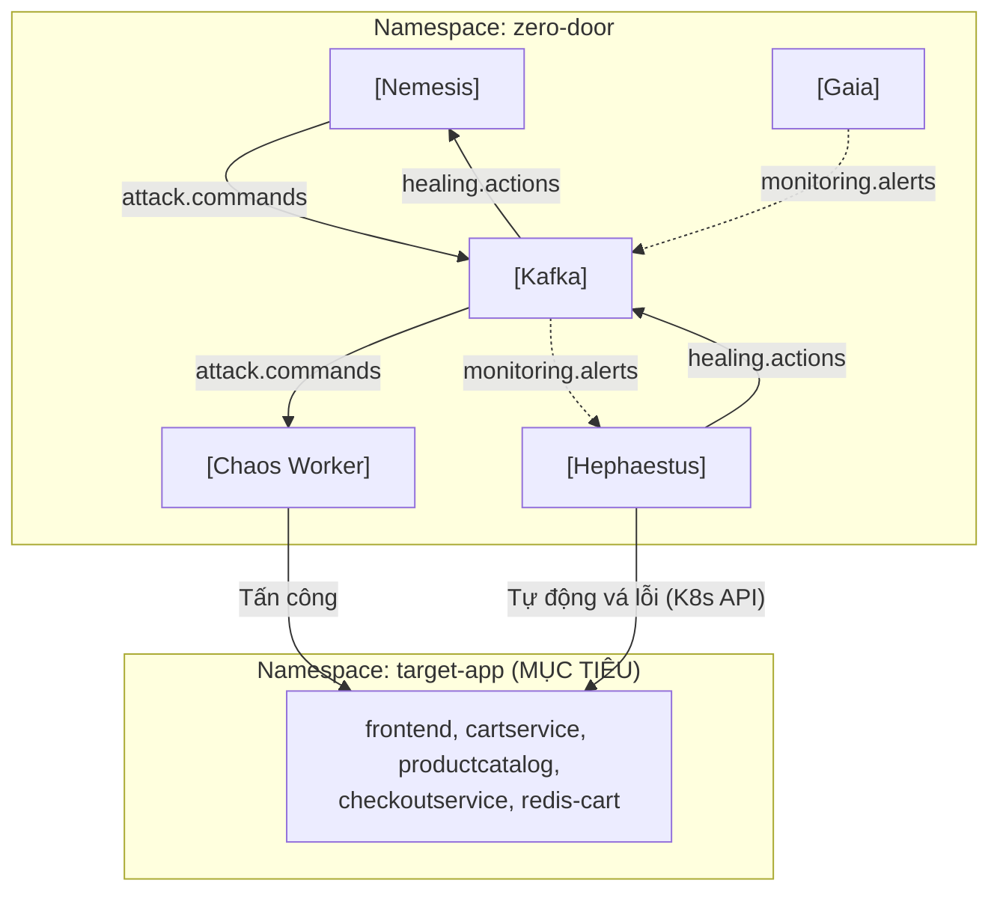
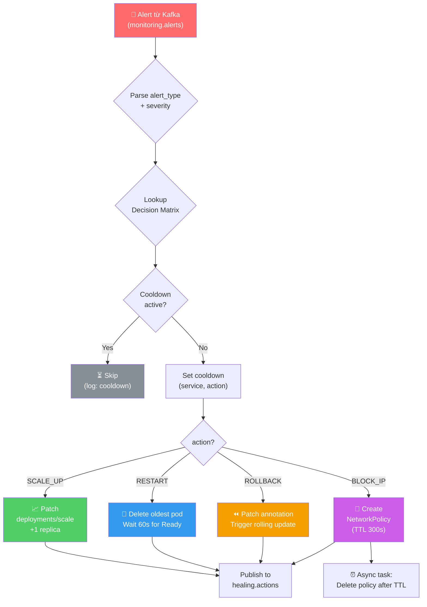

# 📘 RUNBOOK — Phase 4: Agent Hephaestus (Blue Team) + Closed-Loop Self-Healing

> **Tài liệu hướng dẫn vận hành (Runbook)** giải thích CHI TIẾT các thành phần đã triển khai,  
> TẠI SAO thiết kế như vậy, cấu trúc hệ thống, và cách vận hành/kiểm thử Phase 4.  
> Cập nhật: 2026-06-24 | Author: EurusDevSec

---

## 1. Tổng quan — Phase 4 là gì?

Phase 4 hoàn thiện **vòng lặp tự phục hồi (Self-Healing Loop)** của Zero Door:

```
Attack (Nemesis) → Chaos (Chaos Worker) → Detect (Gaia) → HEAL (Hephaestus)
```

**Hephaestus** là Agent Blue Team — nhận cảnh báo từ Gaia qua Kafka, phân tích nguyên nhân dựa trên Decision Matrix, rồi trực tiếp gọi Kubernetes API để phục hồi hệ thống về trạng thái bình thường.

### Sơ đồ Closed-Loop đầy đủ



### Luồng xử lý chi tiết của một Healing Cycle

```
Gaia                   Kafka                   Hephaestus               K8s API
 │                       │                          │                       │
 │── [1] publish alert ──▶                          │                       │
 │      (monitoring.alerts)                         │                       │
 │                       │── [2] consume alert ────▶│                       │
 │                       │                          │                       │
 │                       │       [3] Lookup Decision Matrix                 │
 │                       │       (alert_type + severity → action)           │
 │                       │                          │                       │
 │                       │       [4] Cooldown check                         │
 │                       │       (skip if already healed recently)          │
 │                       │                          │                       │
 │                       │                          │── [5] Execute ───────▶│
 │                       │                          │   SCALE_UP            │
 │                       │                          │   RESTART             │
 │                       │                          │   ROLLBACK            │
 │                       │                          │   BLOCK_IP            │
 │                       │                          │◀──────────────────────│
 │                       │                          │                       │
 │                       │◀── [6] publish result ───│                       │
 │                       │     (healing.actions)    │                       │
```

---

## 2. Cấu trúc File đã tạo

```
agent-orchestrator/hephaestus/
├── main.py              # FastAPI: Decision Engine + 4 Healing Executors + Kafka Consumer loop
├── requirements.txt     # fastapi, uvicorn, kafka-python, kubernetes==28.1.0, pydantic
└── Dockerfile           # Multi-stage: Python 3.11-slim → nobody user

infrastructure/manifests/
└── hephaestus-deployment.yaml   # ServiceAccount, Role (target-app), RoleBinding (cross-ns), ConfigMap, Deployment, Service, Ingress

infrastructure/scripts/
└── setup-phase4.ps1     # Build → Import K3d → Deploy → RBAC verify
```

---

## 3. Healing Decision Matrix

Hephaestus ánh xạ từng loại cảnh báo sang hành động phục hồi cụ thể:

| Alert Type | Severity | Healing Action | Mô tả |
|---|---|---|---|
| `HIGH_CPU` | WARNING | `SCALE_UP` | Tăng replica count +1 (giảm tải mỗi pod) |
| `HIGH_CPU` | CRITICAL | `RESTART` | Restart pod lâu nhất (có thể bị leak) |
| `HIGH_MEMORY` | WARNING/CRITICAL | `RESTART` | Restart giải phóng memory leak |
| `HIGH_ERROR_RATE` | WARNING | `SCALE_UP` | Tăng capacity để hấp thụ traffic spike |
| `HIGH_ERROR_RATE` | CRITICAL | `ROLLBACK` | Rollback deployment về bản cũ |
| `POD_CRASH` | WARNING/CRITICAL | `RESTART` | Force delete pod, K8s tự tạo lại |
| `HIGH_LATENCY` | WARNING/CRITICAL | `SCALE_UP` | Scale up để phân tải |
| `SUSPICIOUS_LOG` | CRITICAL | `BLOCK_IP` | Tạo NetworkPolicy chặn source IP |

---

## 4. Healing Action Executors — Chi tiết kỹ thuật

### 4.1. SCALE_UP
```
K8s API: PATCH /apis/apps/v1/namespaces/target-app/deployments/{name}/scale
```
- Đọc `currentReplicas`, tính `desired = min(current+1, MAX_REPLICAS=3)`
- Patch scale subresource (không patch toàn bộ Deployment spec)
- Nếu đã ở max replicas → trả về `PARTIAL` (log cảnh báo, không lỗi)

### 4.2. RESTART
```
K8s API: DELETE /api/v1/namespaces/target-app/pods/{podName}?gracePeriodSeconds=0
```
- List pods với `label_selector=app={service}`, chọn pod lâu nhất (oldest)
- Xóa với `gracePeriodSeconds=0` (immediate)
- Chờ tối đa 60s cho pod mới xuất hiện và `Ready`
- Trả về `SUCCESS` nếu pod mới ready, `PARTIAL` nếu hết 60s chưa thấy

### 4.3. ROLLBACK
```
K8s API: PATCH /apis/apps/v1/namespaces/target-app/deployments/{name}
```
- Patch annotation `hephaestus.io/rollback-triggered` vào pod template
- Annotation thay đổi → K8s trigger rolling update từ previous ReplicaSet
- Ghi lại revision trước khi rollback vào healing log

### 4.4. BLOCK_IP
```
K8s API: POST /apis/networking.k8s.io/v1/namespaces/target-app/networkpolicies
```
- Tạo NetworkPolicy với rule `ingress: allow 0.0.0.0/0 EXCEPT {sourceIP}/32`
- Thêm annotation `hephaestus.io/expires-at` để tracking TTL
- Asyncio task tự động delete NetworkPolicy sau `NETWORK_POLICY_TTL_SEC=300s`
- Label `hephaestus.io/managed=true` để dễ list qua REST API

---

## 5. Design Decisions — Tại sao làm như vậy?

### 5.1. Cross-Namespace RBAC (Answer to Q1)

> **Q1: Hephaestus chạy trong `zero-door` nhưng cần quyền tác động lên `target-app`. Dùng Role hay ClusterRole?**

**Trả lời: Role + RoleBinding (không dùng ClusterRole)**

```yaml
# Role định nghĩa WHAT — đặt trong target-app namespace
kind: Role
metadata:
  namespace: target-app    # ← scope giới hạn ở đây
  name: hephaestus-healer-role

# RoleBinding kết nối WHO (SA ở zero-door) với WHAT (Role ở target-app)
kind: RoleBinding
metadata:
  namespace: target-app    # ← binding cũng nằm ở target-app
subjects:
  - kind: ServiceAccount
    name: hephaestus-sa
    namespace: zero-door   # ← SA ở namespace khác — đây là cross-ns RBAC
roleRef:
  kind: Role
  name: hephaestus-healer-role
```

**Tại sao không dùng ClusterRole?** ClusterRole sẽ cấp quyền trên **tất cả namespaces** — vi phạm nguyên tắc least-privilege. Hephaestus chỉ cần quyền trong `target-app`, không cần `monitoring` hay `kube-system`.

**Verify** sau khi deploy:
```powershell
# Phải trả về "yes"
kubectl auth can-i --as=system:serviceaccount:zero-door:hephaestus-sa delete pods -n target-app

# Phải trả về "no"  
kubectl auth can-i --as=system:serviceaccount:zero-door:hephaestus-sa delete pods -n kube-system
```

### 5.2. HPA + Hephaestus Coexistence (Answer to Q2)

> **Q2: HPA cũng tự scale khi CPU cao. Nếu cả hai cùng scale, chuyện gì xảy ra?**

**Trả lời: Không conflict — HPA quản lý, Hephaestus hỗ trợ**

- HPA liên tục điều chỉnh replicas dựa trên metrics thực time (scrape mỗi 15s).
- Hephaestus `SCALE_UP` chỉ tăng 1 replica ngay lập tức khi Gaia báo ngưỡng vượt mức.
- Sau khi Hephaestus scale lên, HPA sẽ tiếp tục quản lý và có thể scale xuống khi CPU bình thường.
- Cả hai đều bị cap bởi `maxReplicas=3` trong HPA, nên không thể vượt quá giới hạn.
- **Worst case**: Hephaestus set replicas=2, HPA thấy CPU vẫn cao và cũng set replicas=2 → idempotent, không có hại.

### 5.3. Healing Cooldown — Tại sao 90 giây? (Answer to Q4)

> **Q4: Cooldown quá ngắn → thrashing. Quá dài → heal chậm lần 2.**

**Trả lời: 90s là balance hợp lý cho local K3d**

- **Restart pod**: Pod K3d mất ~20-40s để `Running+Ready`. 90s đủ để pod mới ổn định và Gaia không re-alert về cùng vấn đề.
- **Scale-up**: HPA mất ~60s để nhận diện metrics thay đổi sau khi scale.
- **Tradeoff**: Nếu heal lần 1 thất bại, phải chờ 90s. Với cooldown = 90s, trong 10 phút chỉ có tối đa ~6 lần heal (chấp nhận được với attack test).
- **Configurable**: Thay đổi qua env var `HEALING_COOLDOWN_SEC` mà không cần rebuild image.

### 5.4. NetworkPolicy và Source IP (Answer to Q3)

> **Q3: Source IP trong K8s có thể bị SNAT bởi kube-proxy. Làm sao lấy real source IP?**

**Trả lời: `externalTrafficPolicy: Local` + Ingress source IP**

- Khi traffic đến từ bên ngoài qua Ingress, kube-proxy mặc định SNAT → source IP là IP của node, không phải client.
- Với `externalTrafficPolicy: Local` trên Service, kube-proxy giữ nguyên source IP (không SNAT) nhưng chỉ forward đến pods trên cùng node.
- Nginx Ingress Controller expose `X-Forwarded-For` header chứa real client IP.
- Trong môi trường local K3d, HTTP Flood từ Chaos Worker đi qua cluster-internal network → source IP là pod IP của chaos-worker → Hephaestus có thể block pod IP đó.

---

## 6. RBAC — Quyền chi tiết

| Resource | Verbs | Lý do cần |
|---|---|---|
| `pods` | `get`, `list` | Tìm pod cần restart |
| `pods` | `delete` | Restart: xóa pod để K8s tạo lại |
| `deployments` | `get`, `list` | Đọc replica count hiện tại |
| `deployments` | `patch` | Rollback: patch pod template annotation |
| `deployments/scale` | `get`, `patch` | Scale-up: patch replicas |
| `replicasets` | `get`, `list` | Verify rollout status |
| `networkpolicies` | `get`, `list`, `create`, `delete` | BLOCK_IP: tạo/xóa NetworkPolicy |

---

## 7. Cách Deploy Phase 4

### Bước 1: Chạy setup script tự động

```powershell
pwsh -ExecutionPolicy Bypass -File r:\_Projects\Eurus_Workspace\zero_door\infrastructure\scripts\setup-phase4.ps1
```

### Bước 2: Verify RBAC

```powershell
# Phải trả về "yes"
kubectl auth can-i --as=system:serviceaccount:zero-door:hephaestus-sa delete pods -n target-app
kubectl auth can-i --as=system:serviceaccount:zero-door:hephaestus-sa patch deployments -n target-app
kubectl auth can-i --as=system:serviceaccount:zero-door:hephaestus-sa create networkpolicies -n target-app

# Phải trả về "no"
kubectl auth can-i --as=system:serviceaccount:zero-door:hephaestus-sa delete pods -n kube-system
kubectl auth can-i --as=system:serviceaccount:zero-door:hephaestus-sa delete pods -n monitoring
kubectl auth can-i --as=system:serviceaccount:zero-door:hephaestus-sa delete pods -n zero-door
```

---

## 8. Kiểm thử End-to-End (Definition of Done Verification)

### 8.1. Test SCALE_UP — Manual trigger

```powershell
# Trigger manual SCALE_UP cho frontend
curl -X POST http://localhost:8080/hephaestus/heal/trigger `
  -H "Content-Type: application/json" `
  -d '{"alertType":"HIGH_CPU","severity":"WARNING","affectedService":"frontend"}'

# Quan sát replica tăng:
kubectl get deployment frontend -n target-app -w
```

**Expected**: `frontend` replicas tăng từ 1 (hoặc 2) lên tối đa 3.

### 8.2. Test RESTART — Manual trigger

```powershell
# Ghi lại pod name hiện tại
kubectl get pods -n target-app -l app=cartservice

# Trigger RESTART
curl -X POST http://localhost:8080/hephaestus/heal/trigger `
  -H "Content-Type: application/json" `
  -d '{"alertType":"POD_CRASH","severity":"CRITICAL","affectedService":"cartservice"}'

# Xem pod bị xóa và pod mới xuất hiện
kubectl get pods -n target-app -l app=cartservice -w
```

**Expected**: Pod cũ bị xóa → pod mới `Running` trong < 60s.

### 8.3. Test BLOCK_IP — Manual trigger

```powershell
# Trigger BLOCK_IP với một IP giả
curl -X POST http://localhost:8080/hephaestus/heal/trigger `
  -H "Content-Type: application/json" `
  -d '{"alertType":"SUSPICIOUS_LOG","severity":"CRITICAL","affectedService":"frontend","sourceIP":"192.168.1.100"}'

# Kiểm tra NetworkPolicy được tạo:
kubectl get networkpolicies -n target-app -l hephaestus.io/managed=true

# Xem NetworkPolicy YAML
kubectl get networkpolicy -n target-app -l hephaestus.io/managed=true -o yaml

# Xem list qua API:
curl http://localhost:8080/hephaestus/network-policies
```

**Expected**: NetworkPolicy `block-frontend-XXXXXXXX` được tạo. Tự xóa sau 300s.

### 8.4. Test Closed-Loop — Full Attack → Detect → Heal

```powershell
# Terminal 1: Watch healing.actions topic
kubectl exec -n zero-door -it $(kubectl get pod -n zero-door -l app.kubernetes.io/name=kafka -o name | Select-Object -First 1) `
  -- kafka-console-consumer.sh --bootstrap-server localhost:9092 --topic healing.actions

# Terminal 2: Trigger CPU stress qua Nemesis
curl -X POST http://localhost:8080/nemesis/attack/trigger `
  -H "Content-Type: application/json" `
  -d '{"attackType":"CPU_STRESS","targetService":"cartservice","durationSec":60,"intensity":"HIGH"}'

# Terminal 3: Watch pods
kubectl get pods -n target-app -w
```

**Expected full loop**:
1. Chaos Worker inject stress pod vào `cartservice` namespace
2. Prometheus scrape CPU spike
3. Gaia publish `HIGH_CPU` alert vào `monitoring.alerts`  
4. Hephaestus consume alert → `SCALE_UP` cartservice
5. healing.actions topic nhận log `{"action":"SCALE_UP","status":"SUCCESS",...}`
6. `cartservice` replicas tăng lên 2 → CPU per pod giảm

### 8.5. Test Healing Cooldown

```powershell
# Trigger heal 2 lần liên tiếp cùng service + action
curl -X POST http://localhost:8080/hephaestus/heal/trigger `
  -d '{"alertType":"HIGH_CPU","severity":"WARNING","affectedService":"frontend"}'

curl -X POST http://localhost:8080/hephaestus/heal/trigger `
  -d '{"alertType":"HIGH_CPU","severity":"WARNING","affectedService":"frontend"}'

# Kiểm tra cooldown:
curl http://localhost:8080/hephaestus/cooldowns
```

**Expected**: Lần 2 bị skip (log `"Cooldown active"`). REST API `/cooldowns` hiển thị remaining time.

---

## 9. Monitoring trên Grafana

Sau khi healing chạy, quan sát trên Grafana (http://localhost:3000):

| Metric | Dashboard | Dấu hiệu healing thành công |
|---|---|---|
| Replica count | Kubernetes / Workloads | Tăng sau SCALE_UP |
| Pod restart count | Kubernetes / Pods | Reset về 0 sau pod mới Running |
| CPU usage | Kubernetes / Compute | Giảm sau SCALE_UP hoặc RESTART |
| Pod count | Kubernetes / Workloads | Giảm rồi tăng lại sau RESTART |

---

## 10. REST API Reference

| Endpoint | Method | Mô tả |
|---|---|---|
| `GET /hephaestus/` | GET | Status + timestamp |
| `GET /hephaestus/healthz` | GET | K8s + Kafka connectivity + active cooldowns |
| `GET /hephaestus/cooldowns` | GET | List active cooldowns với remaining time |
| `POST /hephaestus/heal/trigger` | POST | Manual trigger a healing action |
| `GET /hephaestus/network-policies` | GET | List all managed NetworkPolicies |

---

## 11. Troubleshooting

| Triệu chứng | Nguyên nhân | Giải pháp |
|---|---|---|
| `hephaestus` pod `CrashLoopBackOff` | Kafka không kết nối được | `kubectl logs -n zero-door -l app=hephaestus` |
| SCALE_UP không tăng được replica | Đã ở `MAX_REPLICAS=3` | Giảm replicas trước: `kubectl scale deploy/frontend -n target-app --replicas=1` |
| RESTART không tìm được pod | Service name ≠ label `app=` | Check: `kubectl get pods -n target-app --show-labels` |
| NetworkPolicy được tạo nhưng không block | CNI không hỗ trợ NetworkPolicy | K3d dùng Flannel, cần enable: `kubectl get pods -n kube-system -l app=flannel` |
| `kubectl auth can-i` trả về "no" cho target-app | RoleBinding chưa được apply | `kubectl get rolebinding -n target-app hephaestus-healer-binding` |
| Cooldown không hết | Restart Hephaestus pod (in-memory state) | `kubectl rollout restart deployment/hephaestus -n zero-door` |

---

## 12. Mermaid — Hephaestus Decision Flow



---

## 13. Kafka Message Schema — healing.actions

```json
{
  "healingId":      "uuid-string",
  "timestamp":      "2026-06-24T12:33:28.912Z",
  "source":         "hephaestus",
  "triggerAlertId": "uuid-of-gaia-alert",
  "action":         "SCALE_UP | RESTART | ROLLBACK | BLOCK_IP",
  "target": {
    "namespace": "target-app",
    "resource":  "frontend | pod-name | policy-name"
  },
  "status": "SUCCESS | FAILED | PARTIAL",
  "details": {
    "previousState": "1 replicas",
    "newState":      "2 replicas",
    "durationMs":    245,
    "errorMessage":  ""
  }
}
```

---

*Phase 4 hoàn thành khi: Hephaestus pod Running, RBAC verified, cả 3 healing actions (SCALE_UP, RESTART, BLOCK_IP) hoạt động, và full closed-loop từ Nemesis attack → Gaia detect → Hephaestus heal chạy thành công.*
