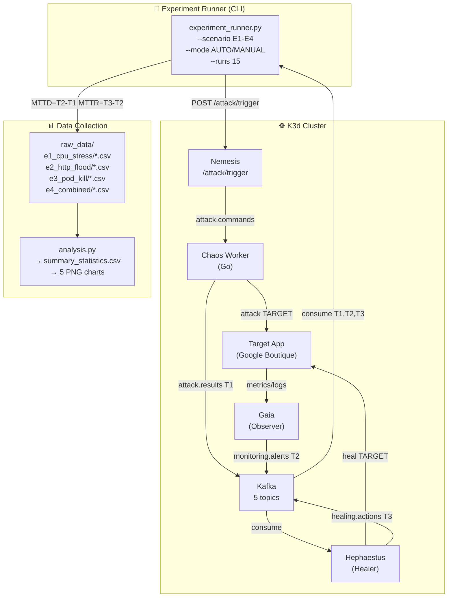

# Phase 5 Runbook — War Game Experiments & Data Collection

> **Status:** ✅ Implemented | **Timeline:** Week 17-20 (Sprint 9-10)  
> **Owner:** EurusDevSec (Experiment Design & Execution) + hp8001 (Data Collection & Analysis)  
> **Prerequisite:** Phase 4 (Hephaestus Healer) fully deployed and verified

---

## 1. Tổng quan kiến trúc Phase 5



---

## 2. Experiment Matrix (T5.2)

| ID | Kịch bản | Attack Type | Expected Alert | Expected Action | MTTD Target | MTTR Target |
|---|---|---|---|---|---|---|
| **E1** | CPU Stress — cartservice (60s) | `CPU_STRESS` | `HIGH_CPU/CRITICAL` | `SCALE_UP` | < 60s | < 180s |
| **E2** | HTTP Flood — frontend (30s, 100 concurrent) | `HTTP_FLOOD` | `HIGH_ERROR_RATE/CRITICAL` | `SCALE_UP` + `BLOCK_IP` | < 60s | < 180s |
| **E3** | Pod Kill — frontend | `POD_KILL` | `POD_CRASH/CRITICAL` | `RESTART` | < 30s | < 60s |
| **E4** | Combined — CPU + HTTP Flood + Pod Kill | `COMBINED` | `MULTIPLE` | `MULTIPLE` | < 60s | < 180s |

---

## 3. Steady-State Hypothesis (T5.1)

Trước mỗi experiment run, cluster **PHẢI** đạt trạng thái:

| Metric | Steady-State | Prometheus Query |
|---|---|---|
| CPU per pod | < 60% | `rate(container_cpu_usage_seconds_total{namespace="target-app"}[1m])` |
| Memory per pod | < 70% | `container_memory_working_set_bytes{namespace="target-app"}` |
| HTTP 5xx rate | < 1% | `rate(http_requests_total{status=~"5.."}[1m])` |
| Frontend replicas | = 1 | `kube_deployment_spec_replicas{deployment="frontend"}` |
| NetworkPolicies | = 0 managed | `kubectl get netpol -n target-app -l hephaestus.io/managed=true` |

---

## 4. Cấu trúc Files

```
docs/experiments/
├── raw_data/
│   ├── e1_cpu_stress/        ← CSV output từ experiment_runner.py
│   ├── e2_http_flood/
│   ├── e3_pod_kill/
│   └── e4_combined/
├── analysis/
│   ├── summary_statistics.csv ← aggregate stats (mean/median/P95)
│   ├── mttd_comparison.png    ← Bar chart AUTO vs MANUAL
│   ├── mttr_comparison.png
│   ├── mttd_boxplot.png       ← Box plot distribution
│   ├── uptime_e4.png          ← Line chart E4 uptime per run
│   └── heal_success_rate.png  ← Horizontal bar chart
└── screenshots/               ← Manual Grafana screenshots

infrastructure/scripts/
├── experiment_runner.py       ← Main experiment CLI
├── analysis.py                ← Analysis & chart generation
└── setup-phase5.ps1           ← One-command setup
```

---

## 5. Hướng dẫn triển khai

### 5.1. Setup (một lần)

```powershell
# Đảm bảo cluster đang chạy
k3d cluster list
kubectl get pods -n zero-door

# Chạy setup script (port-forward + smoke test)
cd r:\_Projects\Eurus_Workspace\zero_door
.\infrastructure\scripts\setup-phase5.ps1
```

### 5.2. Chạy experiment thủ công

```powershell
# Set environment variables (port-forwards phải đang chạy)
$env:NEMESIS_URL     = "http://localhost:9092"
$env:HEPHAESTUS_URL  = "http://localhost:9091"
$env:PROMETHEUS_URL  = "http://localhost:9090"
$env:KAFKA_BOOTSTRAP = "localhost:9093"
$env:STEADY_STATE_WAIT_SEC = "30"

# Chạy E1 — 15 runs AUTO mode
python infrastructure/scripts/experiment_runner.py --scenario E1 --mode AUTO --runs 15

# Chạy E1 — 15 runs MANUAL mode (không có Hephaestus healing)
python infrastructure/scripts/experiment_runner.py --scenario E1 --mode MANUAL --runs 15

# Chạy tất cả scenarios — cả AUTO và MANUAL (= 120 runs tổng)
python infrastructure/scripts/experiment_runner.py --scenario ALL --mode BOTH --runs 15
```

### 5.3. Phân tích & xuất charts

```powershell
# Generate tất cả charts (output: docs/experiments/analysis/*.png)
python infrastructure/scripts/analysis.py

# Stats only, không generate charts (nhanh hơn)
python infrastructure/scripts/analysis.py --no-charts

# Chỉ phân tích E1 và E3
python infrastructure/scripts/analysis.py --scenario E1 E3
```

---

## 6. Timestamps & Metrics

### Cách tính MTTD/MTTR

```
T0 = attack trigger time (experiment_runner.py ghi lại)
T1 = timestamp trong attack.results (Chaos Worker thực hiện attack)
T2 = timestamp trong monitoring.alerts (Gaia phát hiện)
T3 = timestamp trong healing.actions (Hephaestus hoàn thành heal)

MTTD = T2 - T0   (thời gian phát hiện từ khi tấn công)
MTTR = T3 - T2   (thời gian khắc phục từ khi phát hiện)
```

### CSV Schema

```csv
run_id,scenario,mode,attack_type,attack_start,attack_end,detect_time,
heal_start,heal_end,mttd_seconds,mttr_seconds,uptime_percent,
heal_status,false_positives,notes
```

---

## 7. Definition of Done

| # | Tiêu chí | Kiểm chứng |
|---|---|---|
| 1 | `experiment_runner.py` chạy được với `--runs 2` smoke test | Exit code 0, CSV xuất ra |
| 2 | `analysis.py` tạo được `summary_statistics.csv` | File tồn tại trong `docs/experiments/analysis/` |
| 3 | 5 charts PNG đã generate | Files trong `docs/experiments/analysis/` |
| 4 | Directory structure `docs/experiments/` đã tạo | `ls docs/experiments/` |
| 5 | `setup-phase5.ps1` chạy thành công | Không có error exit |
| 6 | MTTD < 60s trong ≥ 70% AUTO runs (full suite) | `summary_statistics.csv`: `mttd_lt60_pct >= 70` |
| 7 | MTTR < 180s trong ≥ 70% AUTO runs | `summary_statistics.csv`: `mttr_lt180_pct >= 70` |

---

## 8. Verification Commands

```powershell
# 1. Kiểm tra script syntax
python -m py_compile infrastructure/scripts/experiment_runner.py; Write-Host "OK"
python -m py_compile infrastructure/scripts/analysis.py; Write-Host "OK"

# 2. Chạy smoke test E1, 2 runs (nhanh, không cần Kafka thật)
$env:STEADY_STATE_WAIT_SEC = "5"
python infrastructure/scripts/experiment_runner.py --scenario E1 --mode AUTO --runs 2 --skip-steady-state

# 3. Kiểm tra CSV đã tạo
Get-ChildItem docs/experiments/raw_data -Recurse -Filter "*.csv" | Select-Object FullName, Length

# 4. Generate analysis
python infrastructure/scripts/analysis.py --no-charts

# 5. Kiểm tra charts (sau khi chạy đủ data)
Get-ChildItem docs/experiments/analysis -Filter "*.png"
```

---

## 9. Troubleshooting

| Lỗi | Nguyên nhân | Fix |
|---|---|---|
| `Nemesis API unreachable` | Port-forward chưa chạy | `kubectl port-forward svc/nemesis 9092:8000 -n zero-door` |
| `kafka.errors.NoBrokersAvailable` | Kafka port-forward chưa bind | `kubectl port-forward svc/kafka 9093:9092 -n zero-door` |
| `heal_status = TIMEOUT` | Hephaestus chưa process alert | Kiểm tra `kubectl logs -n zero-door -l app=hephaestus` |
| `mttd_seconds = -1` | Gaia không detect được attack | Kiểm tra Prometheus thresholds trong `gaia/main.py` |
| Charts trống (no data) | Chưa chạy experiment | Chạy `experiment_runner.py` trước |
| `No module named rich` | Missing Python deps | `pip install rich pandas matplotlib scipy` |

---

## 10. Design Decisions (Trả lời Design Questions Phase 5)

**Q1: Bao nhiêu runs là đủ?**  
Dùng n=15 runs/scenario/mode. Theo Central Limit Theorem, n≥30 là lý tưởng nhưng với thời gian giới hạn của sprint, n=15 đủ để tính mean, median, P95. Kết quả được ghi rõ là "exploratory" chứ không phải "confirmatory" nếu n<30.

**Q2: Đảm bảo steady-state giữa các runs?**  
Script `reset_to_steady_state()` trong `experiment_runner.py`: scale tất cả deployments về 1 replica, xóa NetworkPolicies managed bởi Hephaestus, chờ `STEADY_STATE_WAIT_SEC=30s` cho Prometheus metrics normalize. Có thêm `check_steady_state()` query Prometheus xác nhận CPU < 60% trước khi bắt đầu run tiếp.

**Q3: Ranh giới MTTD/MTTR trong manual mode?**  
- **MTTD** (manual): T0 (attack start) → T_grafana_visible (khi alert hiện trên Grafana). Script ghi nhận timestamp khi alert xuất hiện trên `monitoring.alerts` Kafka topic — nhất quán với auto mode.
- **MTTR** (manual): Ghi nhận kể từ khi người dùng gõ `kubectl` command đầu tiên → pod/deployment trở về Ready. Người chạy phải ghi thủ công vào cột `notes` trong CSV, hoặc dùng `heal_start` field để ghi timestamp.

---

## 11. Files tạo mới trong Phase 5

| File | Mô tả |
|---|---|
| [`infrastructure/scripts/experiment_runner.py`](../../infrastructure/scripts/experiment_runner.py) | CLI runner — trigger attacks, collect timestamps, export CSV |
| [`infrastructure/scripts/analysis.py`](../../infrastructure/scripts/analysis.py) | Analysis & chart generation (pandas, matplotlib) |
| [`infrastructure/scripts/setup-phase5.ps1`](../../infrastructure/scripts/setup-phase5.ps1) | One-command setup & smoke test |
| `docs/experiments/raw_data/e{1-4}_*/` | Directories cho raw CSV data |
| `docs/experiments/analysis/` | Output directory cho charts và summary |
| `docs/experiments/screenshots/` | Manual Grafana screenshots |
