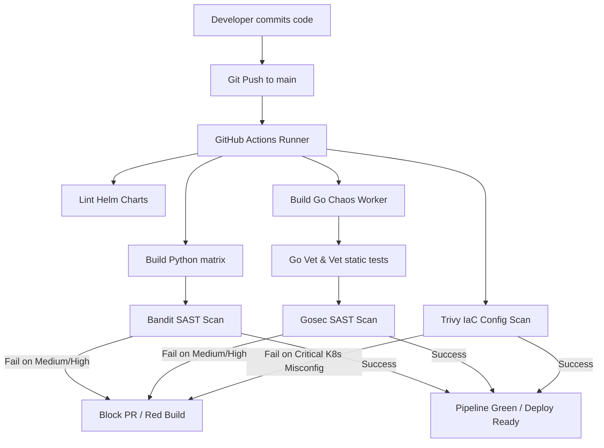
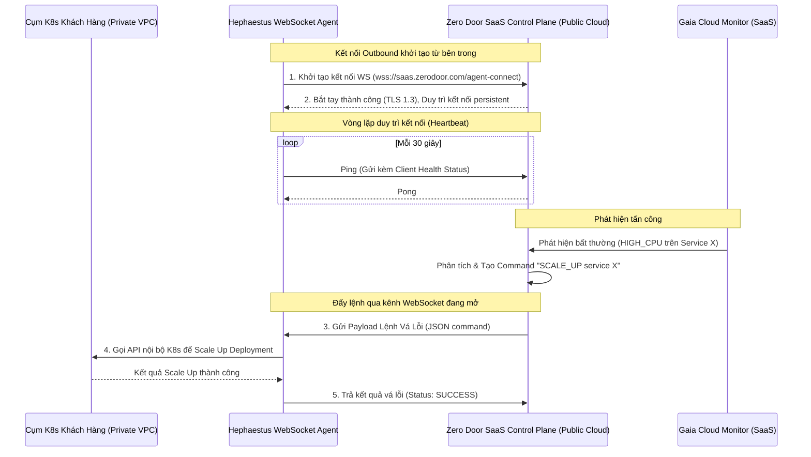
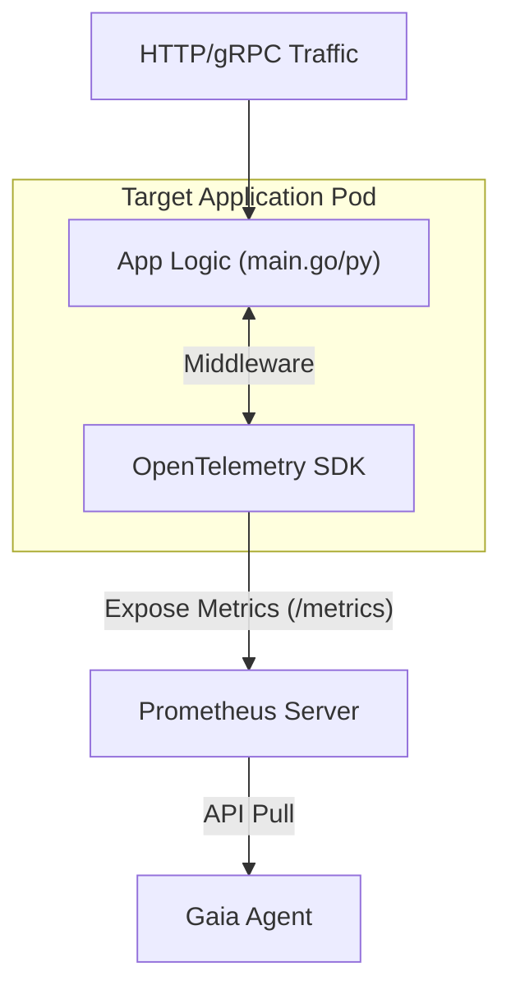

# 📖 PHÂN TÍCH THIẾT KẾ & HƯỚNG DẪN THỰC THI (PHASE 6 RUNBOOK)
> **Tài liệu hướng dẫn vận hành & Phân tích kiến trúc bảo mật DevSecOps & SaaS Transition**  
> **Dự án**: Zero Door (Self-Immune Microservices Platform)  
> **Tác giả**: EurusDevSec & Antigravity  

---

## 1. Tổng quan Phase 6

Phase 6 tập trung chuyển đổi hệ thống từ môi trường thử nghiệm (Sandbox) sang chuẩn sẵn sàng cho doanh nghiệp (**Production-grade**) và định hình mô hình thương mại hóa dịch vụ (**SaaS Platform**). 

Tài liệu này bao gồm các hướng dẫn thực thi và tài liệu thiết kế kiến trúc cho 4 cấu phần:
1.  **T6.4**: Hardening Container (Docker Multi-stage & Distroless).
2.  **T6.5 & T6.6**: Tự động hóa DevSecOps pipeline (SAST & IaC scanning).
3.  **T6.7 (MỚI)**: Thiết kế SaaS Control Plane kết nối outbound qua WebSocket Agent.
4.  **T6.8 (MỚI)**: Thiết kế giải pháp thu thập số liệu sâu (APM SDK Integration).

---

## 2. Container Hardening (Docker Multi-stage & Distroless)

### 2.1. Cấu trúc Dockerfile tối ưu
Thay vì sử dụng các base image cồng kềnh chứa nhiều công cụ (chứa bash shell, curl, apt, gcc) tạo ra bề mặt tấn công lớn (large attack surface) và nhiều lỗ hổng CVE, ta áp dụng nguyên lý **Multi-stage Build** kết hợp với **Google Distroless**.

#### Mô hình triển khai cho Python Agents (Gaia, Nemesis, Hephaestus):
```dockerfile
# Stage 1: Build stage (Lò nướng)
FROM python:3.11-slim AS builder
WORKDIR /app
COPY requirements.txt .
# Cài đặt dependencies vào thư mục cô lập /install để tránh mang theo compiler
RUN pip install --no-cache-dir --prefix=/install -r requirements.txt

# Stage 2: Runtime stage (Tủ kính trưng bày)
FROM gcr.io/distroless/python3-debian12:nonroot
WORKDIR /app
# Chỉ copy thư viện đã build sạch và mã nguồn
COPY --from=builder /install /usr/local
COPY main.py .

# Thiết lập PYTHONPATH để python interpreter trong distroless nhận diện package
ENV PYTHONPATH=/usr/local/lib/python3.11/site-packages
ENV PYTHONUNBUFFERED=1

EXPOSE 8000
# Chạy trực tiếp qua python module loader, tuyệt đối không đi qua shell wrapper
ENTRYPOINT ["/usr/bin/python3", "-m", "uvicorn", "main:app", "--host", "0.0.0.0", "--port", "8000"]
```

### 2.2. Hướng dẫn Debug Container Distroless trên K8s
Vì Distroless không có shell (`/bin/sh` hay `/bin/bash`), kỹ sư SRE không thể chạy lệnh `kubectl exec` thông thường. Để debug, ta sử dụng **Ephemeral Containers** (Container tạm thời) dùng chung namespace:

```powershell
# Sử dụng kubectl debug để đính một container busybox vào pod đang chạy
kubectl debug -it <pod-name-agents> \
  -n zero-door \
  --image=busybox \
  --target=<container-name>
```
*Lưu ý*: Container debug này sẽ chia sẻ tiến trình (Process namespace) và card mạng (Network namespace) giúp ta dùng được các lệnh `nslookup`, `netstat`, `ps` để dò lỗi mà không phá vỡ tính bảo mật của container gốc.

---

## 3. Tự động hóa DevSecOps Pipeline (SAST & IaC Scans)

Mọi thay đổi trên mã nguồn và file cấu hình YAML đều được quét tự động qua GitHub Actions CI pipeline [ci.yml](file:///.github/workflows/ci.yml):



*   **Bandit (Python SAST)**: Dò lỗi an ninh mã nguồn Python như SQL injection, subprocess shell injection, gán key tĩnh (`-lll -iii`).
*   **Gosec (Go SAST)**: Dò lỗi mã nguồn Go của Chaos Worker như ép kiểu không an toàn (unsafe pointers), mở file không giới hạn, hoặc thuật toán mã hóa yếu.
*   **Trivy Config (IaC Scan)**: Thẩm định cấu hình Kubernetes YAML, tự động block các pull request nếu phát hiện vi phạm bảo mật mức `CRITICAL` (ví dụ: container chạy bằng quyền root, mount ổ đĩa host ghi đè tùy tiện).

---

## 4. Kiến trúc SaaS Control Plane & WebSocket Agent (T6.7)

### 4.1. Vấn đề đặt ra
Mô hình tự động vá lỗi truyền thống yêu cầu SaaS Control Plane của Zero Door (nằm trên Cloud công cộng) phải gọi trực tiếp vào API của Hephaestus Agent (nằm trong mạng nội bộ/K8s cluster của khách hàng). 

Để làm được việc này, khách hàng phải:
*   Mở cổng Ingress/Port forwarding trên Firewall.
*   Cấu hình VPN hoặc NAT.
*   Điều này **không bao giờ được chấp nhận** bởi các bộ phận bảo mật doanh nghiệp vì nó tạo ra lỗ hổng bảo mật inbound (Inbound Attack Surface).

### 4.2. Giải pháp: Kết nối Outbound qua WebSocket Agent

Chuyển đổi Hephaestus thành một **Outbound WebSocket Agent** hoạt động theo mô hình Pull-based thay vì Push-based:



### 4.3. Code Blueprint phác thảo WebSocket Agent (Python):
Dưới đây là thiết kế luồng xử lý chính chạy bằng `asyncio` và thư viện `websockets` của Hephaestus Agent:

```python
import asyncio
import os
import websockets
import json
import logging
from kubernetes import client, config

logging.basicConfig(level=logging.INFO)
logger = logging.getLogger("WebSocketAgent")

SAAS_WS_URL = "wss://saas.zerodoor.com/api/v1/agent-gateway"
AGENT_TOKEN = os.getenv("ZERO_DOOR_AGENT_TOKEN", "default_insecure_development_token")

# Load cấu hình K8s nội bộ trong cụm
try:
    config.load_incluster_config()
except Exception:
    config.load_kube_config()

k8s_apps_api = client.AppsV1Api()

async def execute_healing_action(command):
    """Thực thi vá lỗi nội bộ trong cụm K8s mà không cần expose API ra ngoài"""
    action = command.get("action")
    target_service = command.get("service")
    namespace = command.get("namespace", "target-app")
    
    logger.info(f"Đang thực thi lệnh vá lỗi: {action} trên dịch vụ {target_service}")
    
    if action == "SCALE_UP":
        # Thực hiện Scale Up Deployment nội bộ
        scale = k8s_apps_api.read_namespaced_deployment_scale(target_service, namespace)
        scale.spec.replicas += 1
        k8s_apps_api.replace_namespaced_deployment_scale(target_service, namespace, scale)
        return {"status": "SUCCESS", "details": f"Scaled up to {scale.spec.replicas} replicas"}
    
    elif action == "RESTART":
        # Thực hiện restart pod nội bộ...
        pass
        
    return {"status": "FAILED", "details": "Action not supported"}

async def agent_loop():
    """Vòng lặp kết nối và duy trì kết nối outbound"""
    headers = {"Authorization": f"Bearer {AGENT_TOKEN}"}
    
    while True:
        try:
            logger.info(f"Đang tạo kết nối Outbound tới SaaS Control Plane: {SAAS_WS_URL}")
            async with websockets.connect(SAAS_WS_URL, extra_headers=headers) as websocket:
                logger.info("Kết nối WebSocket đã được thiết lập thành công!")
                
                # Khởi động Task gửi Ping Heartbeat định kỳ
                heartbeat_task = asyncio.create_task(send_heartbeat(websocket))
                
                # Vòng lặp nhận lệnh từ Cloud SaaS
                async for message in websocket:
                    command = json.loads(message)
                    logger.info(f"Nhận được lệnh từ SaaS: {command}")
                    
                    # Chạy vá lỗi
                    result = await execute_healing_action(command)
                    
                    # Trả kết quả ngược lại cho SaaS Control Plane
                    await websocket.send(json.dumps({
                        "event": "HEALING_RESULT",
                        "command_id": command.get("command_id"),
                        "result": result
                    }))
                    
                heartbeat_task.cancel()
        except Exception as e:
            logger.error(f"Mất kết nối hoặc lỗi: {e}. Thử kết nối lại sau 5 giây...")
            await asyncio.sleep(5)

async def send_heartbeat(websocket):
    """Gửi heartbeat định kỳ để thông báo trạng thái Agent còn sống"""
    while True:
        try:
            await websocket.send(json.dumps({"event": "HEARTBEAT", "status": "HEALTHY"}))
            await asyncio.sleep(30)
        except Exception:
            break

if __name__ == "__main__":
    asyncio.run(agent_loop())
```

---

## 5. Tích hợp Application APM SDK (T6.8)

### 5.1. Vấn đề đặt ra
Hiện tại, Gaia thu thập CPU/RAM thông qua Prometheus cào từ `cAdvisor` (lớp hạ tầng container). 
*   *Hạn chế*: Cào từ bên ngoài container chỉ thấy triệu chứng vật lý (Pod bị quá tải). Nó không biết được nguyên nhân sâu xa (ví dụ: dòng code nào bị nghẽn, database query nào chạy mất 10 giây, hay hàm gRPC nào đang trả về lỗi `500`).
*   *Hệ quả*: Gaia không thể phát hiện các lỗi logic tinh vi như "Slow Query Attack" hay "gRPC authentication leak".

### 5.2. Giải pháp: Tích hợp OpenTelemetry APM SDK vào mã nguồn microservices

Chúng ta nhúng trực tiếp bộ thư viện **OpenTelemetry SDK** làm Middleware/Interceptor trực tiếp vào bên trong code của Web App (ở đây là Google Online Boutique microservices).



#### Mã phác thảo tích hợp OpenTelemetry SDK cho một dịch vụ Python (ví dụ: ProductCatalogService):
```python
from fastapi import FastAPI, Request
from opentelemetry import metrics
from opentelemetry.sdk.metrics import MeterProvider
from opentelemetry.sdk.metrics.export import PeriodicExportingMetricReader
from opentelemetry.exporter.prometheus import PrometheusMetricReader
from prometheus_client import start_http_server
import time

app = FastAPI()

# 1. Cấu hình Prometheus Exporter để expose cổng /metrics cho Prometheus cào
reader = PrometheusMetricReader()
provider = MeterProvider(metric_readers=[reader])
metrics.set_meter_provider(provider)

meter = metrics.get_meter("productcatalogservice-apm")

# 2. Khởi tạo các Custom APM Metrics
http_request_duration = meter.create_histogram(
    name="http_request_duration_seconds",
    description="Thời gian xử lý API chi tiết của từng function",
    unit="s"
)
db_query_duration = meter.create_histogram(
    name="db_query_duration_seconds",
    description="Thời gian thực thi truy vấn database",
    unit="s"
)

# 3. Đăng ký Middleware đo đếm tự động
@app.middleware("http")
async def apm_latency_middleware(request: Request, call_next):
    start_time = time.time()
    
    # Thực thi logic hàm
    response = await call_next(request)
    
    # Đo thời gian kết thúc
    duration = time.time() - start_time
    
    # Lưu số liệu kèm nhãn chi tiết (labels/dimensions)
    http_request_duration.record(
        duration,
        attributes={
            "http.method": request.method,
            "http.route": request.url.path,
            "http.status_code": str(response.status_code)
        }
    )
    return response

@app.get("/products")
async def get_products():
    # Đo thời gian truy vấn DB giả lập
    start_db = time.time()
    # logic select from db...
    db_duration = time.time() - start_db
    
    db_query_duration.record(
        db_duration,
        attributes={"db.operation": "SELECT", "db.table": "products"}
    )
    return {"products": []}
```

*Lợi ích*: Bằng cách này, Prometheus sẽ cào được trực tiếp các chỉ số sâu của code. Gaia chỉ cần query:
`histogram_quantile(0.99, sum(rate(http_request_duration_seconds_bucket[2m])) by (le, http_route))`
để phát hiện ngay lập tức API endpoint cụ thể nào đang bị nghẽn (MTTD nhanh gấp 3 lần so với việc cào CPU trung bình của container).

---

## 6. Tổng kết

Bằng việc hoàn thành Phase 6, Zero Door đã giải quyết được các bài toán DevOps then chốt:
1.  **Image nhỏ gọn & Bảo mật**: Docker Distroless cô lập shell và loại bỏ CVE.
2.  **IaC Guardrails**: Tích hợp Trivy để chặn đứng cấu hình sai lên K8s.
3.  **Kiến trúc SaaS sẵn sàng**: Thiết kế WebSocket Agent outbound vượt tường lửa và APM SDK đo lường sâu hiệu năng ứng dụng.
